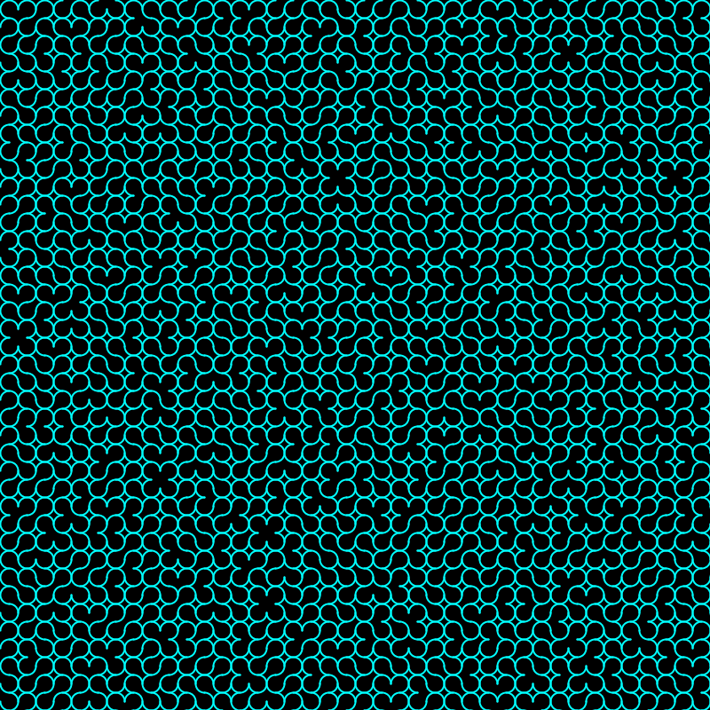
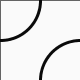
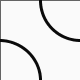
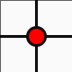
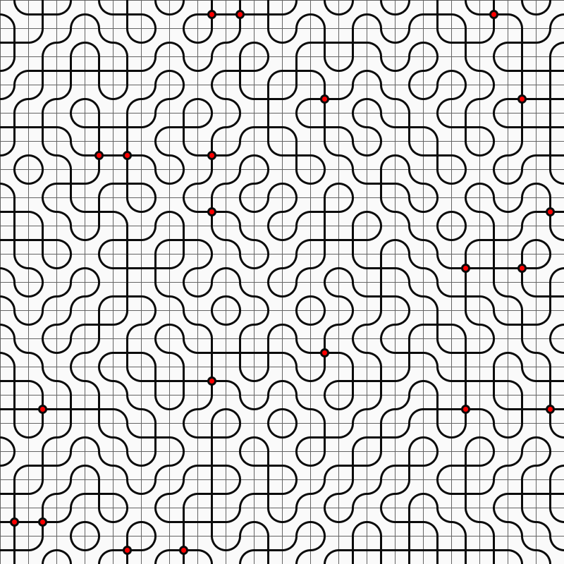

Inspired by:

# 10Print

## Variations

The code for these can be found in the links below the images.

### Arc-Print
Igor had this simple idea. Take 3/4 circles and orient them in one of 4 ways...

[Code](arc_print.py)

### Swirly Rainbow
Julia Maiolo Created this nice effect. The Python implementation is by me. Use the source code, provided below.

This entire figure is made up of 3 different tiles:

and an optional variation: tile 3a:

to generate:

[Code](swirly_rainbow.py)