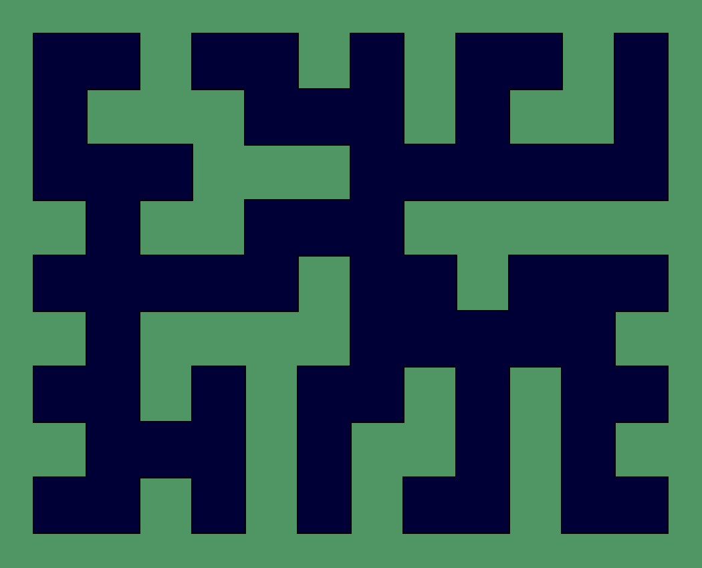

# Experiments in Generative Art
## Using Python, Processing, and P5.js

**Quick Links**
- **2022 Daily Sketches** | [Repo](https://github.com/Ram-N/generative_art/tree/main/daily_sketches) | Done using P5.js
- **2021 Daily Sketches** March-December 2021 | [Gallery](https://github.com/Ram-N/generative_art/blob/main/daily_sketches/2021.md) | [Repo](https://github.com/Ram-N/generative_art/tree/main/daily_sketches) | Done using P5.js
- **Genuary 2021** |Gallery| [repo](https://github.com/Ram-N/Genuary_2021) | [Github Pages](https://ram-n.github.io/Genuary_2021/) |
- **Hexagons** | [Gallery](https://ram-n.github.io/hexagons-gallery/) | [Repo](https://github.com/Ram-N/hexagons) | [Documentation](https://ram-n.github.io/hexagons/build/html/index.html) | Done using Matplotlib. The repo contains several Jupyter Notebooks, with examples.
- **[Images Thumbnail sheet](https://github.com/Ram-N/generative_art/blob/main/docs/contact_sheet.md)**. See if anything interests you and click on the image to go to its directory to find the code.
-**[Keywords-based](https://github.com/Ram-N/generative_art/blob/main/daily_sketches/keywords.md)** Daily sketches sorted based on certain keywords I use to group them.

*Note: I use p5.js. When I use Processing, it is almost always in the Python Mode.*

This is a repo to store several GenArt attempts. I use either p5, or Processing (in Python mode) to create art sketches.

This is a meta-repo, in the sense that it is a directory of directorys. Each sub-directory in the repo has the `code` as well as a set of `images` in the images directory (where applicable). The README.md in each directory explains what that particular experiment was about.

I try to make all my code available and runnable by others. There are many parameters that you can change and try to get your own results.

-----

- Experiments

    - Sinusoidal Sketches
        - [Circular Noise](#Circular-Noise)
        - [Torus](#Torus)

    - Maps
        - [Metro Maps](#Metro-Maps)

    - Image-Based 
        - [15-Puzzle](#15-puzzle)

-----

### Metro Maps | [Code](/metro_maps) | [images](metro_maps/images)

An experimental project that creates Metro Maps for imaginary cities.

What would the Metro (subway) map look like, for imaginary cities? Each time the code is run, it produces a
different set of Terminals, Routes, Junctions and Stations.

-----

### Ball Animations | [Code](/ball_animations) | [images](ball_animations/images)

A series of sketches on balls colliding, as well as balls dodging each other, avoiding collisions.

-----

### Dots and Dashes | [Code](/dots_and_dashes) | [images](dots_and_dashes/images)

Space filling and Space shrinking, rendered Algorithmically

-----

Please look through the directories in this repo, and check out the `images` folder in each. There are many 'experiments' for which I haven't yet added the descriptions.
