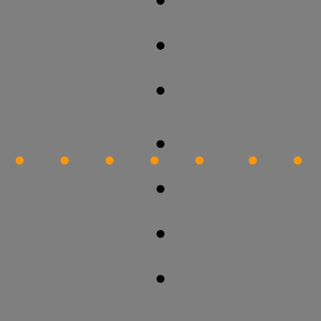
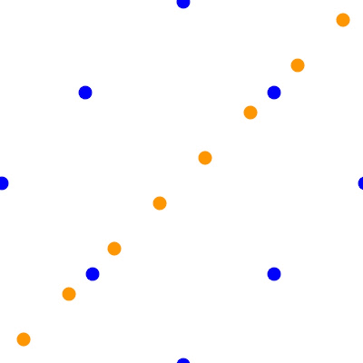

# Ball Crossing Animations

## The Basic Idea

Go through [01_ball_crossing_baiscs.py](01_ball_crossing_basics.py) to see the core idea.
One set of balls moves horizontally, another moves vertically. Timing is controlled by Speed, number of balls,
the canvas dimensions, all of which gives the optimal separation such that all collisions are avoided.

## All Across

## Pinballs

What if there were streams of balls that had close encounters, but managed to barely avoid collisions?

The code for Pinballs can be found in `02_pinballs.py`

