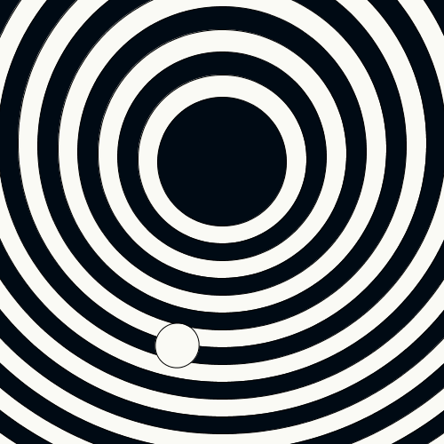

# Disco Disco

Basic idea: On a background of alternating circles, one 'ball' (disc) dances on an imaginary arc.
The height of the disc is a one-dimensional Perlin noise.

### Parts
Background: 
1. Draw circles, one on top of another. (Alternating colors)
2. Move their centers up, and jitter them slightly using Perlin noise.

Place a disc on the 'ground'
Move the disc (ball) up in one direction. Then down and up the other.
The disc is really a pendulum of varying height.

## Variations
- Quantum jump, when the disc/ball jumps from one concentric circle to the next.
I implemented it, but it was too jarring. So I abandoned it.

## Resources

- [1D Perlin noise](https://www.futurelearn.com/courses/creative-coding/0/steps/397)
