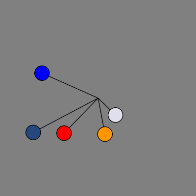
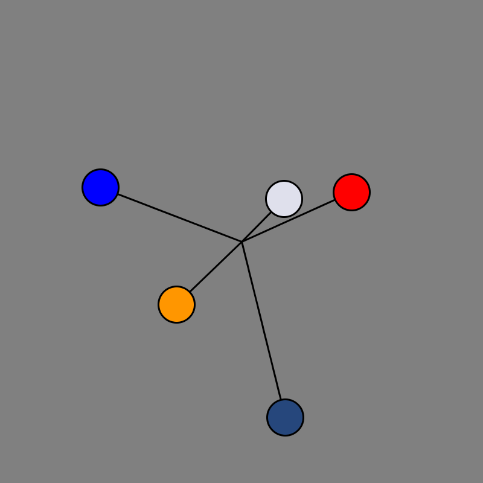

# Ball Animations - Pendulums

`ball.py` has the base Class for Balls. Building on that, we create a sub-class
called `Pendulum.` The following images and attempts use these.

## 01_Single_pendulum.py

One pendulum, rotating around a center. This is the pendulum object, at its most
basic.

## 02_Multiple_pendulums.py

Many pendulums, rotating around a common center

## 03_Collisions Multiple_pendulums.py

Many pendulums, rotating around a common center and collisions cause change of direction.

## 04_Multiple_pendulums.py

Many pendulums, rotating around a common center

## 05 Criss-cross

