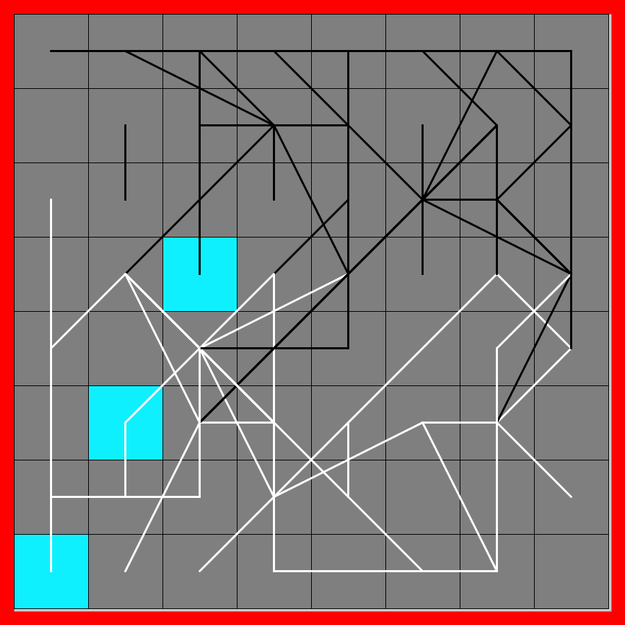
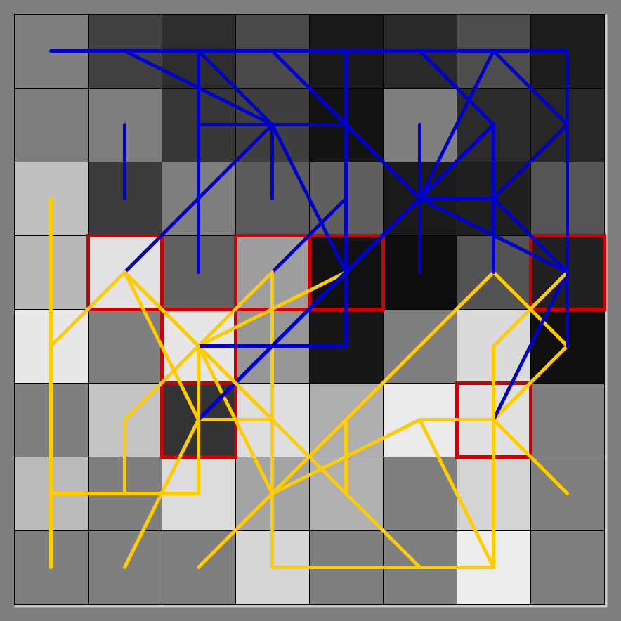

# Chess Art

`grid.py` is the file to display the board (squares).

## The Challenge At Hand

Given a chess game, given all its moves and the result, are there ways to represent that game on a chess board using lines, and colors
to convey some aspects of the game. (Don't use chess pieces if possible)
Can a game be 'condensed' into one static image?
- How much will animation help?
Can we show the battle areas, which side has an advantage, which side won. All that using lines and arrows and coloring squares?

## Ideas

1. Take a chess game (its PGN notation), and highlight several different aspects of the game through 'images'
2. For example: The color intensity of a square is proportional to the number of times it was occupied by a piece.
(This gives a sense of the "battle" spots)
4. Extending that, the Redness of a square equals the number of captures that happened there.
3. Piece Tours: Show how each of the 4 minor and 4 major pieces moved through the game for each player.
    Assign a unique color to each piece
    Draw A line from starting square to ending square.
    Line weight could be a function of piece importance: K, Q, R, B N
5. Show each move as a line. If a line is "taken" increase its weight.

## Preprocessing

* Not being a Processing purist for this one. I parse the PGN using regular Python, use Pandas to prepare my dataset,
and output several lists/dictionaries which I then use in my processing code.

* For example: 0-0 for white has to be parsed as (Ke1-g1 and Rh1-Rf1)

## Things to Do
2. End caps, move end circles?
3. Show capture squares with Colored Outlines. [ ] of different piece colors
4. Show Castling as one Bundle
2. Captures: From square and to square (Is this useful?)
3. Checks: From square and to square
5. Read multiple files and generate multiple plots
6. Opening, Middle Game, EndGame Split image into 3 images below the main one
7. 8 Queens in Adjust pixels.

## Completed
0. Need a UCI game generator (In Jupyter using python-chess)
1. Get piece paths generated for all 16 pieces.
2. Square gets darker the more it gets attention. (DONE but abandoned)
3. Show winner of game.
4. Five dots. N B R Q K (And keep track of which ones are occupied) - Nine didn't work due to overlaps
5. Piece color Line gets darker (or lighter as the game progresses.)
6. Add Title - Game Details

* https://www.cs.kent.ac.uk/people/staff/djb/uci-analyser/

### Interesting Side Note

The 8-Queens problem. I have never come across an actual use case where the 8-Queens problem was needed.
I had to find a "home" for all 8 pieces in each square such that there piece-paths never overlapped.
It turns out that the solution to the 8-Q problem is what was needed. Once I did that, the piece paths showed up
without overlapping! Interesting that a chess-based mathematical problem was needed.