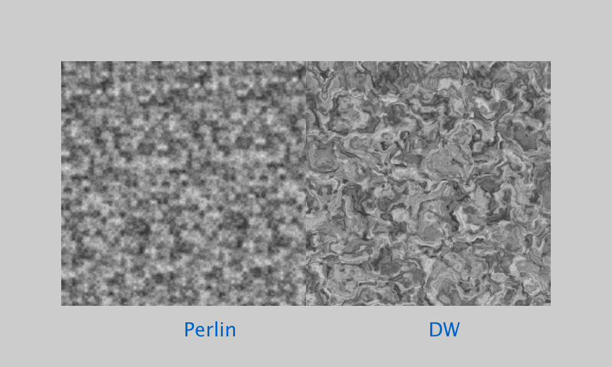
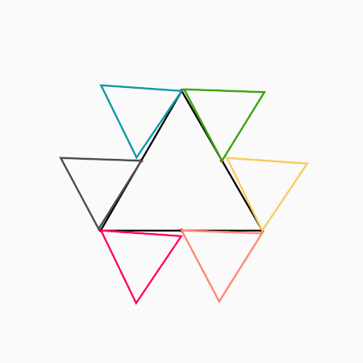
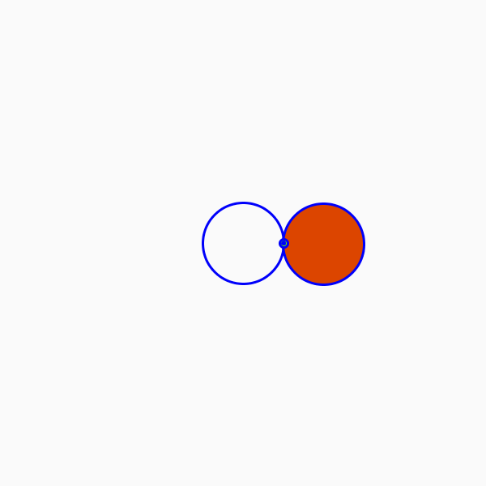
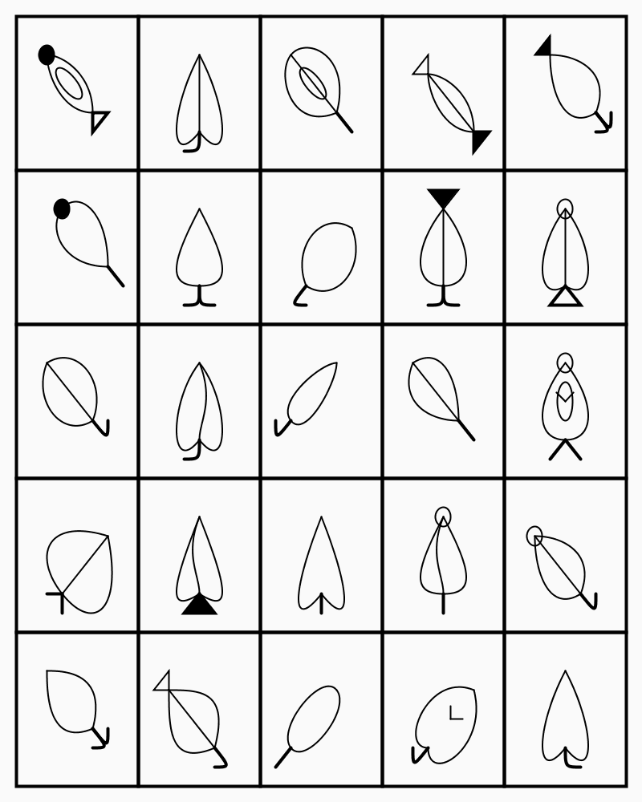
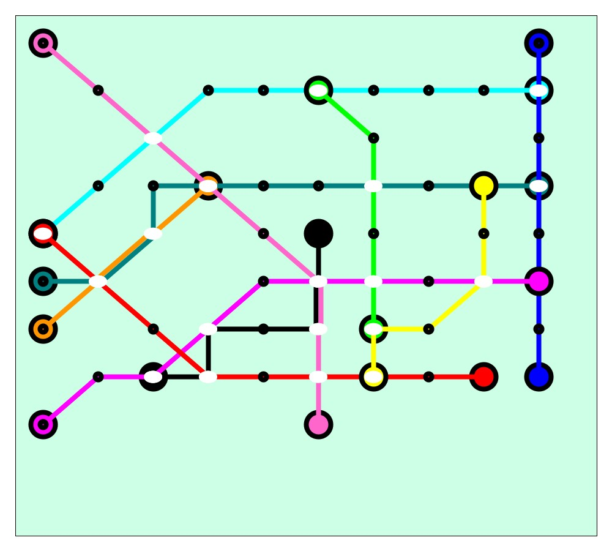
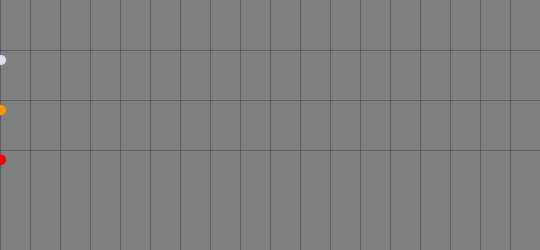
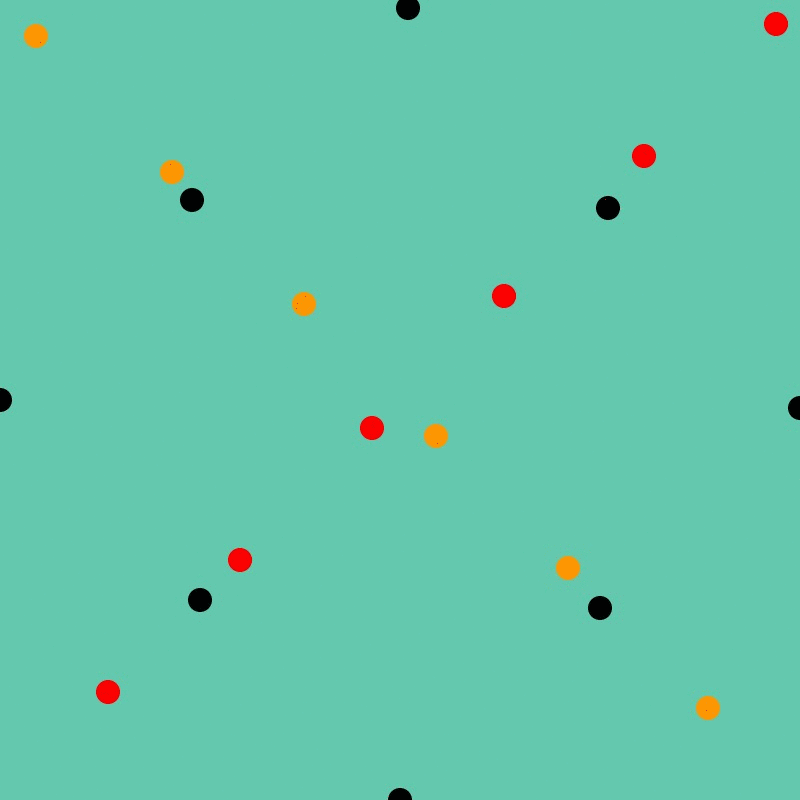
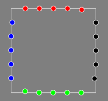
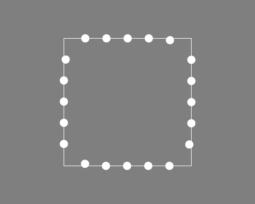

# Portfolio Contact Sheet
A quick reference of what I worked on at different points in time.
Reverse chronological order.

## `Contact Sheet of GenArt Created`

<table style="padding:10px">

[comment]: # (This a images link row) 
  <tr>
    <td> 
         
   </td>
    <td>
        
    </td>
   <td>
        
    </td>    
  </tr>

[comment]: # (This a description Row for the images above) 
  <tr> 
    <td> 
        Domain Warping Expts, 2020-10-10
    </td>
    <td> 
      <a href="geom_rollers">Geom Rollers</a>, 2020-09-30
    </td>
    <td> 
      <a href="chess_art">Chess Art</a>, 2020-09-20
    </td>
  </tr>

[comment]: # (This a spacer row) 
  <tr> 
    <td> 
           ___
    </td>
    <td> 
           ___
    </td>
    <td> 
           ___
    </td>
  </tr>

[comment]: # (This a images link row) 
  <tr>
    <td> 
        
    </td>
    <td>
        
    </td>
   <td>
        
    </td>    
  </tr>

[comment]: # (This a description Row for the images above) 
  <tr> 
    <td> 
        Connections Exercise, 2020-09-07
    </td>
    <td> 
        Disco Disco, 2020-09-06
    </td>
    <td> 
        Sinusoidal Grid, 2020-09-01
    </td>
  </tr>

[comment]: # (This a spacer row) 
  <tr> 
    <td> 
           ___
    </td>
    <td> 
           ___
    </td>
    <td> 
           ___
    </td>
  </tr>

[comment]: # (This a images link row) 
  <tr>
    <td>
        
    </td>
   <td>
        
    </td>    
    <td>
        
    </td>
  </tr>

[comment]: # (This a description Row for the images above) 
  <tr> 
    <td> 
        2-Circle Cardioid, 2020-09-01
    </td>
    <td> 
        Leafont, 2020-08-31
    </td>
    <td> 
        Curved Lines, 2020-08-23
    </td>
  </tr>

[comment]: # (This a spacer row) 
  <tr> 
    <td> 
           ___
    </td>
    <td> 
           ___
    </td>
    <td> 
           ___
    </td>
  </tr>

[comment]: # (This a images link row) 
  <tr>
     <td>
       
    </td>    
   <td>
        
    </td>    
   <td>
       
    </td>    
  </tr>

[comment]: # (This a description Row for the images above) 
  <tr> 
      <td> 
        Space Shrinking, 2020-08-12
    </td>
    <td> 
        Sinusoidal Balls, 2020-08-11
    </td>
    <td> 
        Diagonals & Bounces, 2020-08-08
    </td>
  </tr>
  
[comment]: # (This a spacer row) 
  <tr> 
    <td> 
           ___
    </td>
    <td> 
           ___
    </td>
    <td> 
           ___
    </td>
  </tr>

[comment]: # (COPY FROM HERE) 
[comment]: # (This a images link row) 
  <tr>
   <td>
       
   </td>    
   <td>
        
    </td>
   <td>
       
    </td>    
  </tr>

[comment]: # (This a description Row for the images above) 
  <tr> 
    <td> 
        9x9 Criss Crosses, 2020-08-06
    </td>
    <td> 
        Endless Collisions, 2020-08-04
    </td>
    <td> 
        Ferris, 2020-07-31
    </td>
  </tr>
  
[comment]: # (This a spacer row) 
  <tr> 
    <td> 
           ___
    </td>
    <td> 
           ___
    </td>
    <td> 
           ___
    </td>
  </tr>

[comment]: # (COPY FROM HERE) 
[comment]: # (This a images link row) 
  <tr>
   <td>
        
    </td>    
    <td>
        
    </td>
    <td>
        
    </td>
  </tr>

[comment]: # (This a description Row for the images above) 
  <tr> 
    <td> 
        Circular Noise 1, 2020-07-29
    </td>
    <td> 
        Orderly Noise, 2020-07-28
    </td>
    <td> 
        MetroMapper, 2020-07-26
    </td>
  </tr>
  
[comment]: # (This a spacer row) 
  <tr> 
    <td> 
           ___
    </td>
    <td> 
           ___
    </td>
    <td> 
           ___
    </td>
  </tr>

[comment]: # (COPY FROM HERE) 
[comment]: # (This a images link row) 
  <tr>
   <td>
        
    </td>    
    <td>
        
    </td>
   <td>
        
   </td>    
  </tr>

[comment]: # (This a description Row for the images above) 
  <tr> 
    <td> 
        15_Puzzle, 2020-07-20
    </td>
    <td> 
        Torus Study, 2020-07-12
    </td>
    <td> 
        CoronSine Study, 2020-07-10
    </td>
  </tr>
  
[comment]: # (This a spacer row) 
  <tr> 
    <td> 
           ___
    </td>
    <td> 
           ___
    </td>
    <td> 
           ___
    </td>
  </tr>

[comment]: # (ROW SET ENDS Here) 

[comment]: # (COPY FROM HERE) 
[comment]: # (This a images link row) 
  <tr>
   <td>
        
    </td>
    <td>
        
    </td>
   <td>
        
   </td>    
  </tr>

[comment]: # (This a description Row for the images above) 
  <tr> 
    <td> 
        Multicolor Trapeze, 2020-07-09
    </td>
    <td> 
        White Trapeze Balls, 2020-07-08
    </td>
    <td> 
        Ferris Wheel
    </td>

  </tr>
  
[comment]: # (This a spacer row) 
  <tr> 
    <td> 
           ___
    </td>
    <td> 
           ___
    </td>
    <td> 
           ___
    </td>
  </tr>

[comment]: # (ROW SET ENDS Here) 

</table>

