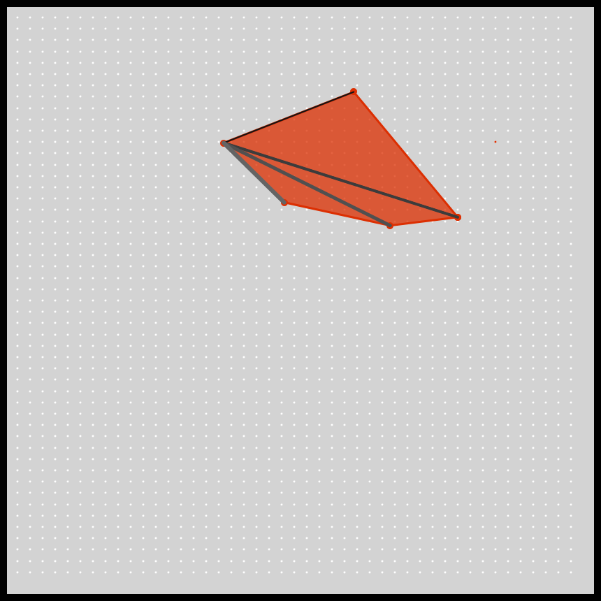

# DAILY SKETCH for 2021-03-09

## Done using P5.js

### Description

This is a work in progress. I still have to write the code to test if a given point is inside a convex shape.

When possible I work for these `daily sketches` which are meant to be quick explorations     on whatever has me interested that day. This code is not typically optimized, but I share it as-is     for anyone interested.

[Code](2021-03-09) 

Here are some of the images that were generated.

 
 

### Reference
- https://youtu.be/aoxOPx2BIHE which uses the cross product changing signs to detect the triangular sector, and then whether it is in or out.

[More Images](2021-03-09/images) 

