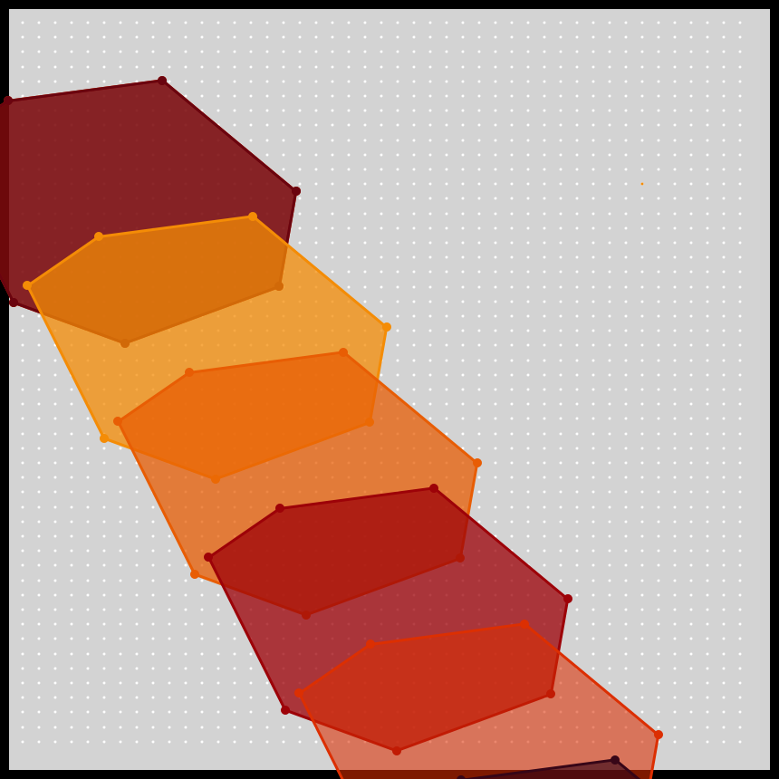
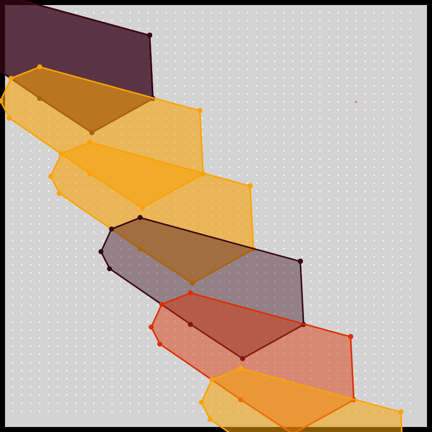

# DAILY SKETCH for 2021-03-10

## Done using P5.js

### Description

Still very much a work in progress.
I am able to duplicate a convex shape and move it around.
But whether a point is internal to the shape is still to be implemented.

When possible I work for these `daily sketches` which are meant to be quick explorations     on whatever has me interested that day. This code is not typically optimized, but I share it as-is     for anyone interested.

[Code](2021-03-10) 

Here are some of the images that were generated.

 
 
 

[More Images](2021-03-10/images) 

