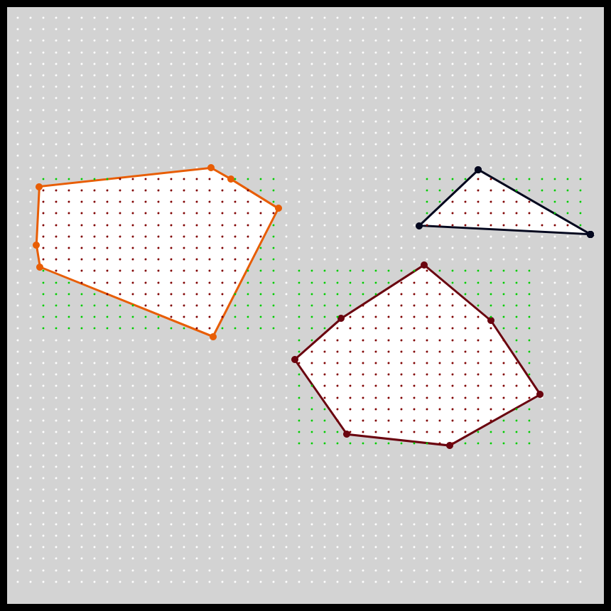
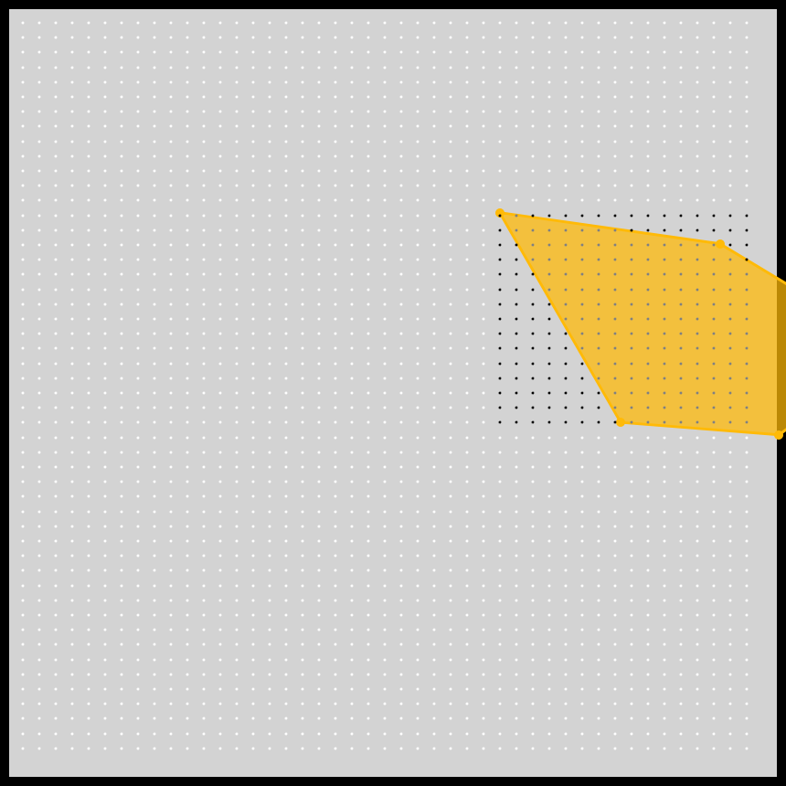

# DAILY SKETCH for 2021-03-11

## Done using P5.js
 

### Description

Work in Progress.

I am now able to find all the points inside a given convex polygon. Next step is to draw
them such that they don't overlap. That is the goal for tomorrow. This is taking longer than I expected, but
at least I am making progress daily.

When possible I work for these `daily sketches` which are meant to be quick explorations     on whatever has me interested that day. This code is not typically optimized, but I share it as-is     for anyone interested.

[Code](2021-03-11) 

Here are some of the images that were generated.

 
 
 

[More Images](2021-03-11/images) 

