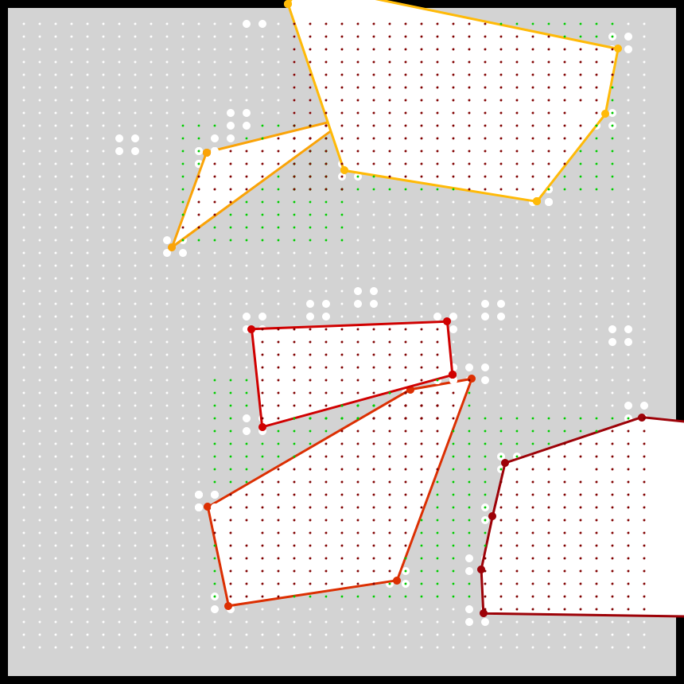
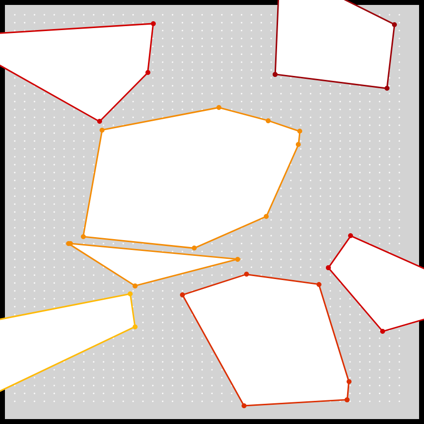
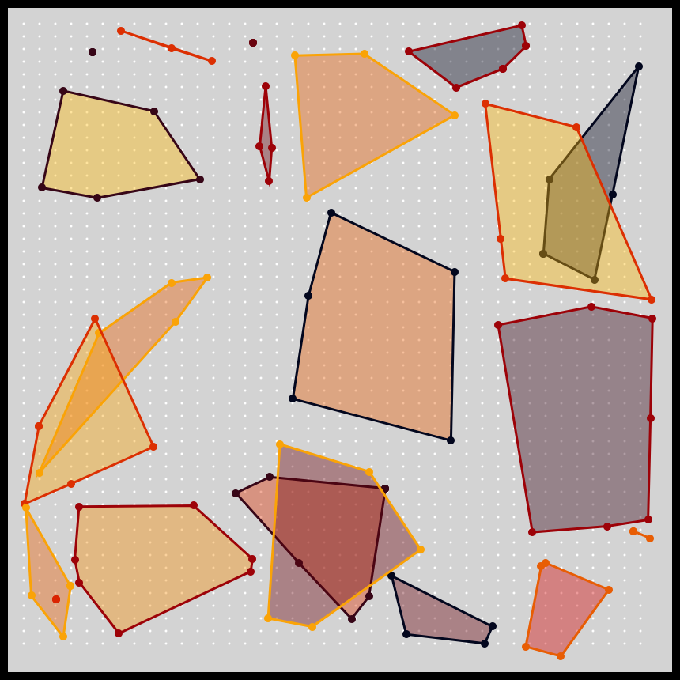
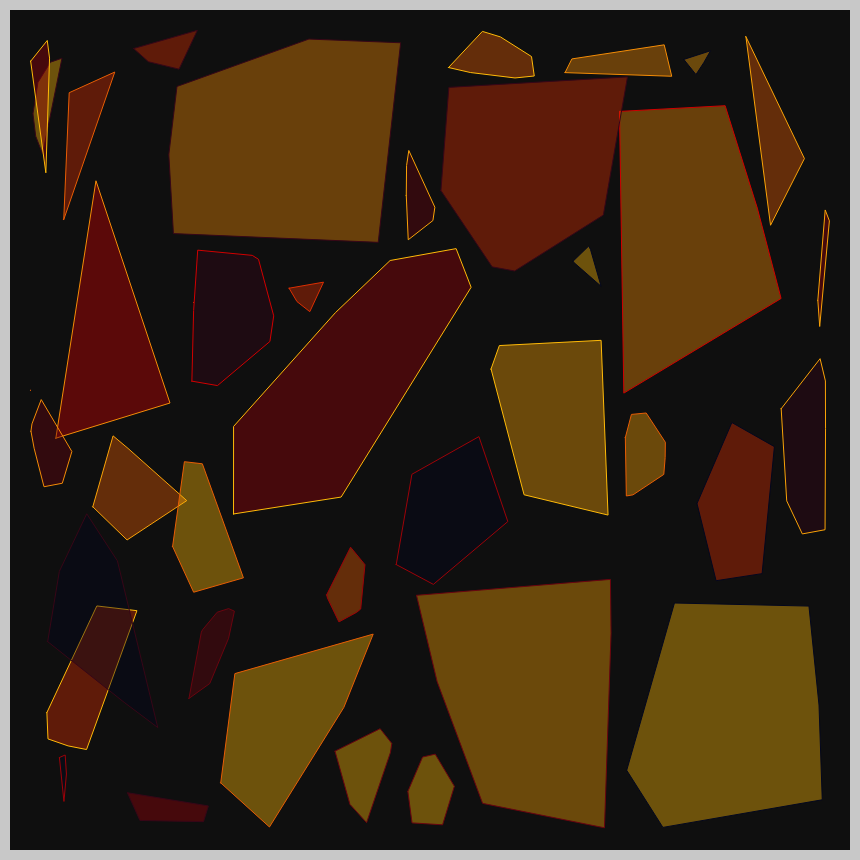

# DAILY SKETCH for 2021-03-13

## Done using P5.js

 

### Description

The non-overlaps is almost working. I need to check all the internal points, not just the hull vertices.
Also, need to move the shapes around to get more "successful placements."

When possible I work for these `daily sketches` which are meant to be quick explorations     on whatever has me interested that day. This code is not typically optimized, but I share it as-is     for anyone interested.

[Code](2021-03-13) 

Here are some of the images that were generated.

 
 
 
 
 

[More Images](2021-03-13/images) 

