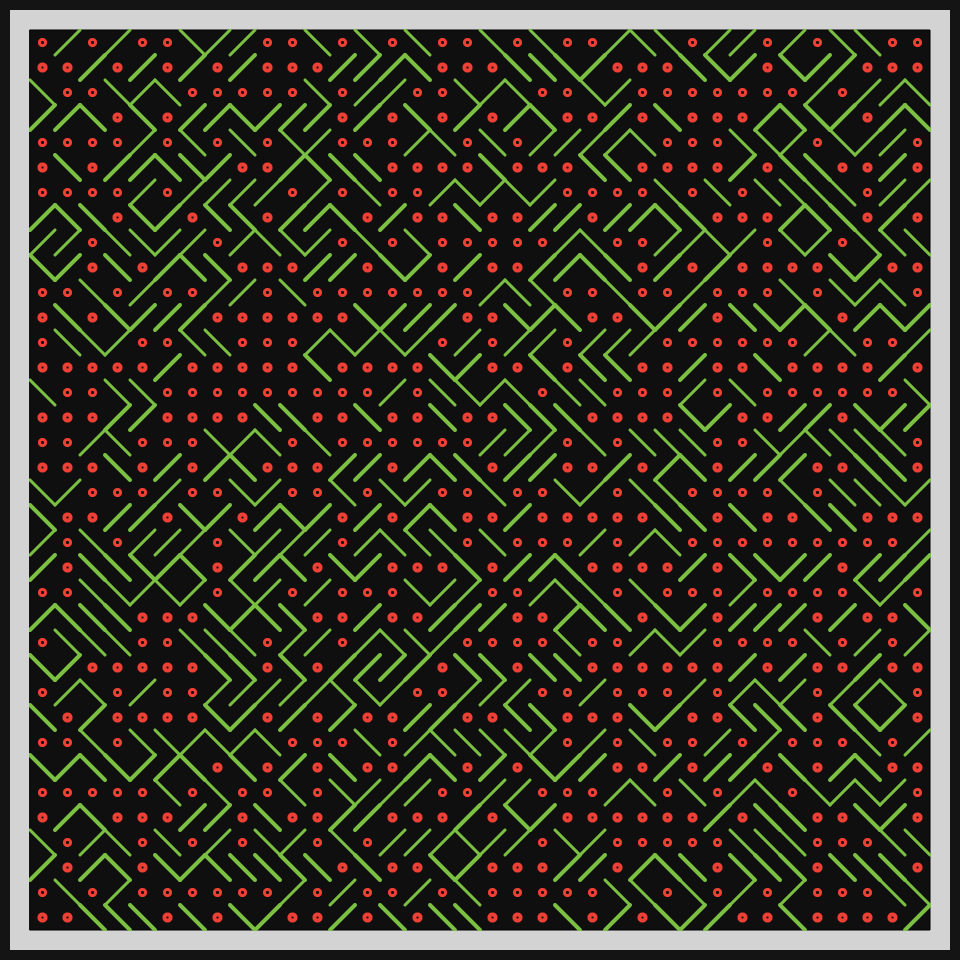
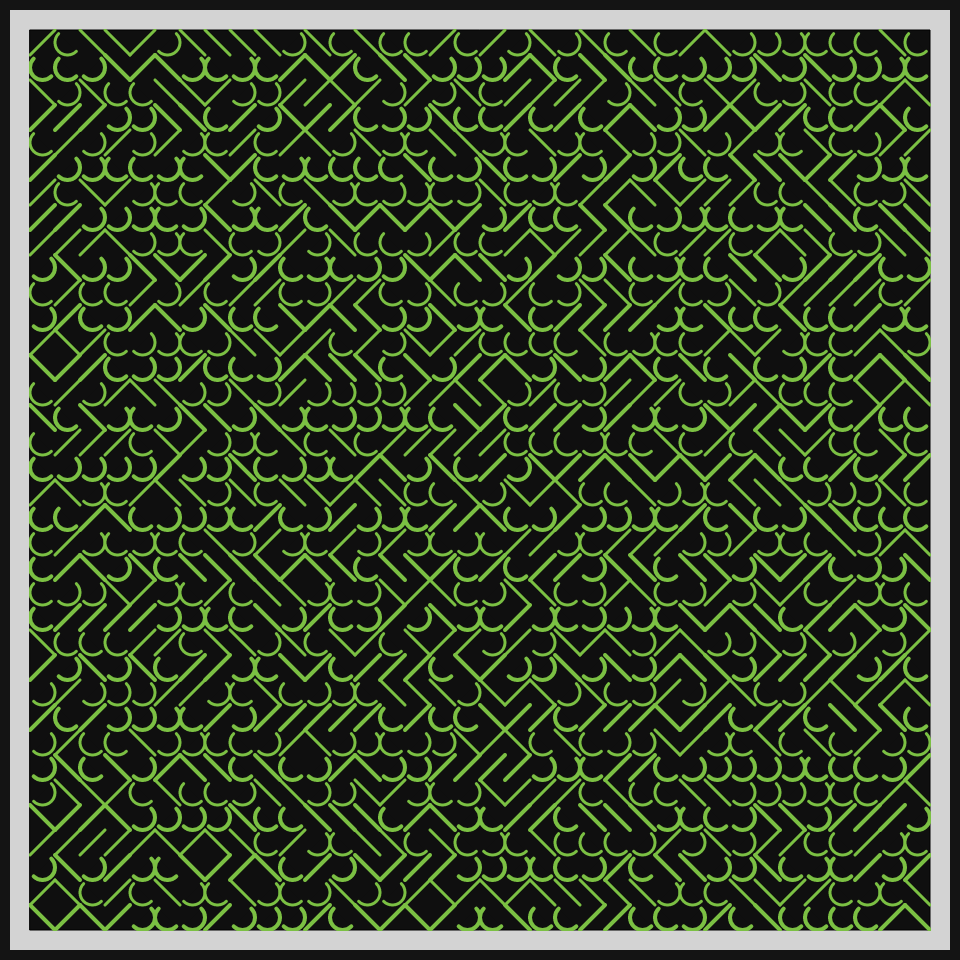
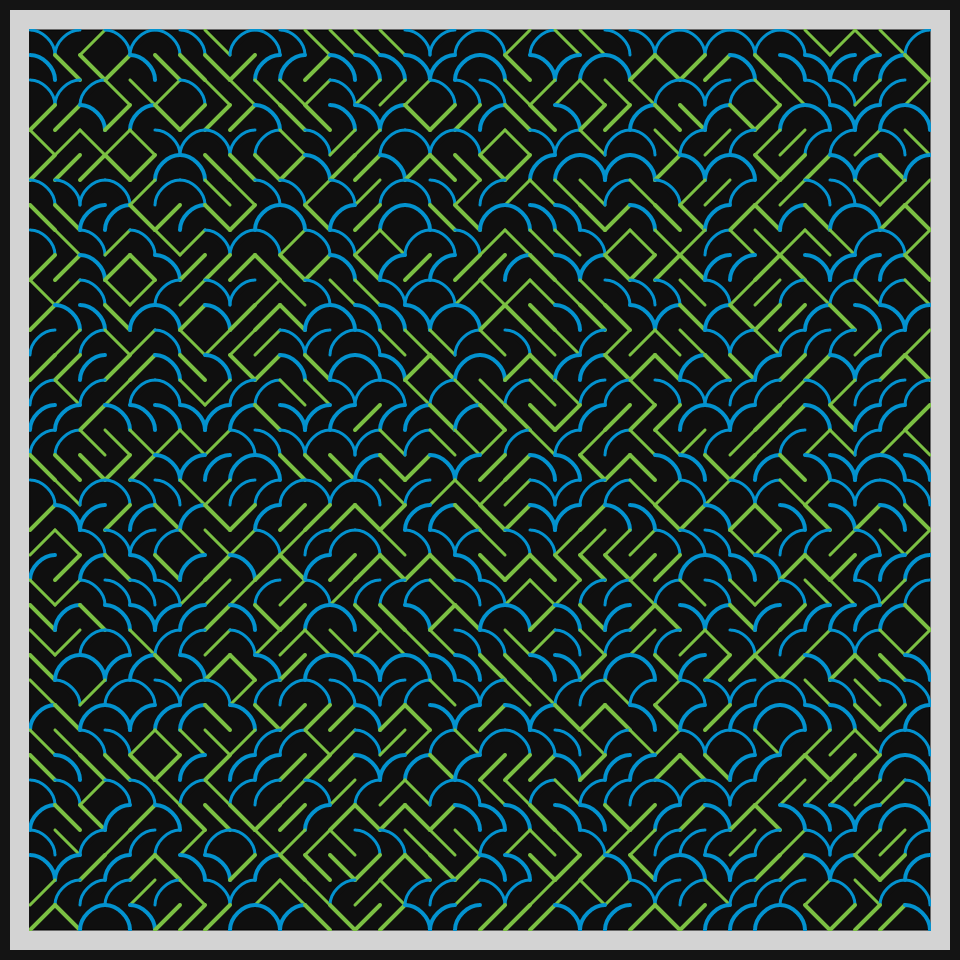

# DAILY SKETCH for 2021-04-14

## Done using P5.js

### Description

These `daily sketches` which are meant to be quick explorations     on whatever topic interested me on that day. This code is not typically optimized, but I share it as-is     for anyone interested.

[Code](2021-04-14) 

Here are some of the images that were generated.

 
 
 
 

[More Images](2021-04-14/images) 

