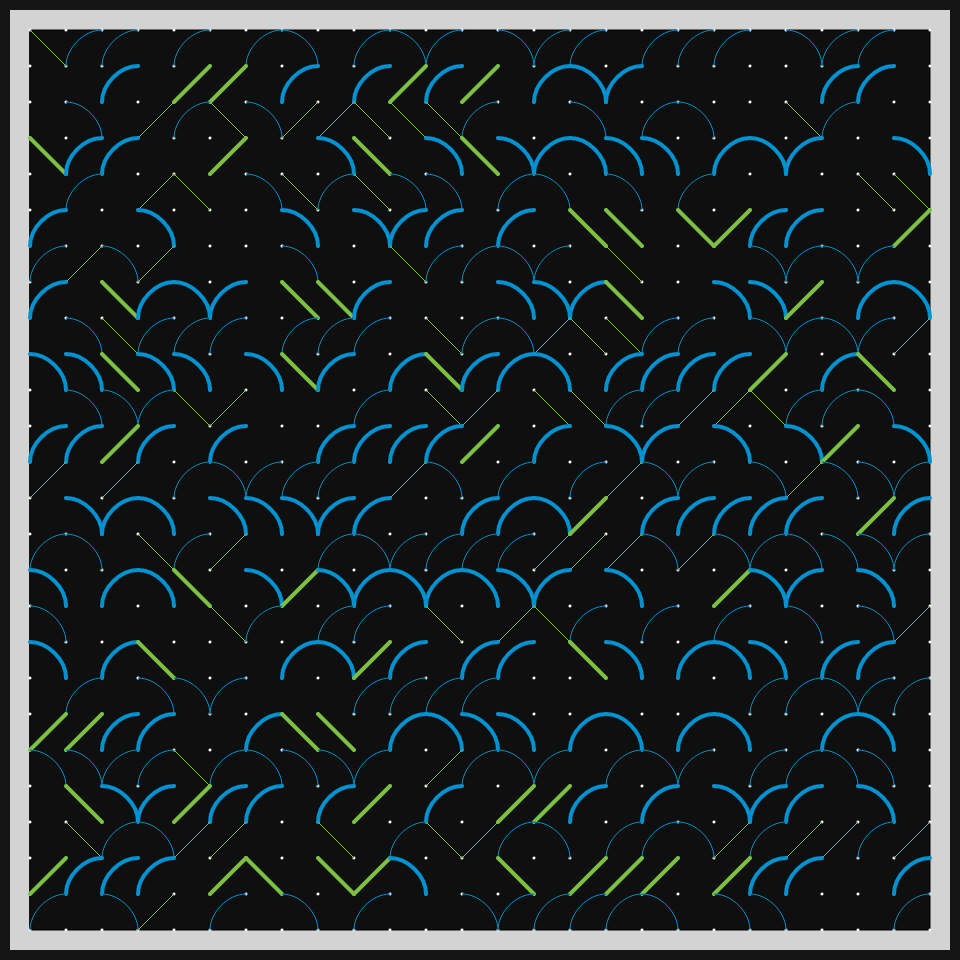
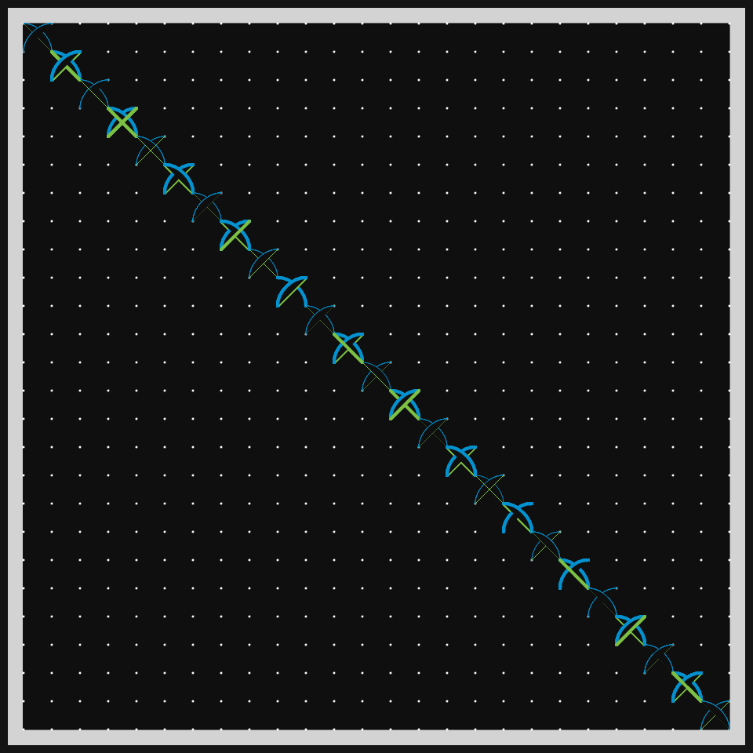
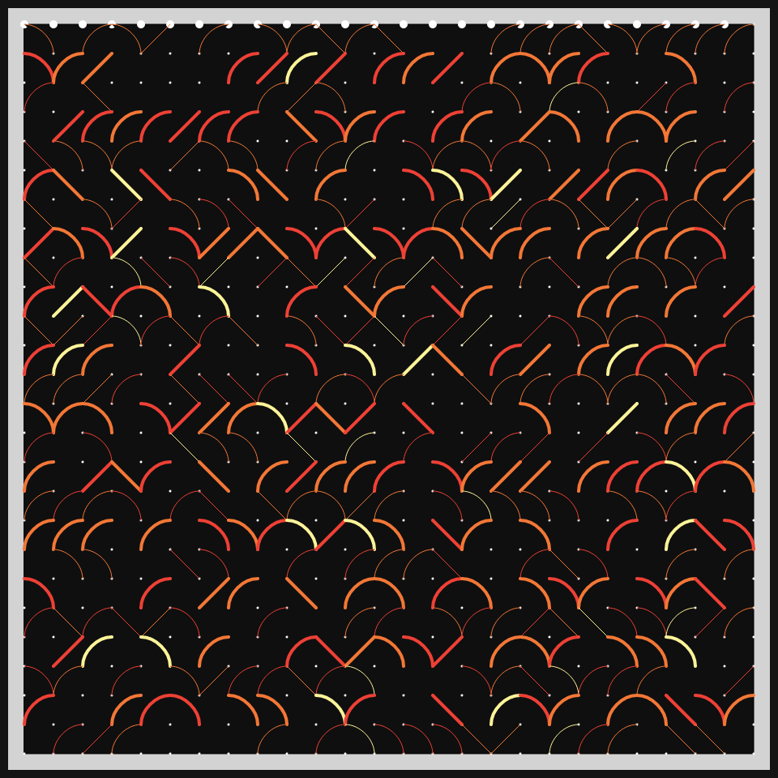

# DAILY SKETCH for 2021-04-15

## Done using P5.js

### Description

These `daily sketches` which are meant to be quick explorations     on whatever topic interested me on that day. This code is not typically optimized, but I share it as-is     for anyone interested.

[Code](2021-04-15) 

Here are some of the images that were generated.

 
 
 
 

[More Images](2021-04-15/images) 

## 2021-04-15

Keywords: 10Print variations
 

 Keep track of every grid point. Note how many line segments end there - 0, 1 or 2.
 Based on that value, new line segments are drawn, below.
 The idea is that continuous "Strands" will flow from top to bottom.
 

Made using P5.js. | [Code](2021/2021-04-15/)| 

-----

