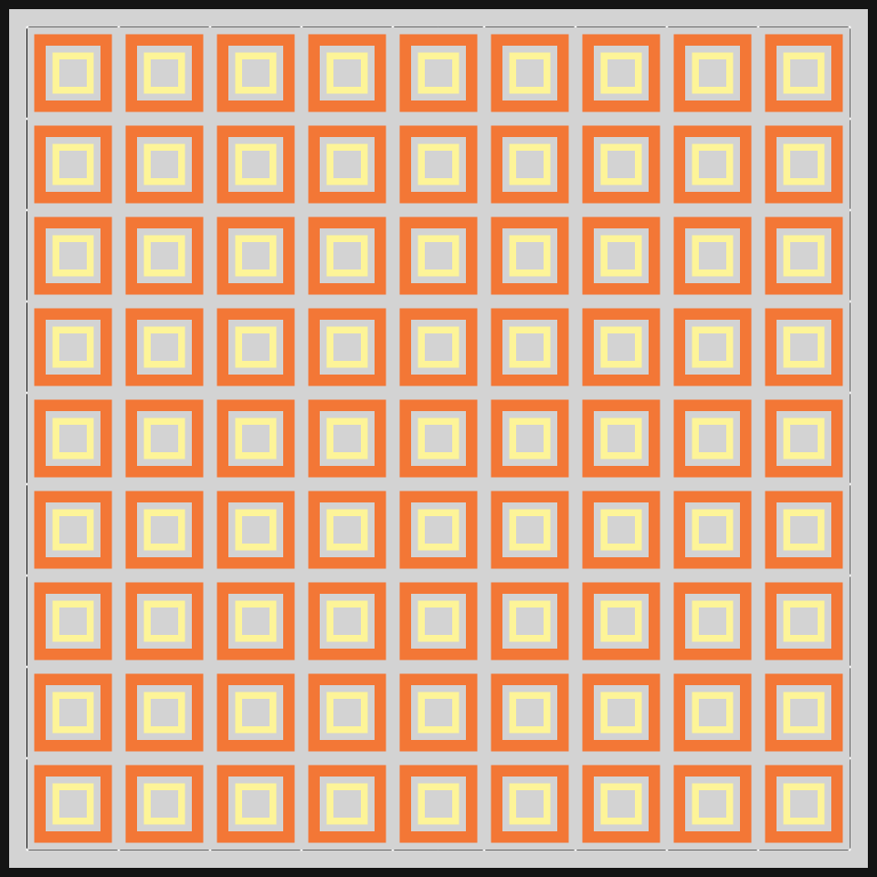
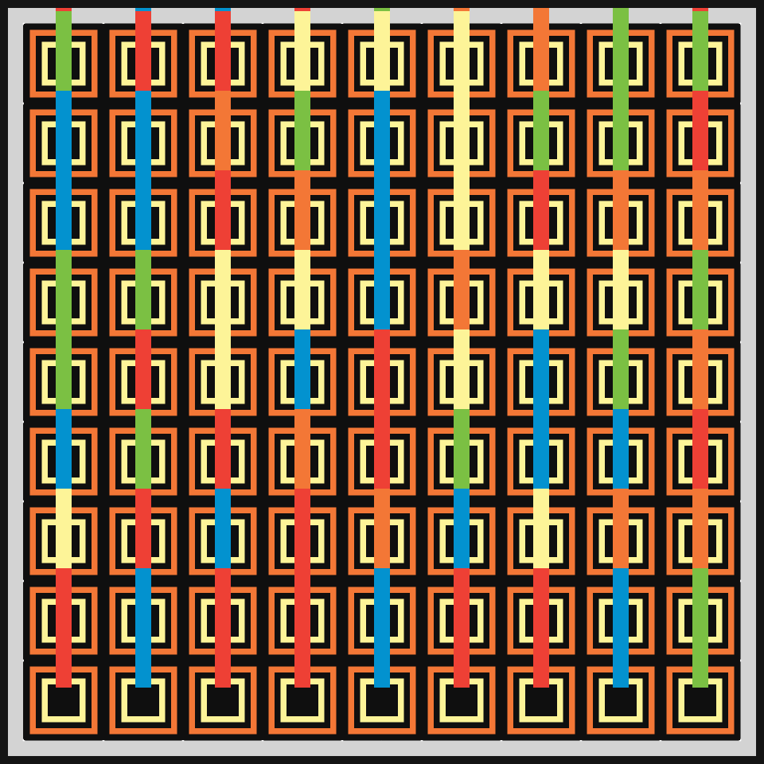
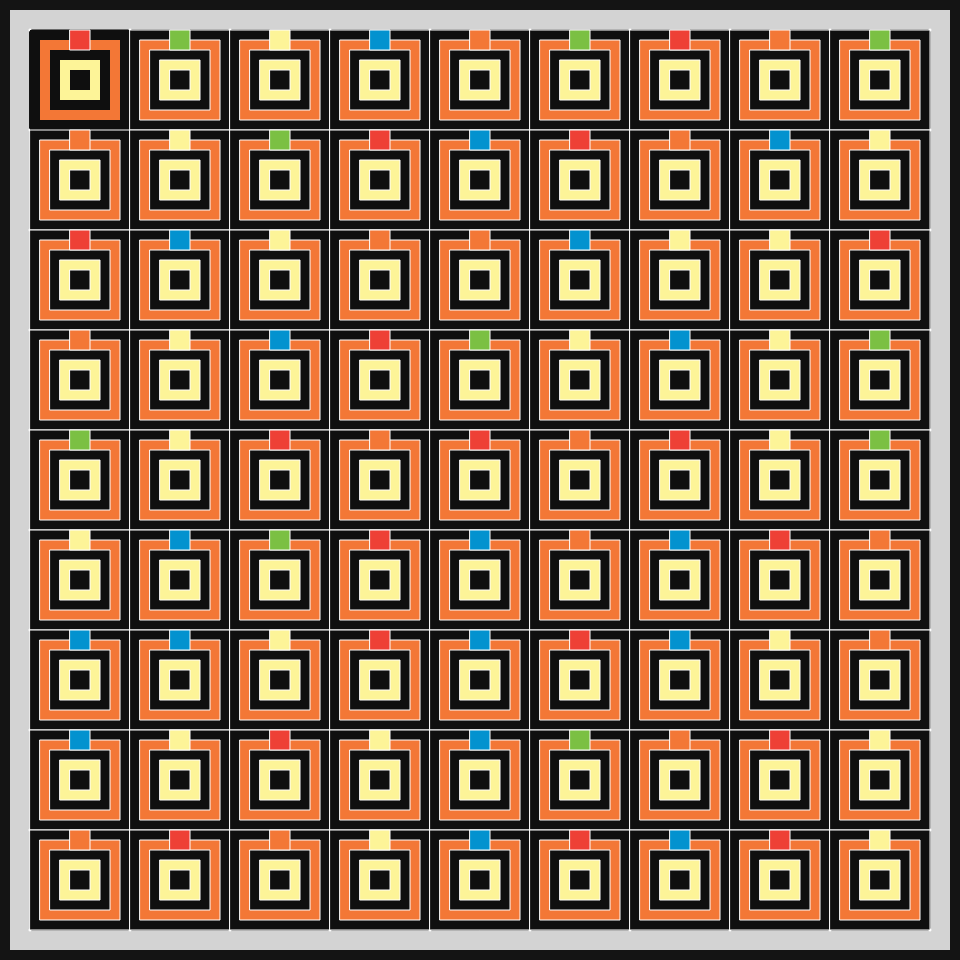
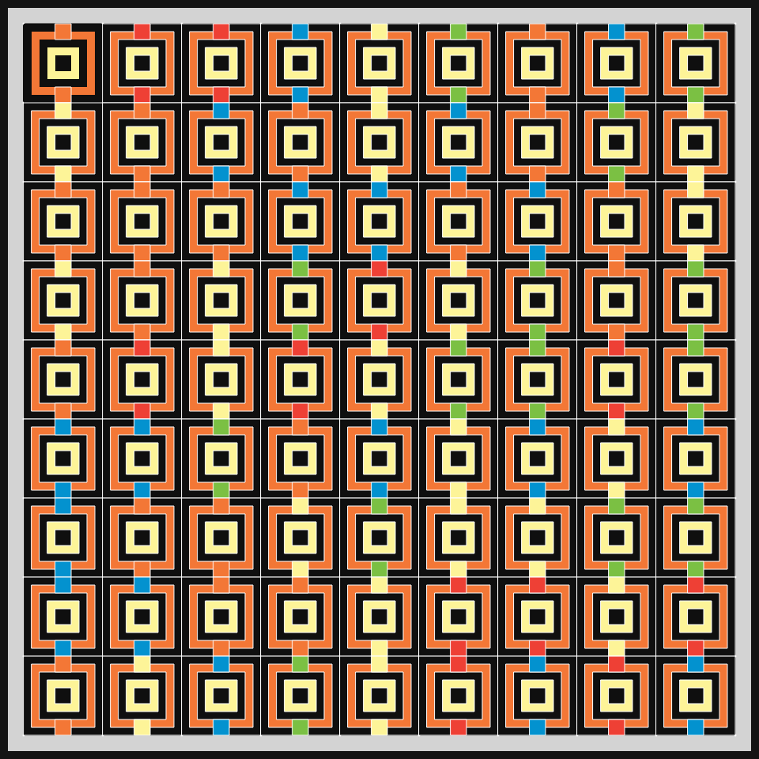
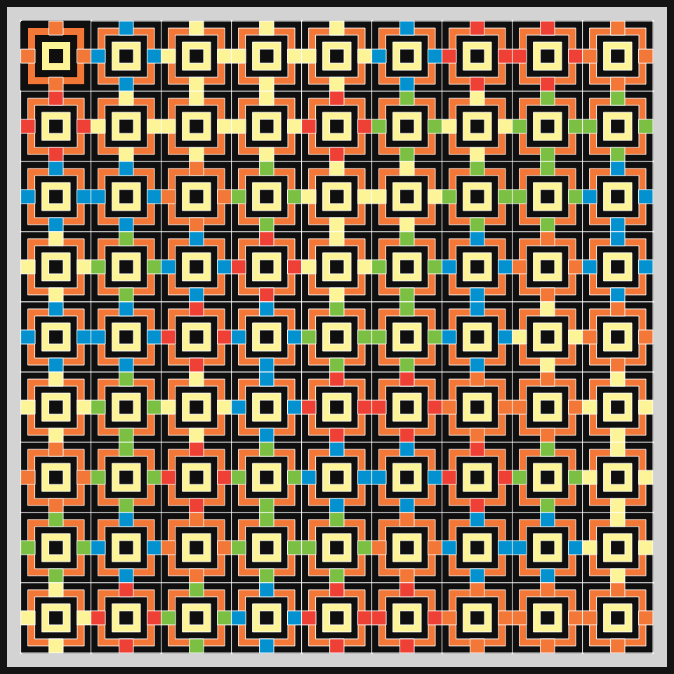
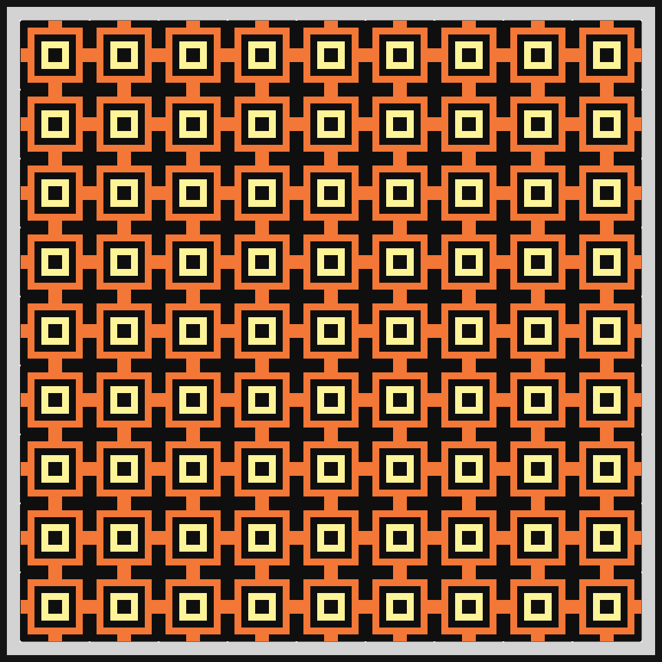

# DAILY SKETCH for 2021-04-16

## Done using P5.js

### Description

These `daily sketches` which are meant to be quick explorations     on whatever topic interested me on that day. This code is not typically optimized, but I share it as-is     for anyone interested.

[Code](2021-04-16) 

Here are some of the images that were generated.

 
 
 
 
 
 
 
 

[More Images](2021-04-16/images) 

## 2021-04-16
Keywords: Celtic pattern, Squares, Tiling
 

## Description 

 This is a classic Celtic pattern, based on overlapping squares. The appeal is that it
 sort of looks like they are all interconnected.
 

Made using P5.js. | [Code](2021/2021-04-16/)| 

-----

