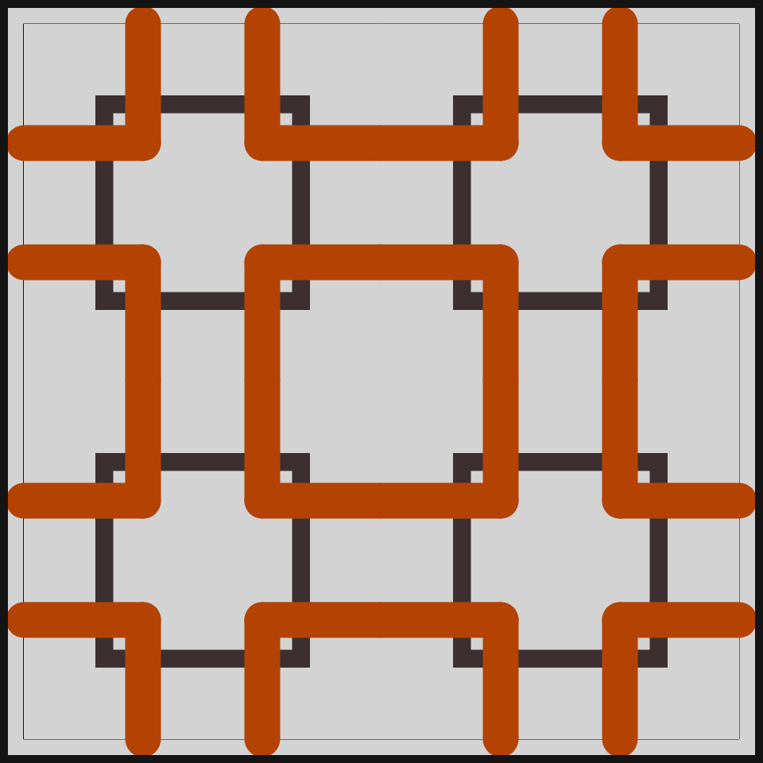
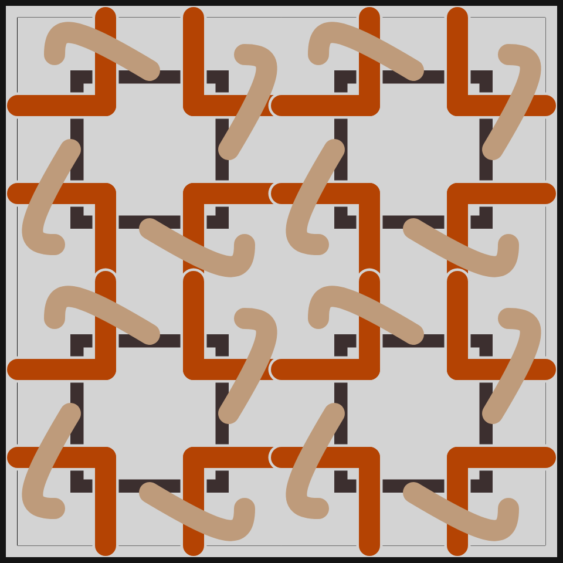
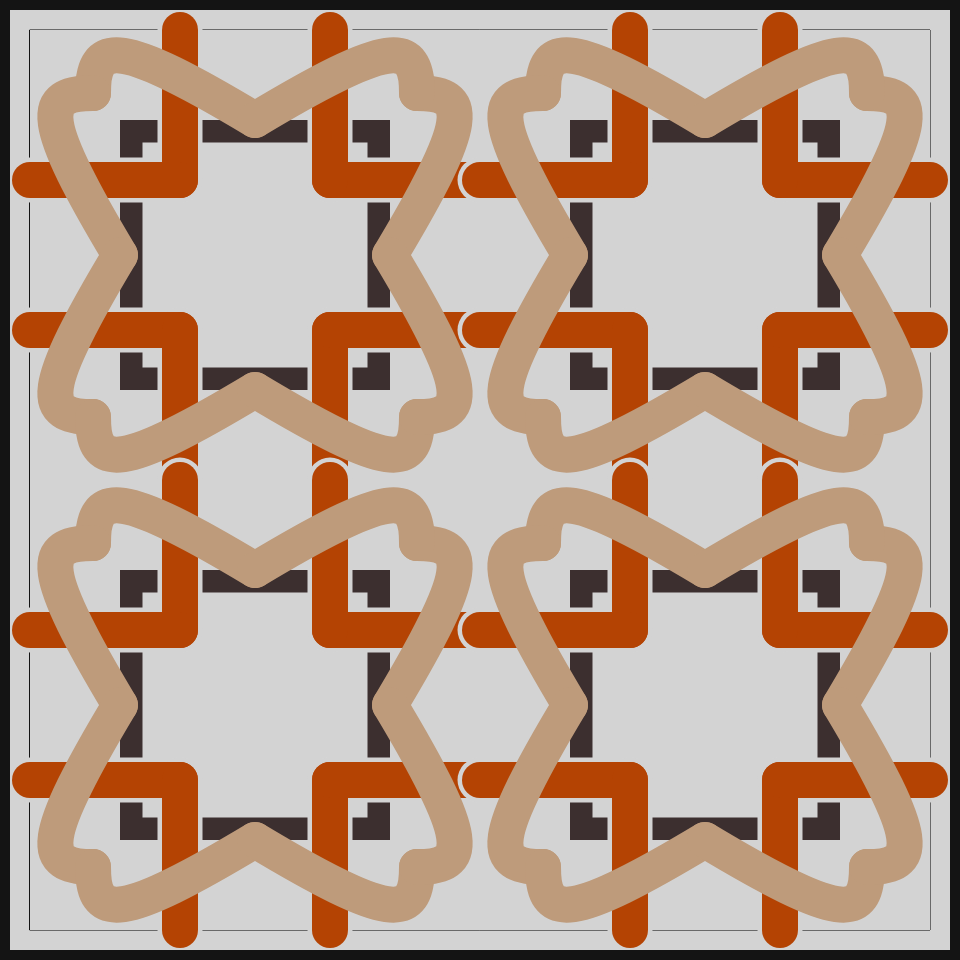
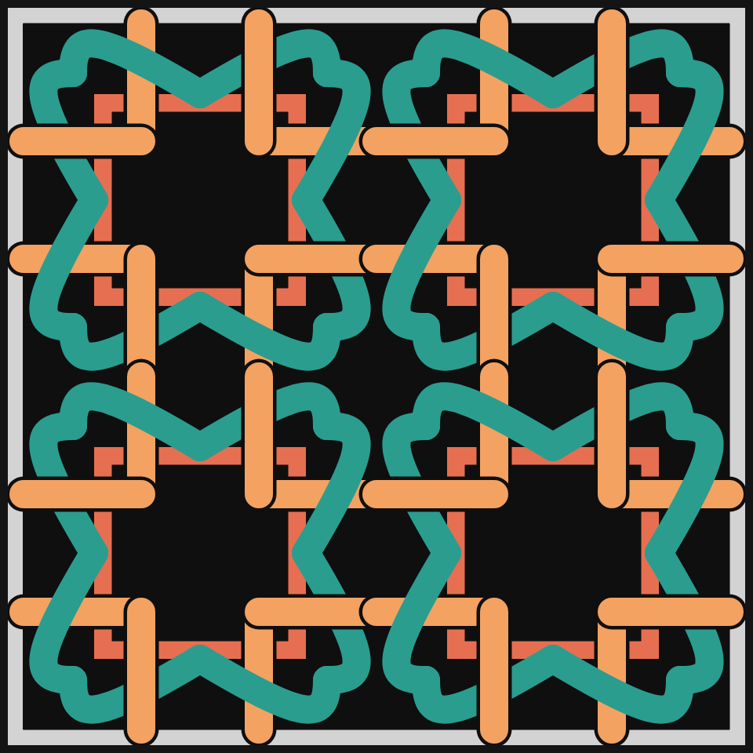
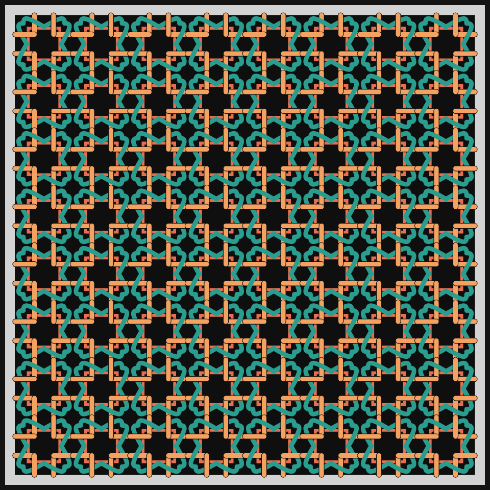

# DAILY SKETCH for 2021-04-19

## Done using P5.js

### Description

These `daily sketches` which are meant to be quick explorations     on whatever topic interested me on that day. This code is not typically optimized, but I share it as-is     for anyone interested.

[Code](2021-04-19) 

Here are some of the images that were generated.

 
 
 
 
 
 

[More Images](2021-04-19/images) 

## 2021-04-19
Keywords: Squares, Tiling
 

## Description 

 This is another classic Celtic pattern, based on overlapping squares. 
 L-shaped segments create squares when 4 tiles meet. 3 different colors in this one tiling. 

Made using P5.js. | [Code](2021/2021-04-19/)| 

-----

