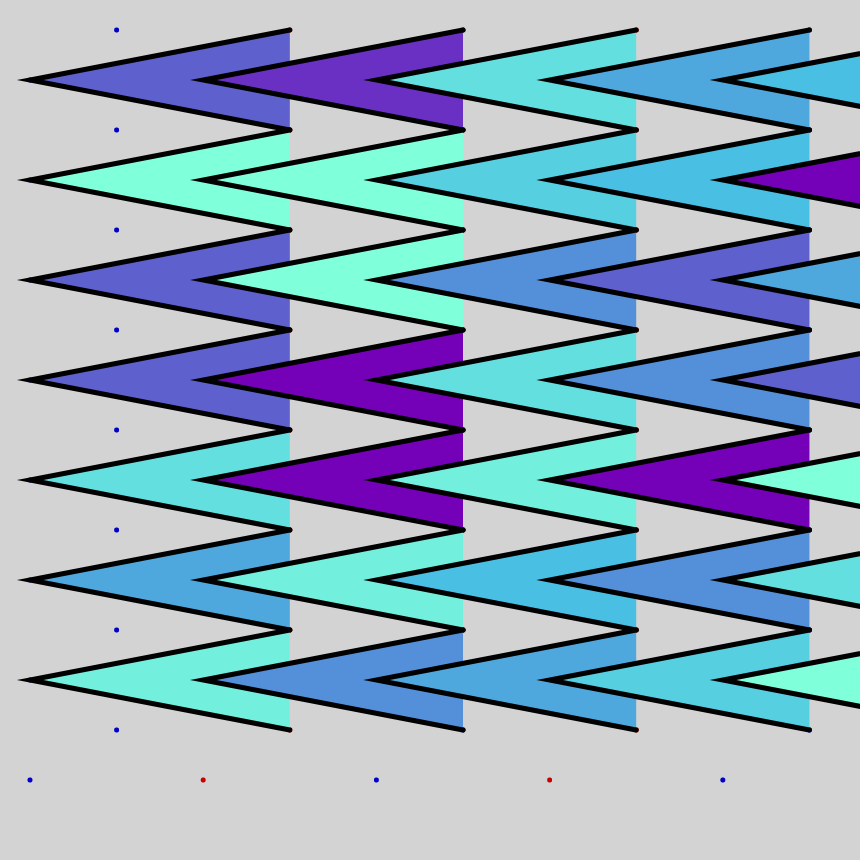
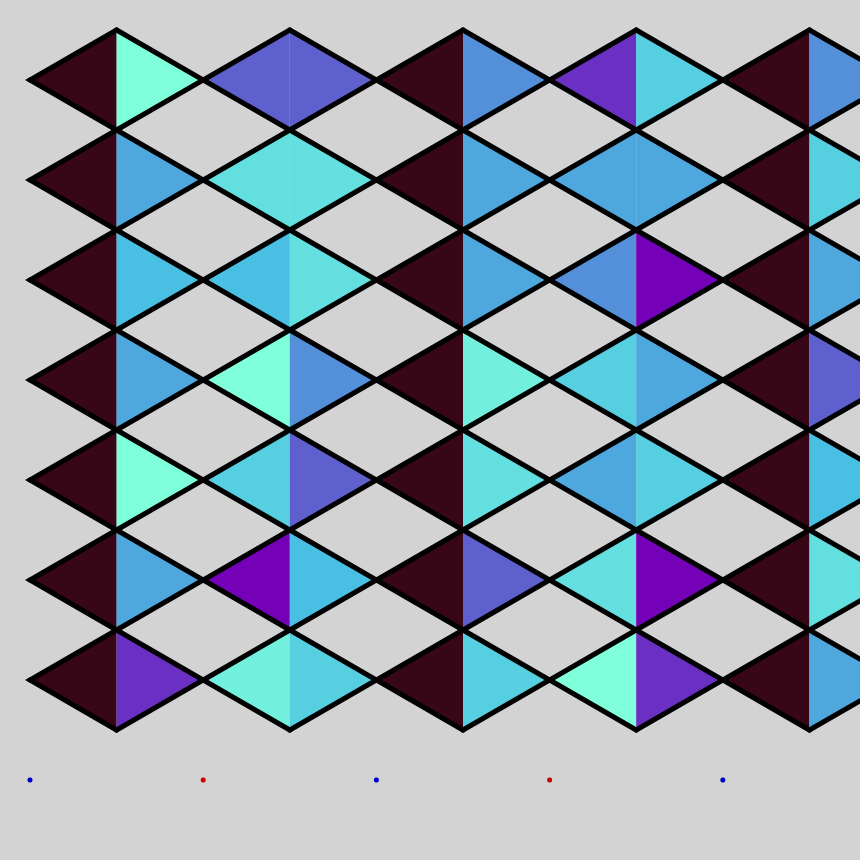
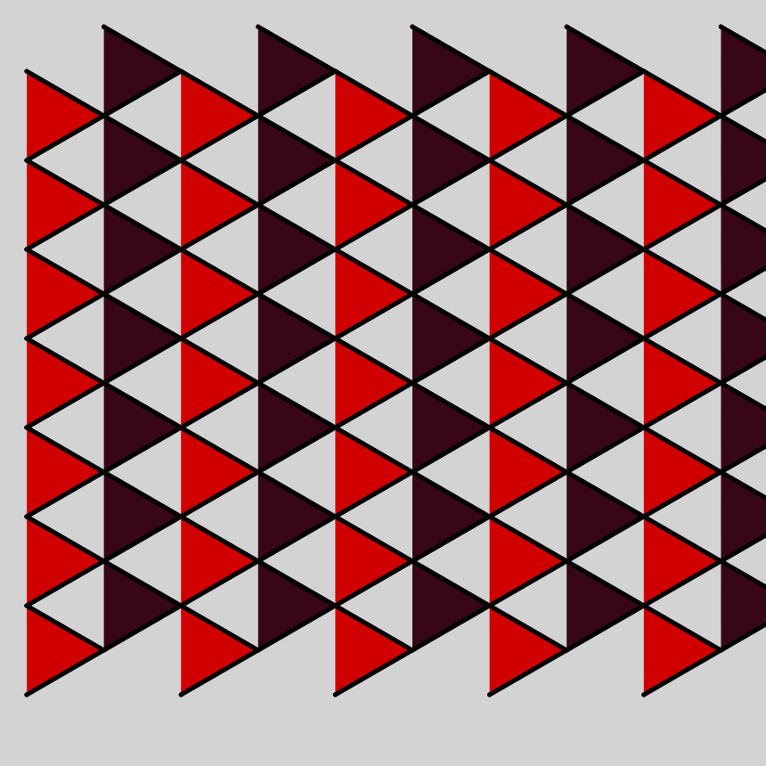
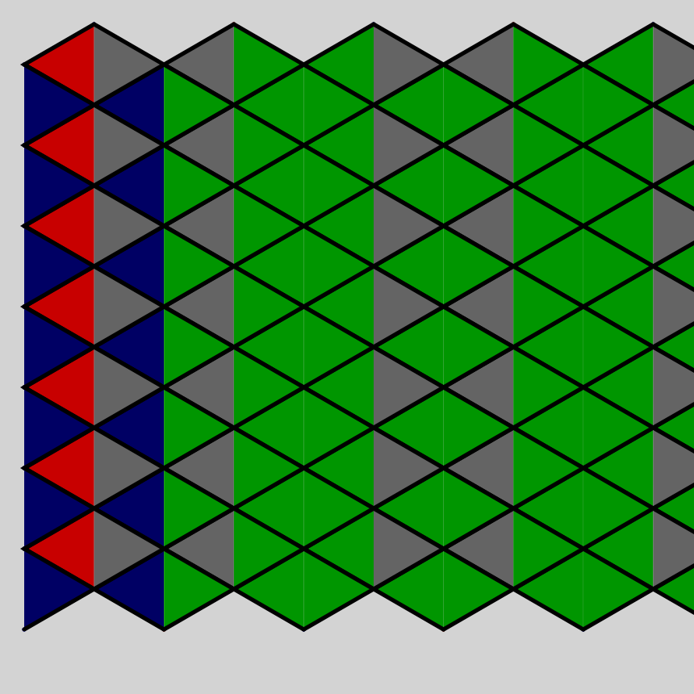
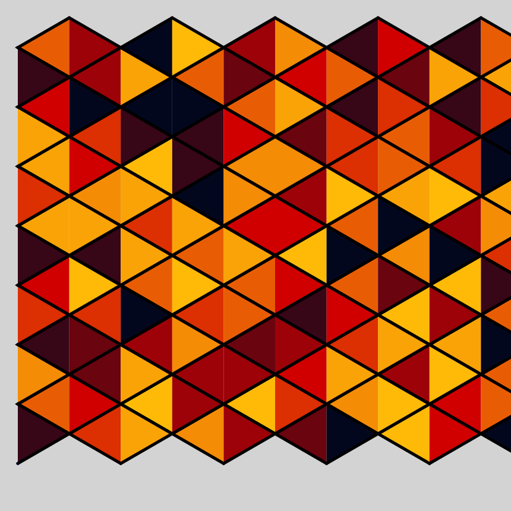

# DAILY SKETCH for 2021-04-24

## Done using P5.js

### Description

These `daily sketches` which are meant to be quick explorations     on whatever topic interested me on that day. This code is not typically optimized, but I share it as-is     for anyone interested.

[Code](2021-04-24) 

 
 
 
 
 
 
 

## Progression of Images that were generated.

 
 
 
 
 
 
 

[More Images](2021-04-24/images) 

## 2021-04-24
Keywords: isometric grid, isometric triangles 

## Description 

 Placing cubes (hexagons) on an isometric grid. The transparent colors lead to interesting effects.
 

Made using P5.js. | [Code](2021/2021-04-24/)| 

-----

