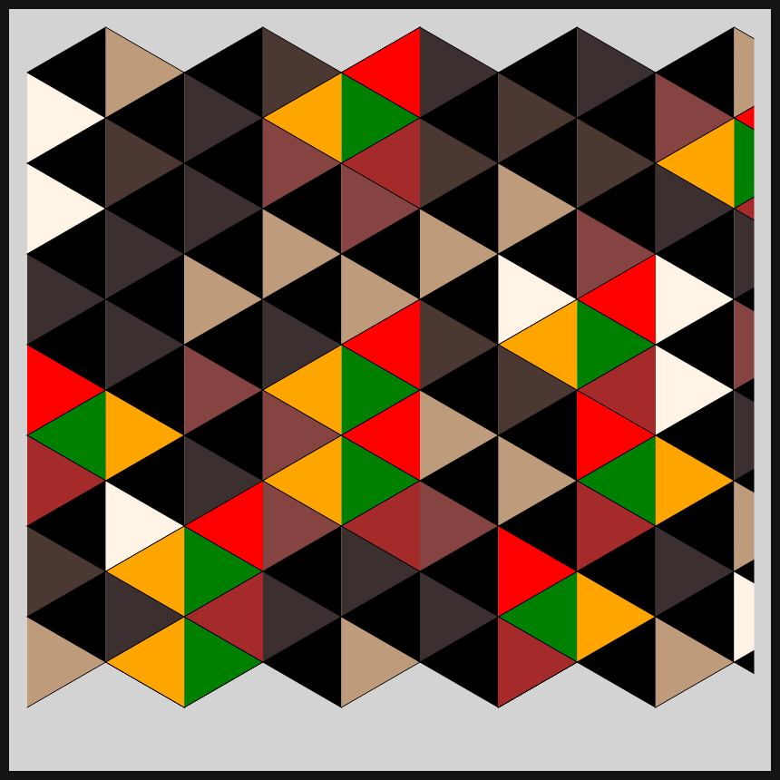
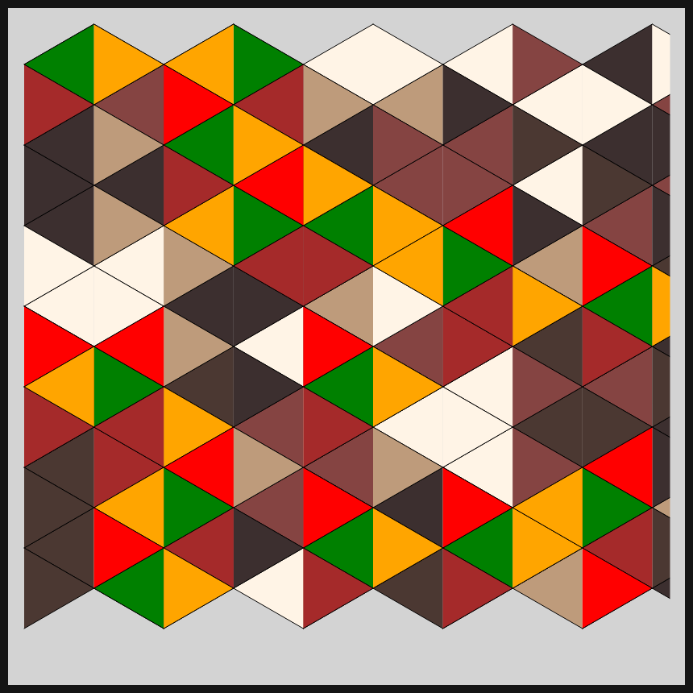
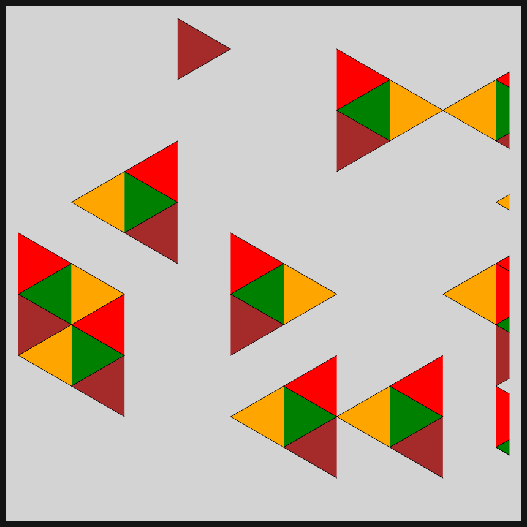

# DAILY SKETCH for 2021-04-26

## Done using P5.js

### Description

These `daily sketches` which are meant to be quick explorations     on whatever topic interested me on that day. This code is not typically optimized, but I share it as-is     for anyone interested.

[Code](2021-04-26) 

    

## Progression of Images that were generated.

 
 
 
 

[More Images](2021-04-26/images) 

## 2021-04-26
Keywords: isometric grid, isometric triangles 

## Description 

 Isometric triangles placed in every grid point. Neighbors are occasionally highlighted.
 

Made using P5.js. | [Code](2021/2021-04-26/)| 

-----

