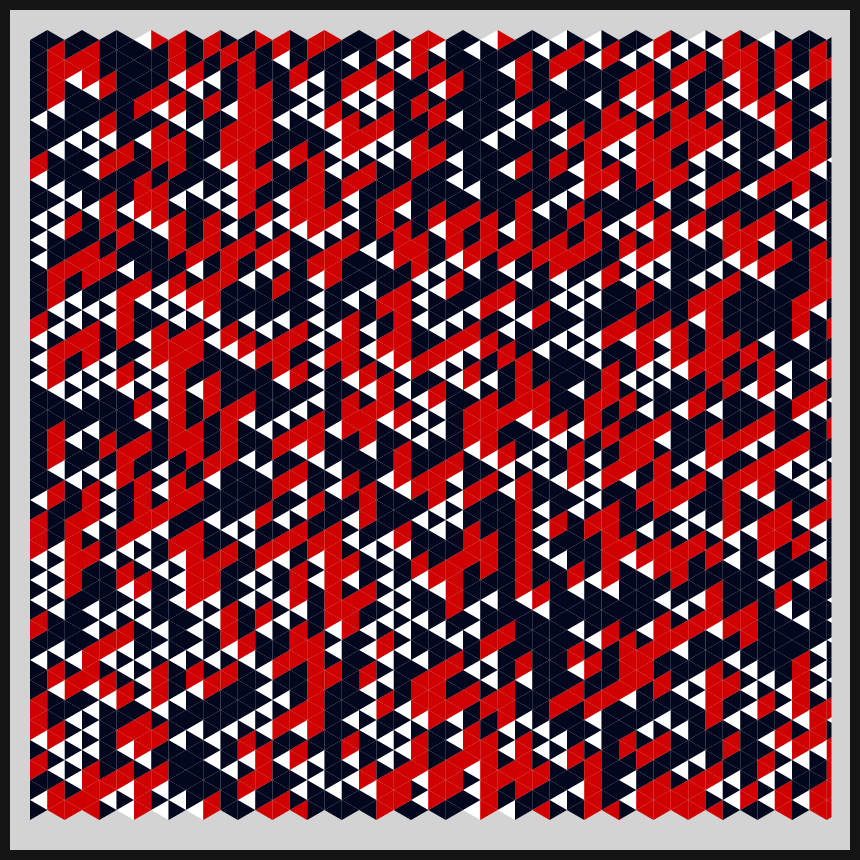

# DAILY SKETCH for 2021-04-28

## Done using P5.js

### Description

These `daily sketches` which are meant to be quick explorations     on whatever topic interested me on that day. This code is not typically optimized, but I share it as-is     for anyone interested.

[Code](2021-04-28) 

  

## Progression of Images that were generated.

 
 

[More Images](2021-04-28/images) 

## 2021-04-28
Keywords: isometric grid, isometric triangles 

## Description 

 Isometric triangles placed in every grid point. Working out a few simple set of rules to govern a 3-color palette
 

Made using P5.js. | [Code](2021/2021-04-28/)| 

-----

