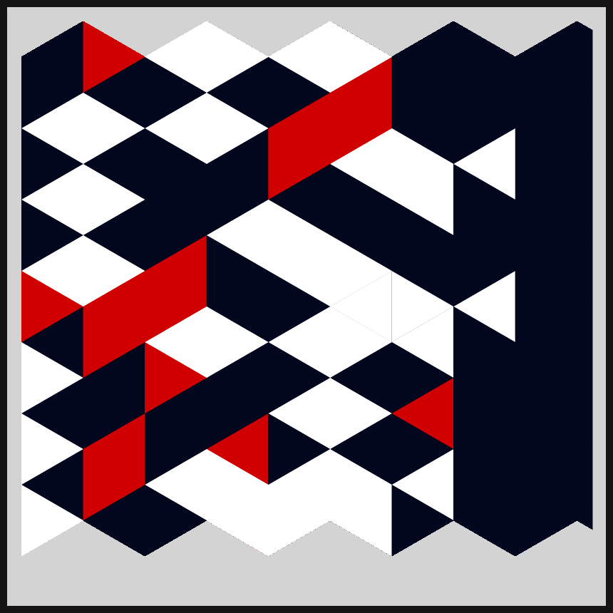
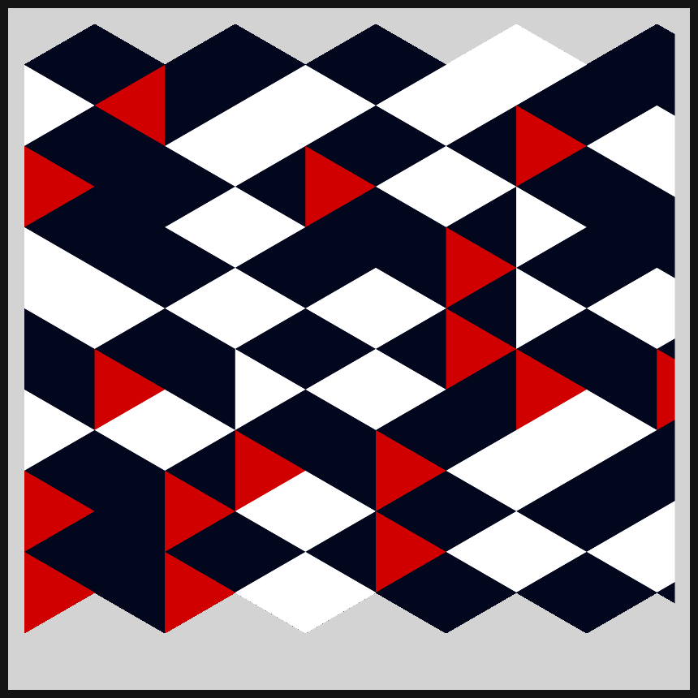
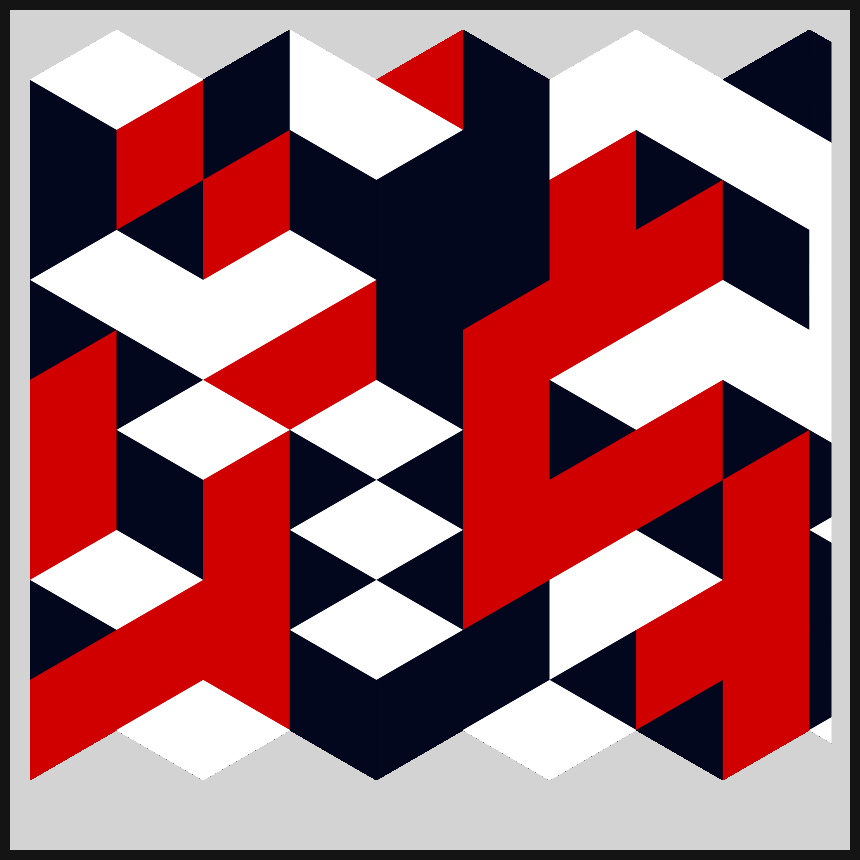

# DAILY SKETCH for 2021-04-29

## Done using P5.js

### Description

These `daily sketches` which are meant to be quick explorations     on whatever topic interested me on that day. This code is not typically optimized, but I share it as-is     for anyone interested.

[Code](2021-04-29) 

    

## Progression of Images that were generated.

 
 
 
 

[More Images](2021-04-29/images) 

## 2021-04-29
Keywords: isometric grid, isometric triangles, cube cuts 

## Description 

 The whole canvas should provide a viable 3D cube lattice. Still a few rules to be cleaned up.
 

Made using P5.js. | [Code](2021/2021-04-29/)| 

-----

