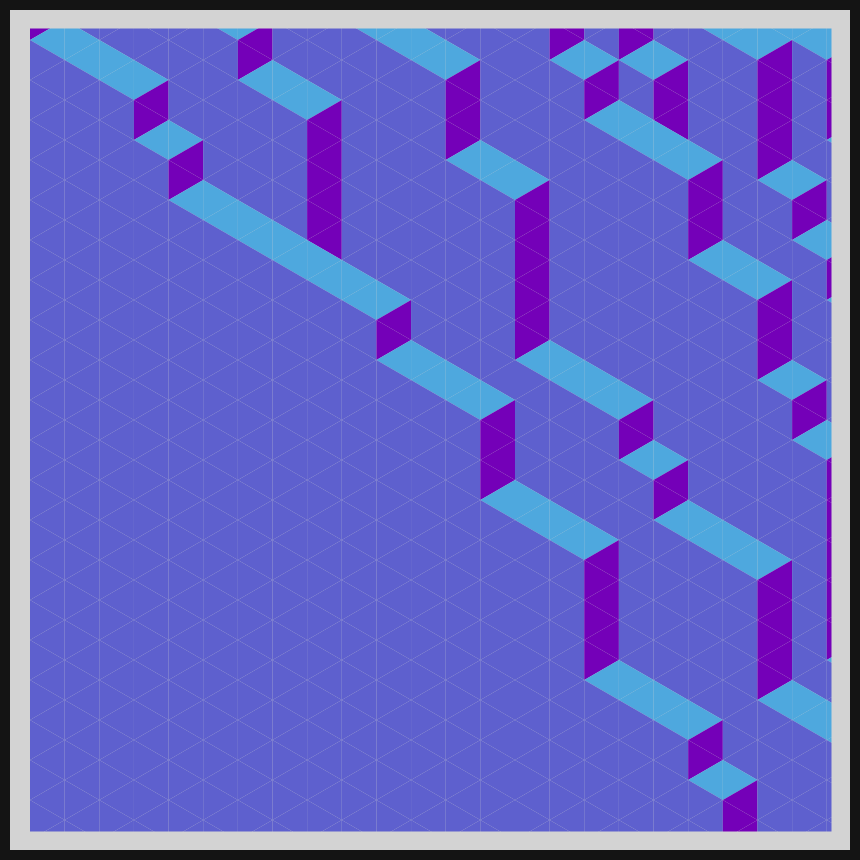

# DAILY SKETCH for 2021-05-01

## Done using P5.js

### Description

These `daily sketches` which are meant to be quick explorations     on whatever topic interested me on that day. This code is not typically optimized, but I share it as-is     for anyone interested.

[Code](2021-05-01) 

   

## Progression of Images that were generated.

 
 
 

[More Images](2021-05-01/images) 

## 2021-05-01
Keywords: isometric grid, isometric triangles, cube cuts 

## Description 

 A viable 3D cube lattice, based on rules. 
 

Made using P5.js. | [Code](2021/2021-05-01/)| 

-----

