# DAILY SKETCH for 2021-05-02

## Done using P5.js

### Description

These `daily sketches` which are meant to be quick explorations     on whatever topic interested me on that day. This code is not typically optimized, but I share it as-is     for anyone interested.

[Code](2021-05-02) 

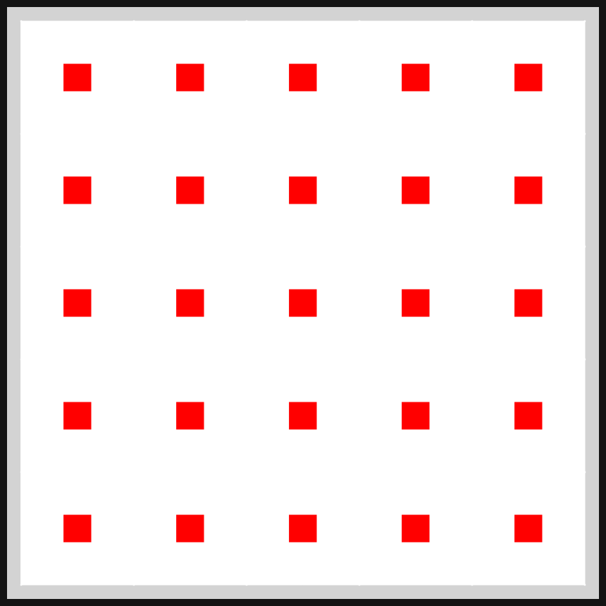 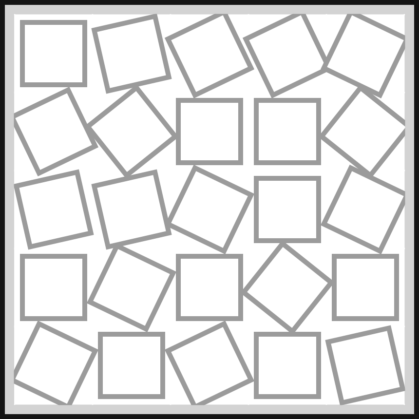 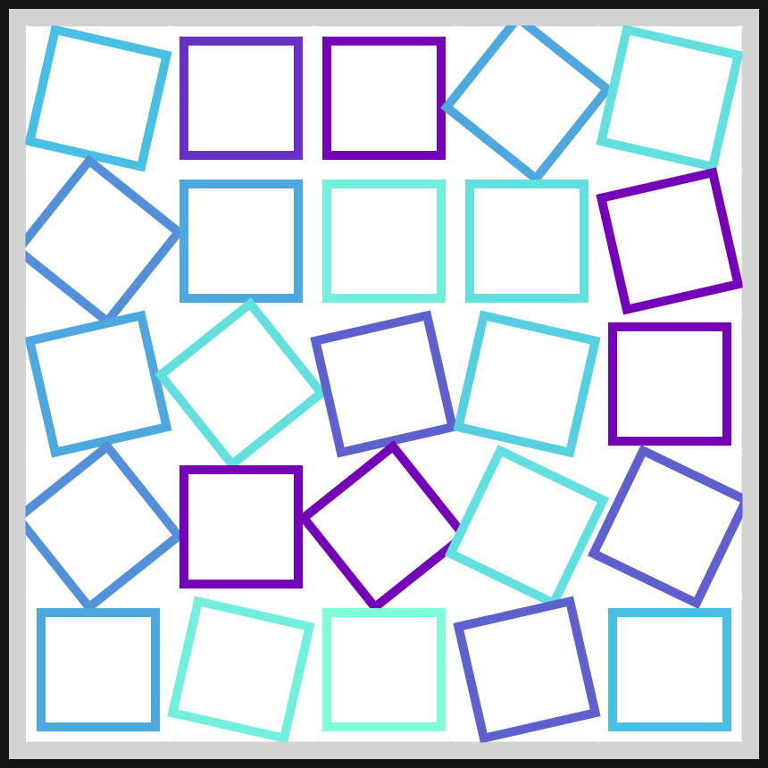 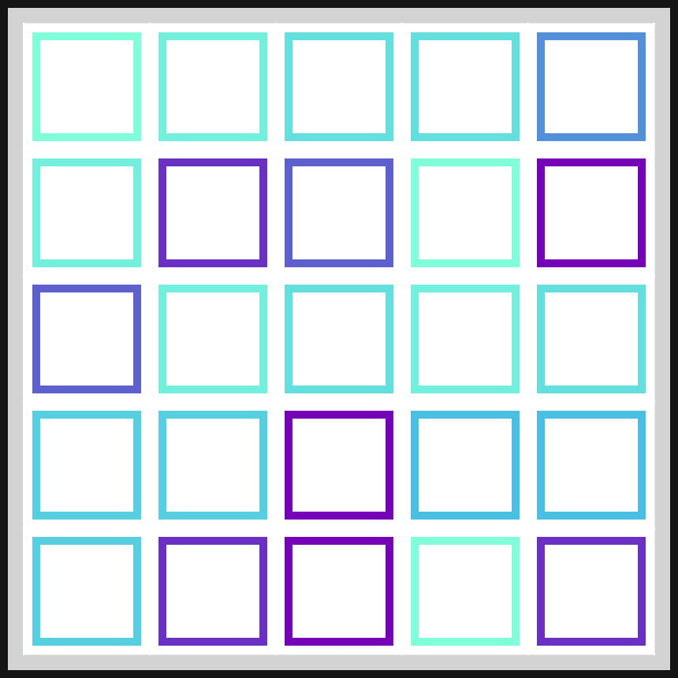 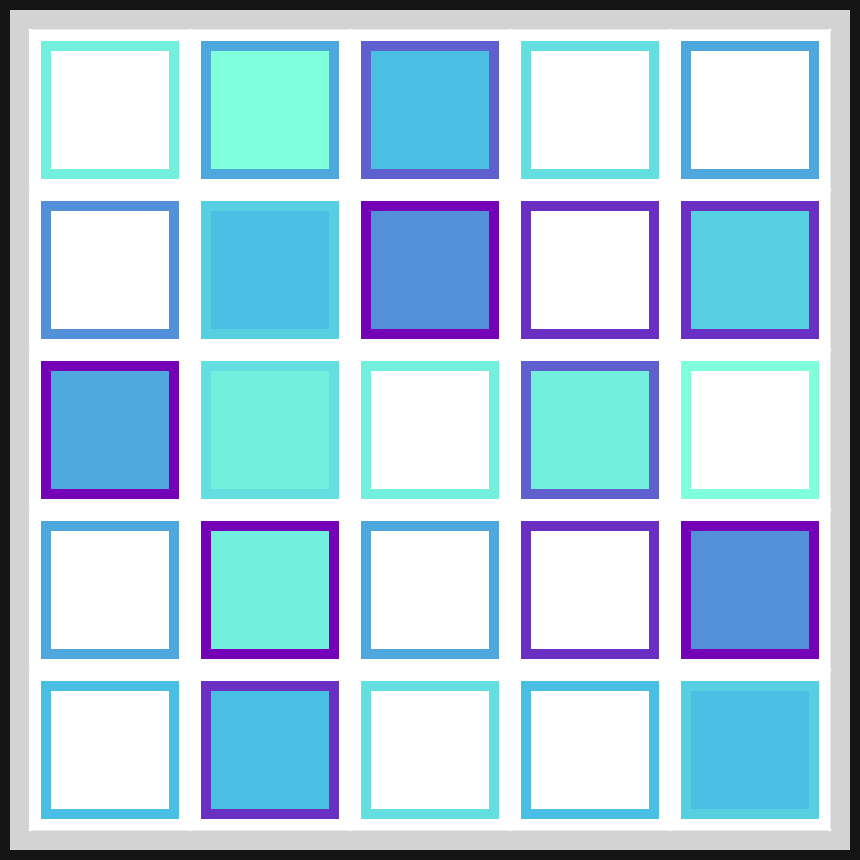 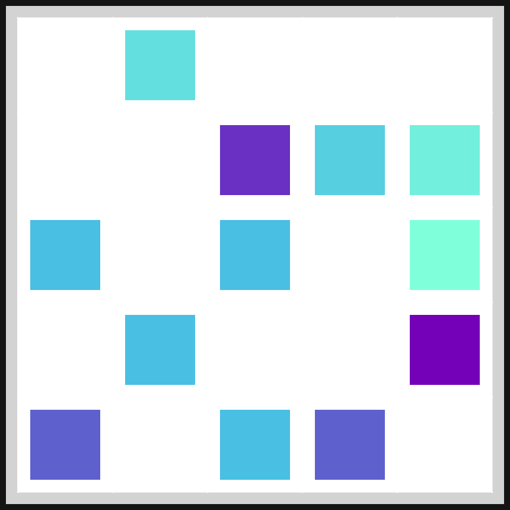 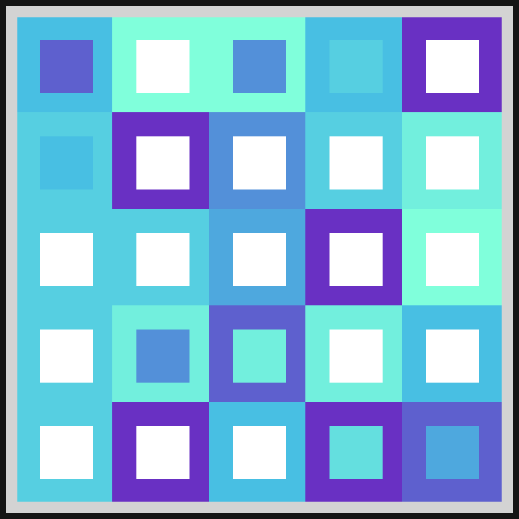 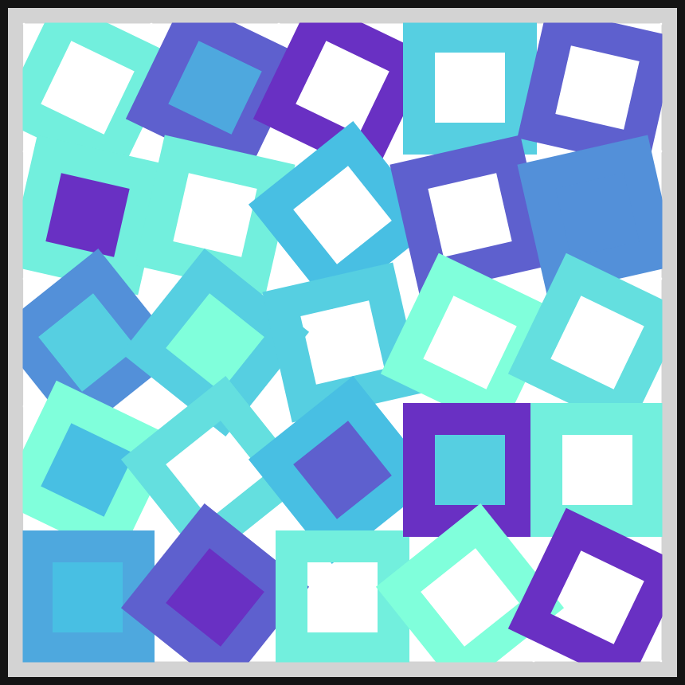 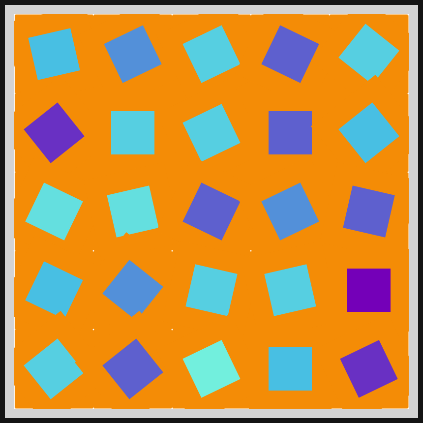 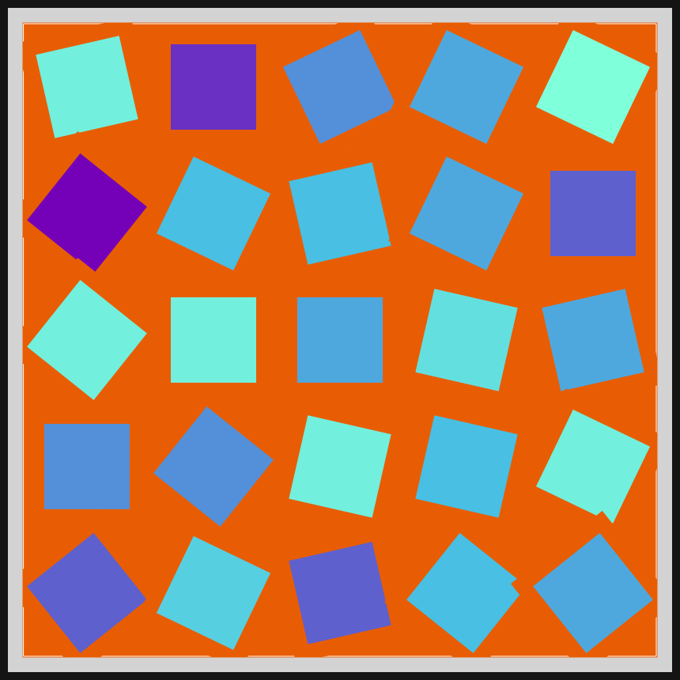 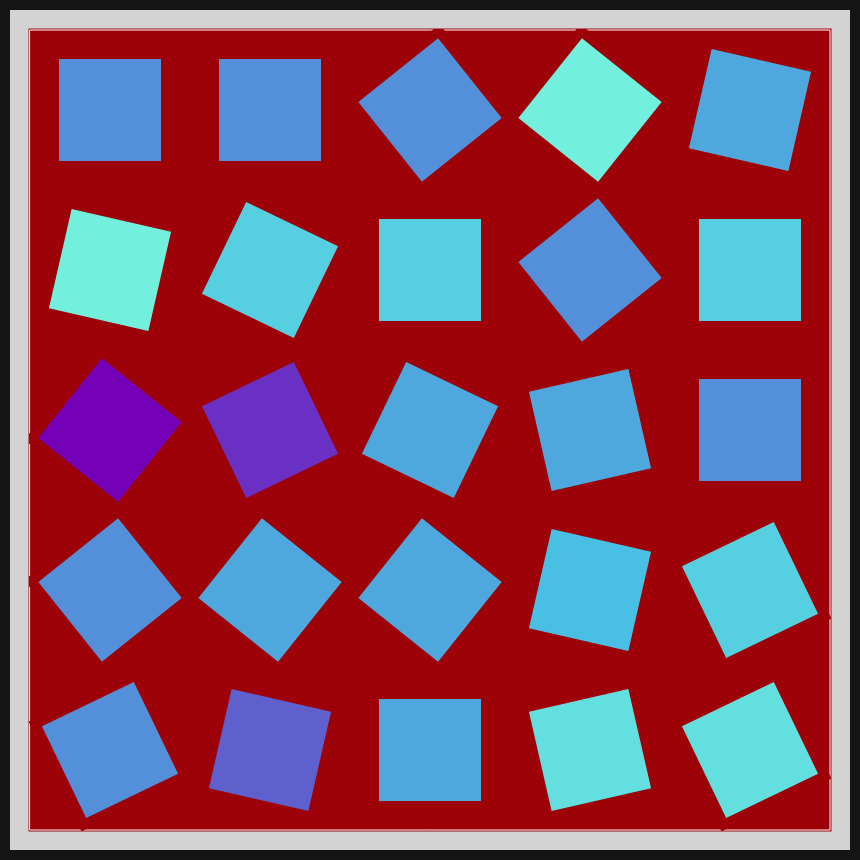  

## Progression of Images that were generated.

 
 
 
 
 
 
 
 
 
 
 
 

[More Images](2021-05-02/images) 

## 2021-05-02
Keywords: Tiles, 25-square, variations-on-a-theme 

## Description 

 Many variations on 25 squares
 

Made using P5.js. | [Code](2021/2021-05-02/) | 

-----

