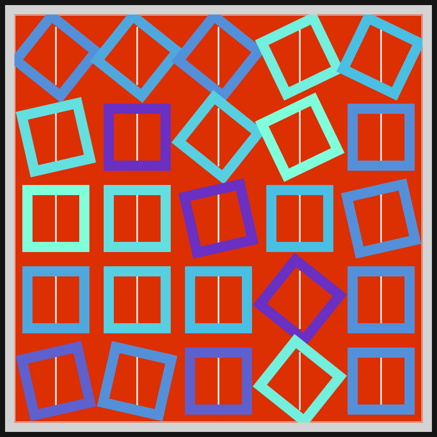
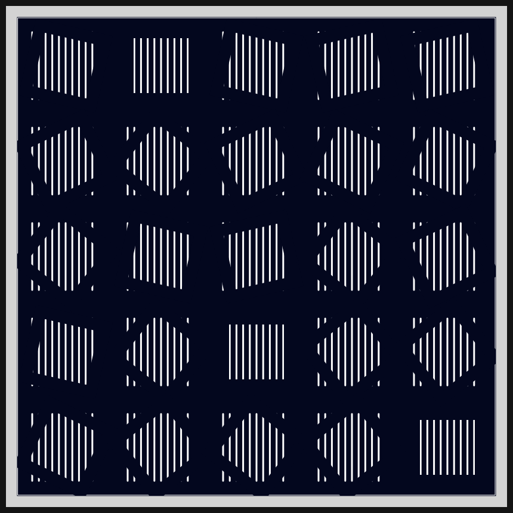
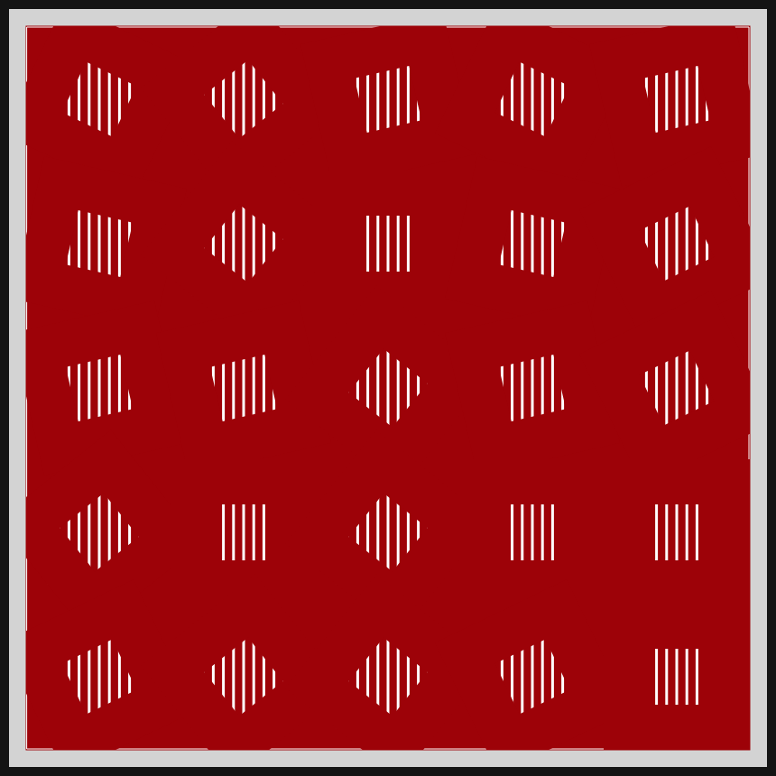
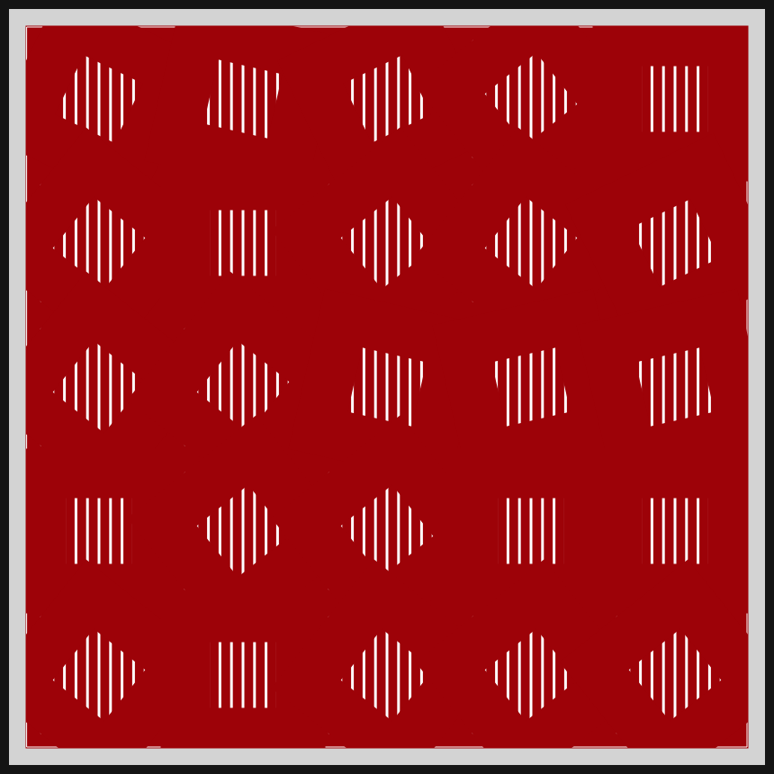
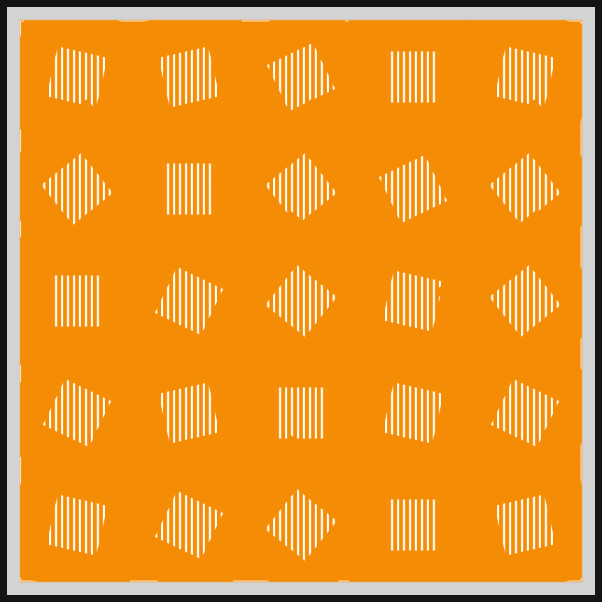
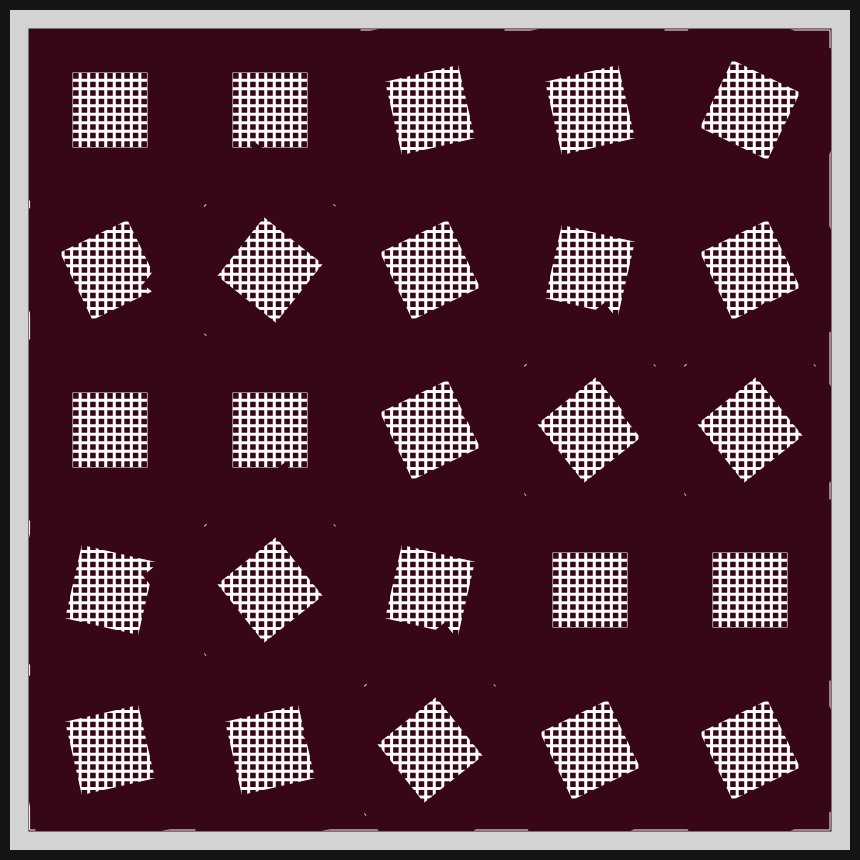
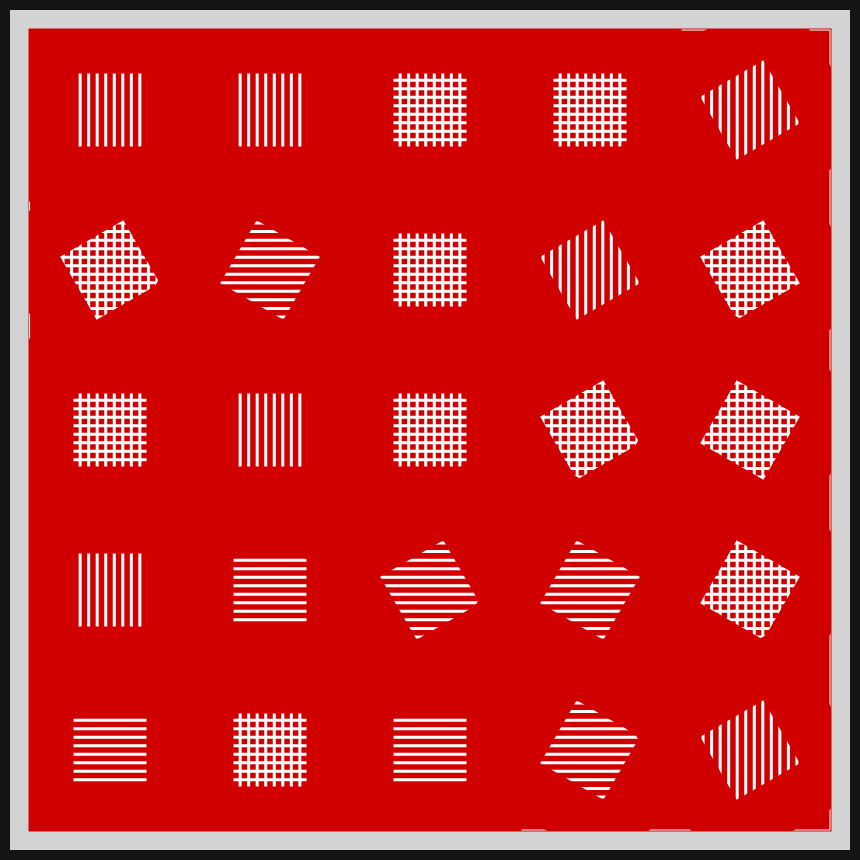
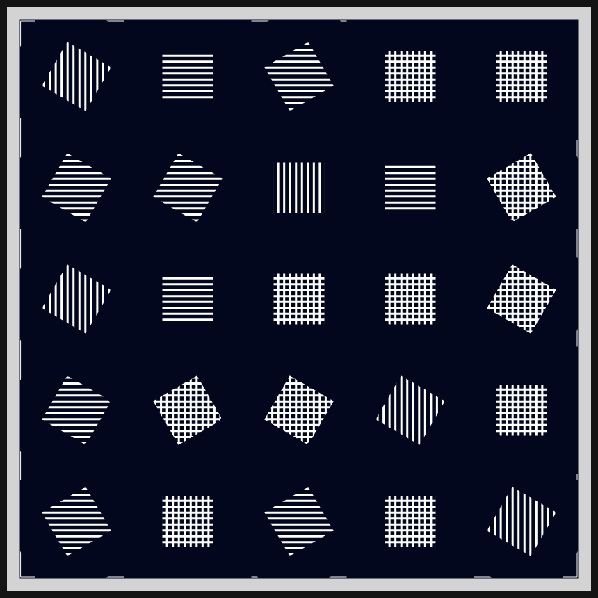

# DAILY SKETCH for 2021-05-03

## Done using P5.js

### Description

These `daily sketches` which are meant to be quick explorations     on whatever topic interested me on that day. This code is not typically optimized, but I share it as-is     for anyone interested.

[Code](2021-05-03) 

         

## Progression of Images that were generated.

 
 
 
 
 
 
 
 
 

[More Images](2021-05-03/images) 

## 2021-05-03
Keywords: Tiles, 25-square, variations-on-a-theme 

## Description 

 One more variation of 25 squares. Lay down vertical lines or horizontal lines, and then lay thick squares on them. The squares are rotated, but the lines should stay
 

Made using P5.js. | [Code](2021/2021-05-03/) | 

-----

