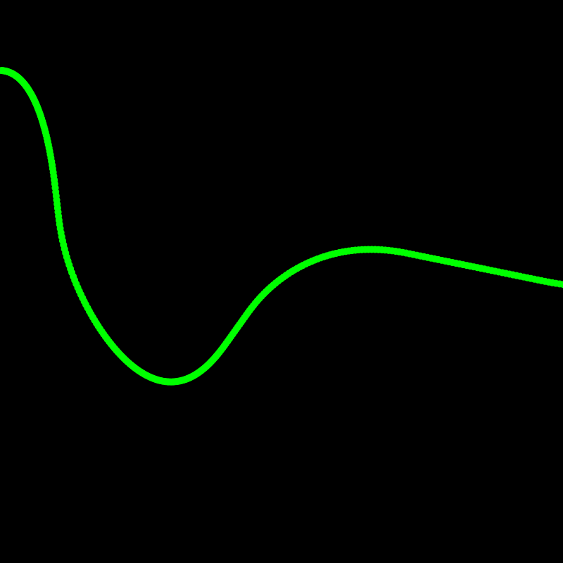
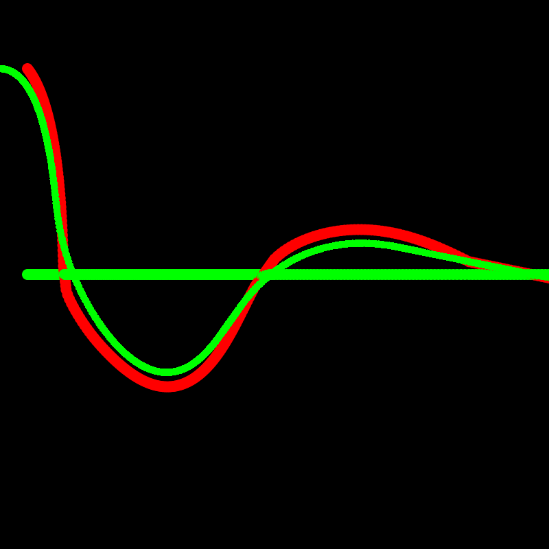
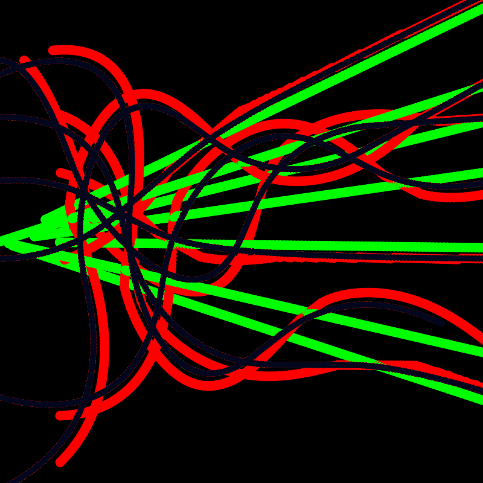
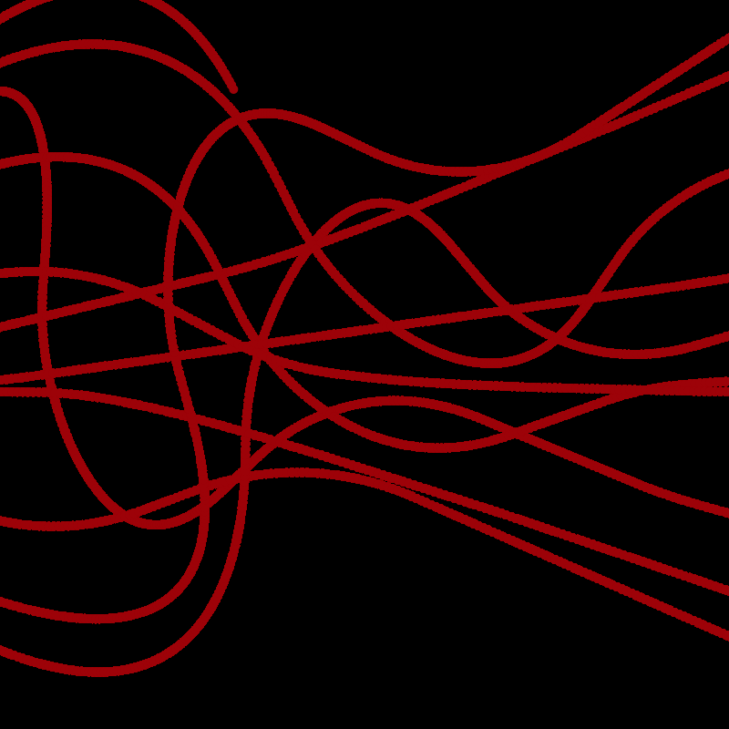
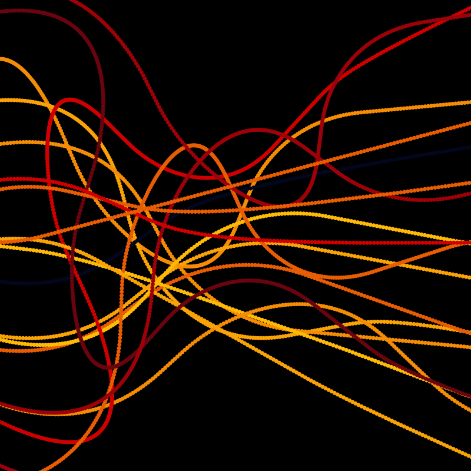

# DAILY SKETCH for 2021-05-06

## Done using P5.js

### Description

These `daily sketches` which are meant to be quick explorations     on whatever topic interested me on that day. This code is not typically optimized, but I share it as-is     for anyone interested.

[Code](2021-05-06) 

      

## Progression of Images that were generated.

 
 
 
 
 
 

[More Images](2021-05-06/images) 

## 2021-05-06
Keywords: Path following, steering behavior, curved lines 

## Description 

 Modify Shiffman's "Steering Behavior" code to get the desired effect. Wanted to get curved lines across the canvas.
 

Made using P5.js. | [Code](2021/2021-05-06/) | 

-----

