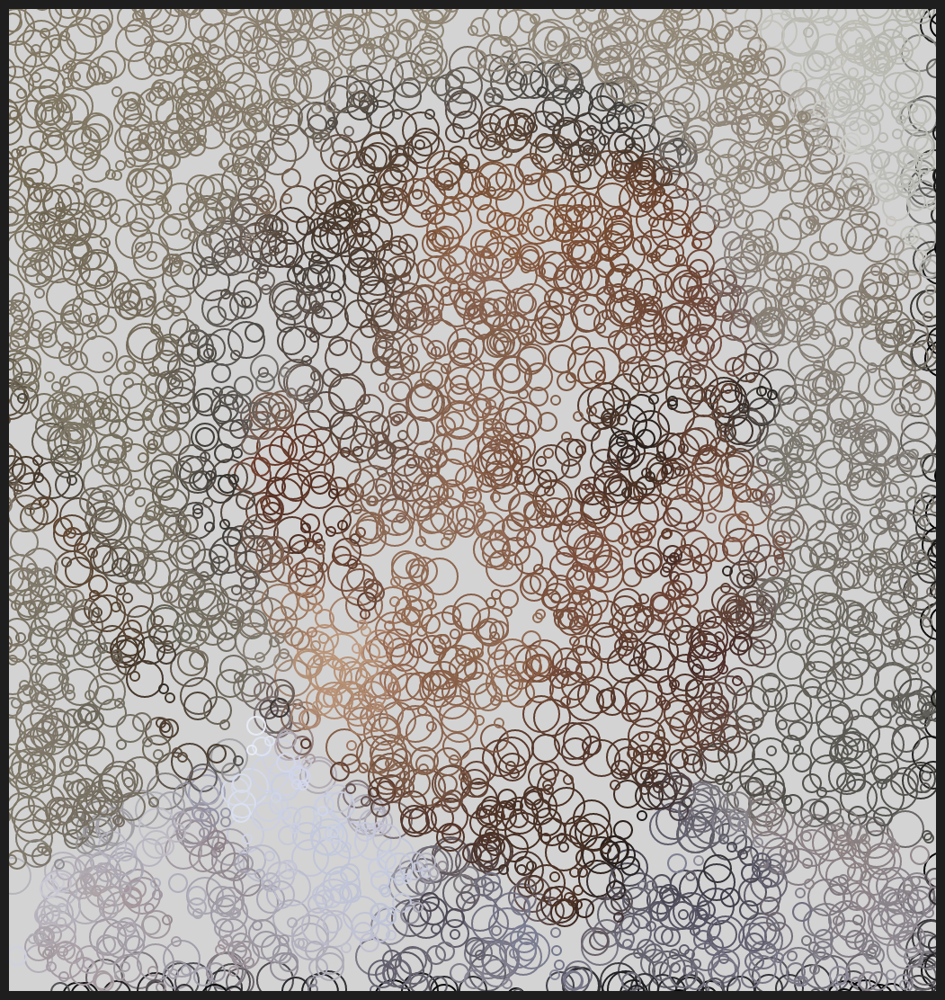
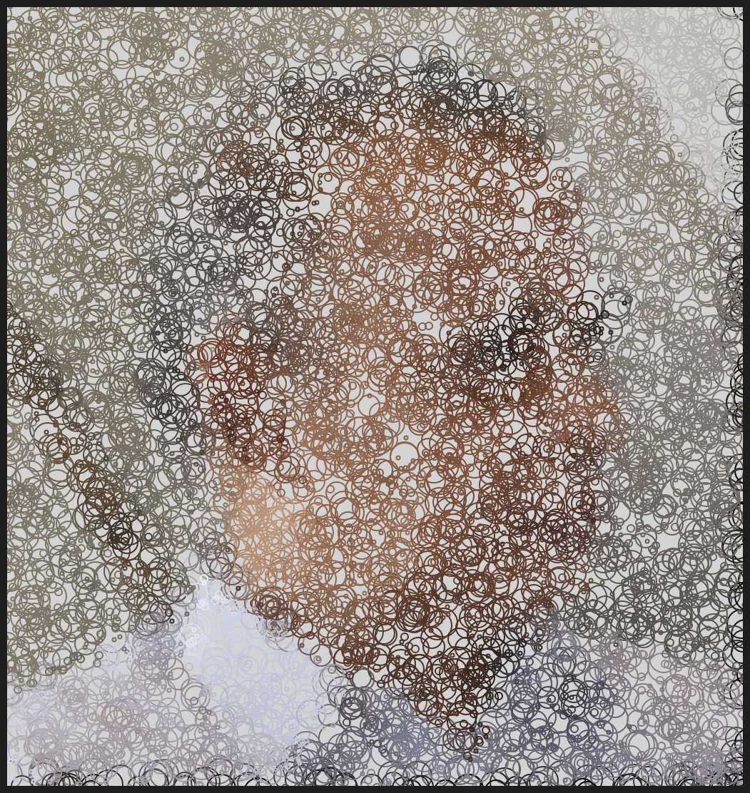
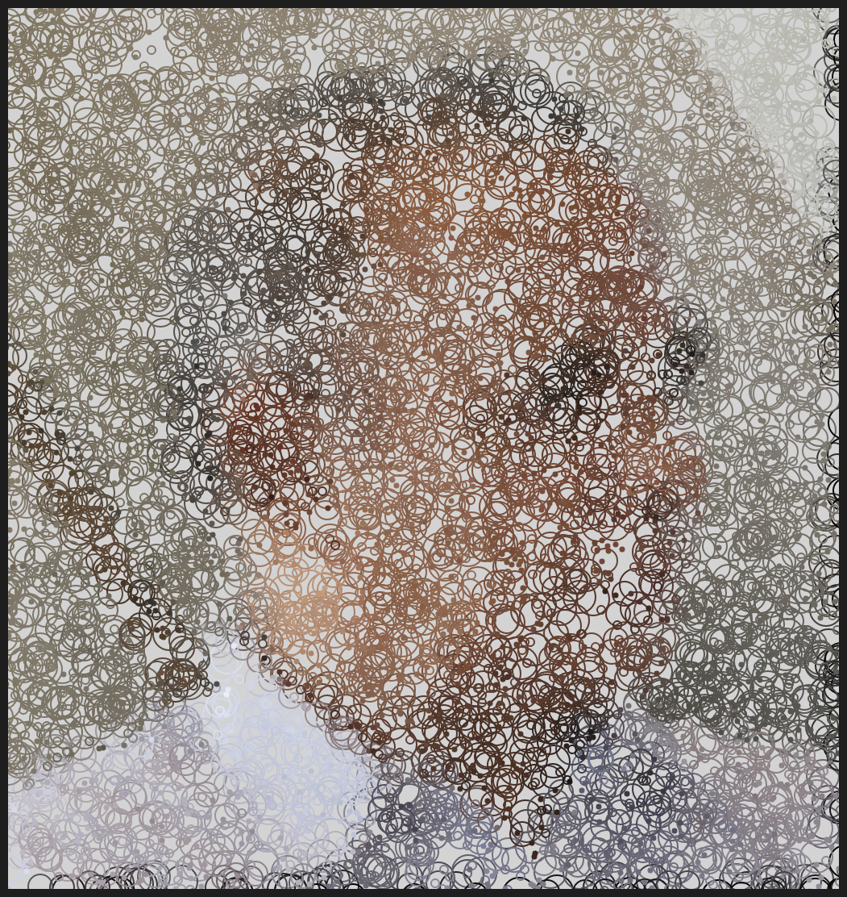
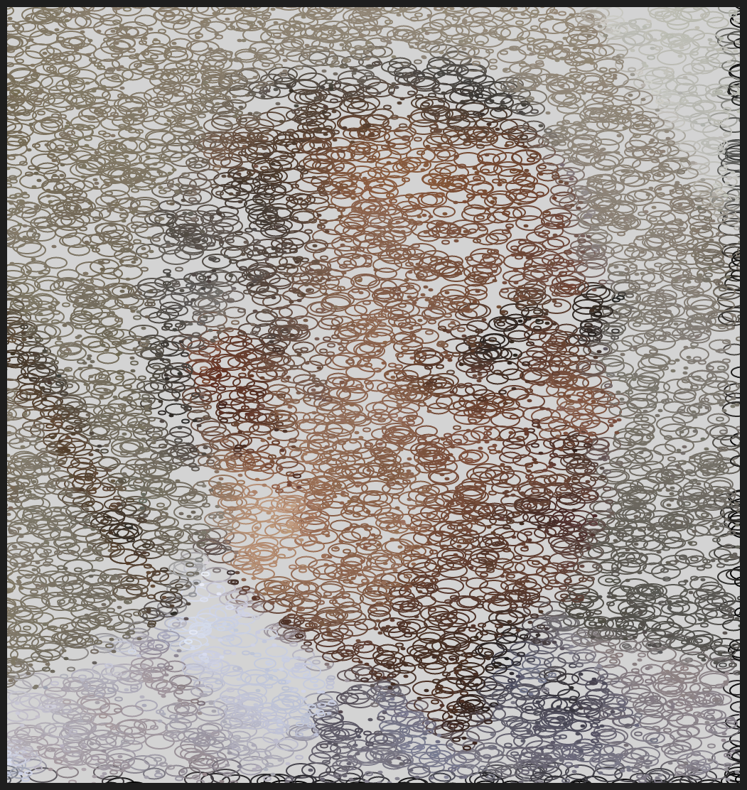

# DAILY SKETCH for 2021-05-10

## Done using P5.js

### Description

These `daily sketches` which are meant to be quick explorations     on whatever topic interested me on that day. This code is not typically optimized, but I share it as-is     for anyone interested.

[Code](2021-05-10) 

     

## Progression of Images that were generated.

 
 
 
 
 

[More Images](2021-05-10/images) 

## 2021-05-10
Keywords: Portrait, Face, Abstract
 

## Description 

 Load an image, slice the portait into patches. For each patch, Calculate Average color or 
 brightness for each path. Render circle/ellipse for each path, dependent of the patch brightness, increase or decrease circle size.
 

Made using P5.js. | [Code](2021/2021-05-10/) | 

-----

