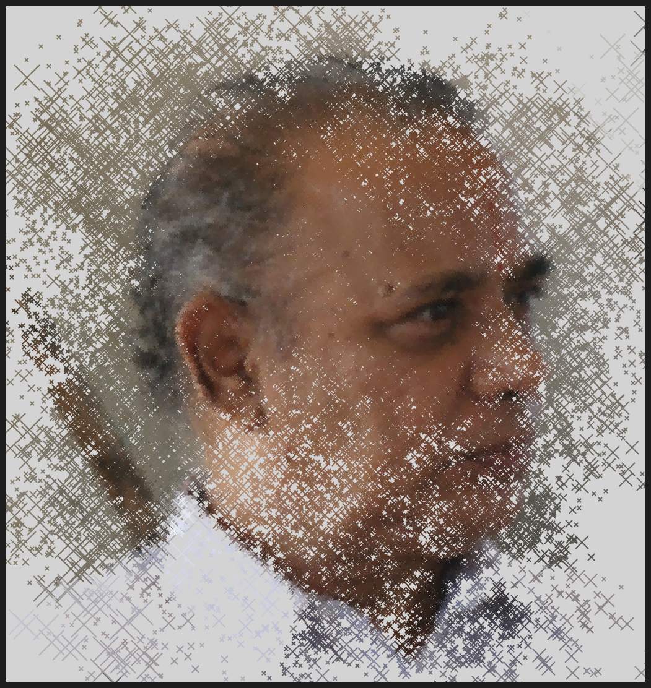
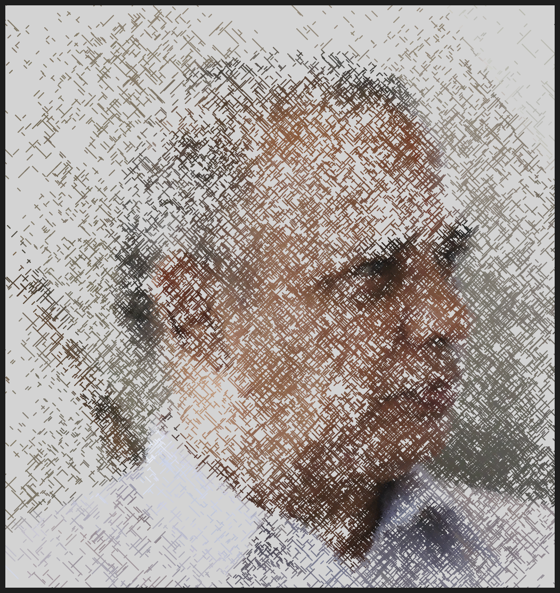
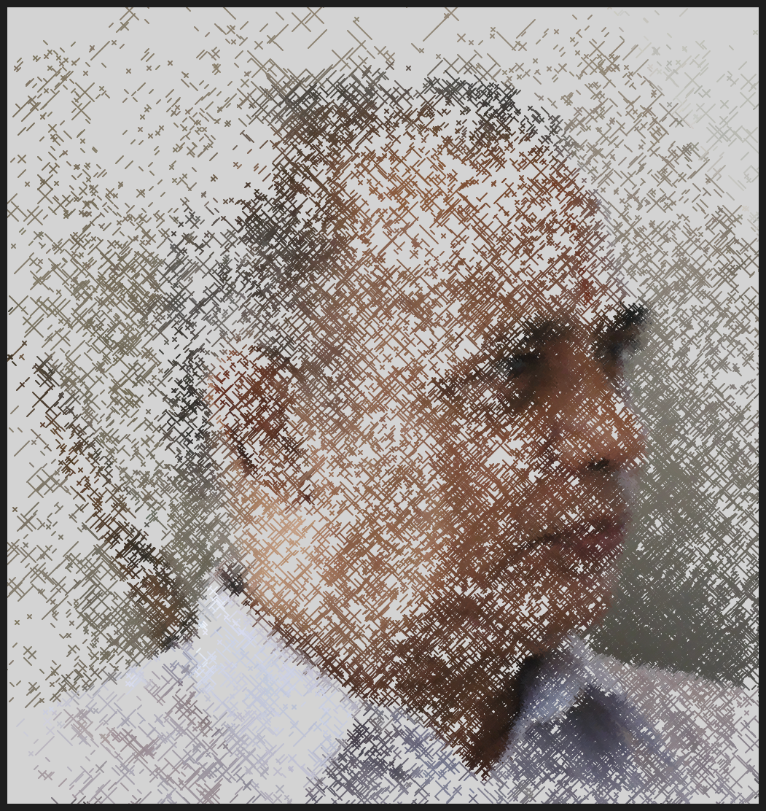

# DAILY SKETCH for 2021-05-11

## Done using P5.js

### Description

These `daily sketches` which are meant to be quick explorations     on whatever topic interested me on that day. This code is not typically optimized, but I share it as-is     for anyone interested.

[Code](2021-05-11) 

    

## Progression of Images that were generated.

 
 
 
 

[More Images](2021-05-11/images) 

## 2021-05-11
Keywords: Portrait, Face, Abstract
 

## Description 

 Load an image, slice the portait into patches. For each patch, Calculate Average color or 
 brightness for each path. Render hatch lines at the random points. Sample more points from areas of low brightness.
 

Made using P5.js. | [Code](2021/2021-05-11/) | 

-----

