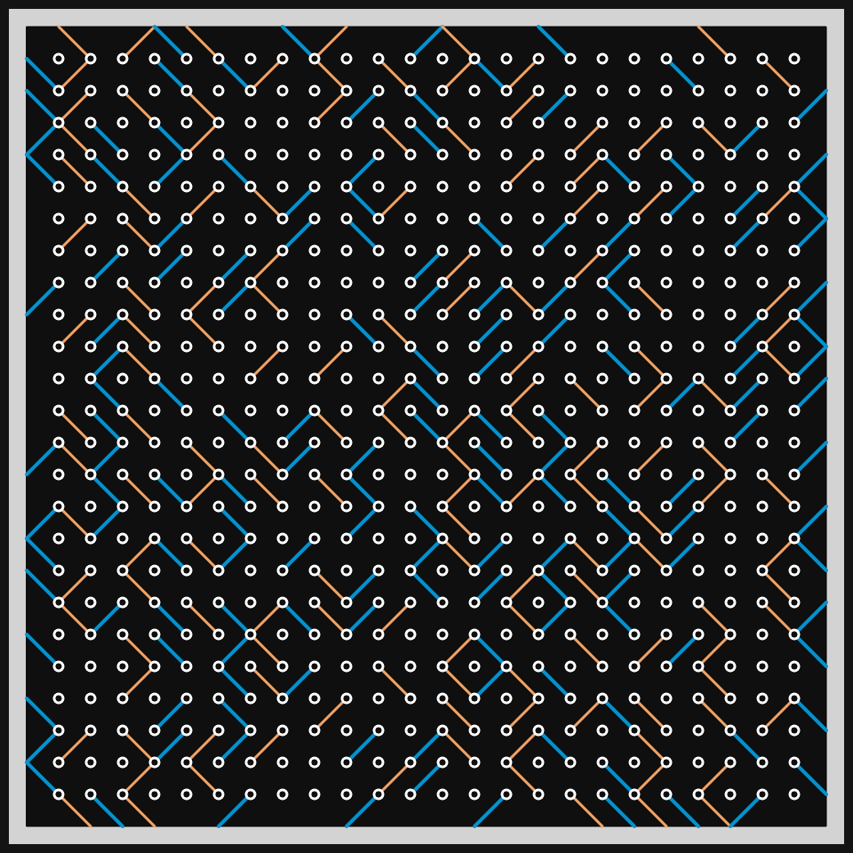
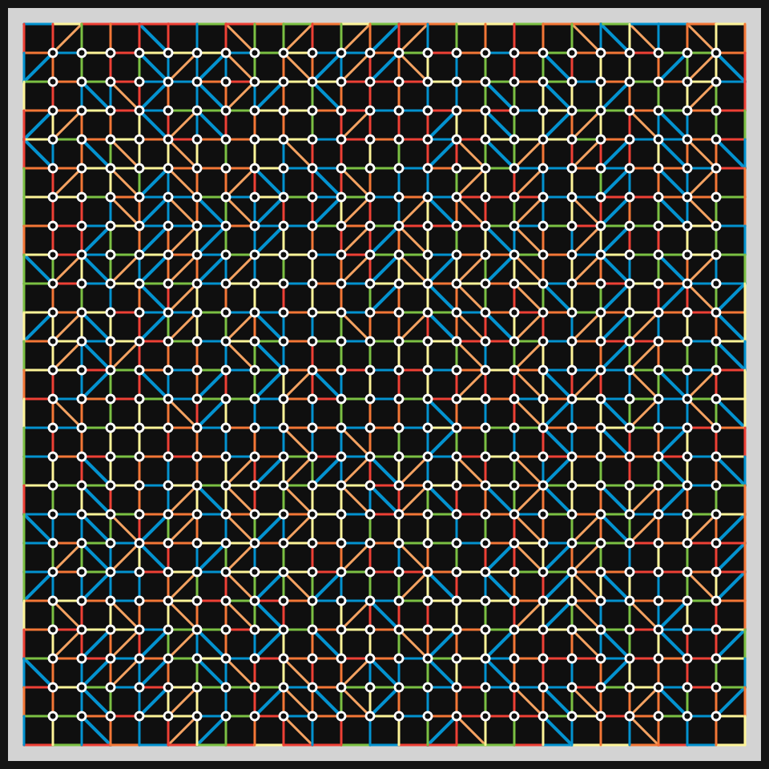

# DAILY SKETCH for 2021-05-13

## Done using P5.js

### Description

These `daily sketches` which are meant to be quick explorations     on whatever topic interested me on that day. This code is not typically optimized, but I share it as-is     for anyone interested.

[Code](2021-05-13) 

   

## Progression of Images that were generated.

 
 
 

[More Images](2021-05-13/images) 

## 2021-05-13
Keywords: Grid points, Segments, Lego
 

## Description 

 Create a grid full of points and segments. Color and fill them, to imply Lego-like structures.
 

Made using P5.js. | [Code](2021/2021-05-13/) | 

-----

