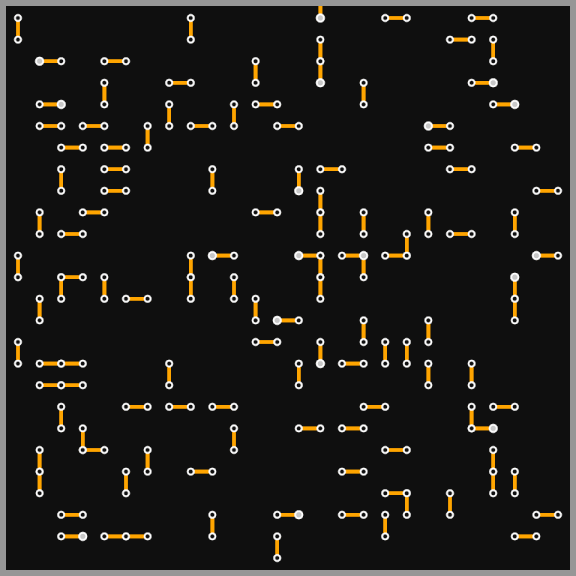
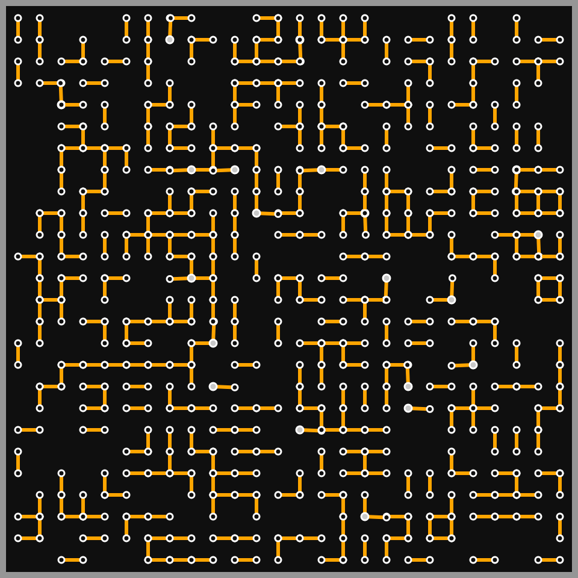

# DAILY SKETCH for 2021-05-20

## Done using P5.js

### Description

These `daily sketches` which are meant to be quick explorations     on whatever topic interested me on that day. This code is not typically optimized, but I share it as-is     for anyone interested.

[Code](2021-05-20) 

   

## Progression of Images that were generated.

 
 
 

[More Images](2021-05-20/images) 

 ## 2021-05-20
Keywords: Segments, Lego, Rotation
 

## Description 

 Grid of segments that swing around circular anchor points. Animation is accurate now. Background of a 10Print like tiles.
 

Made using P5.js. | [Code](2021/2021-05-20/) | [Top](#daily-sketches) 

-----

