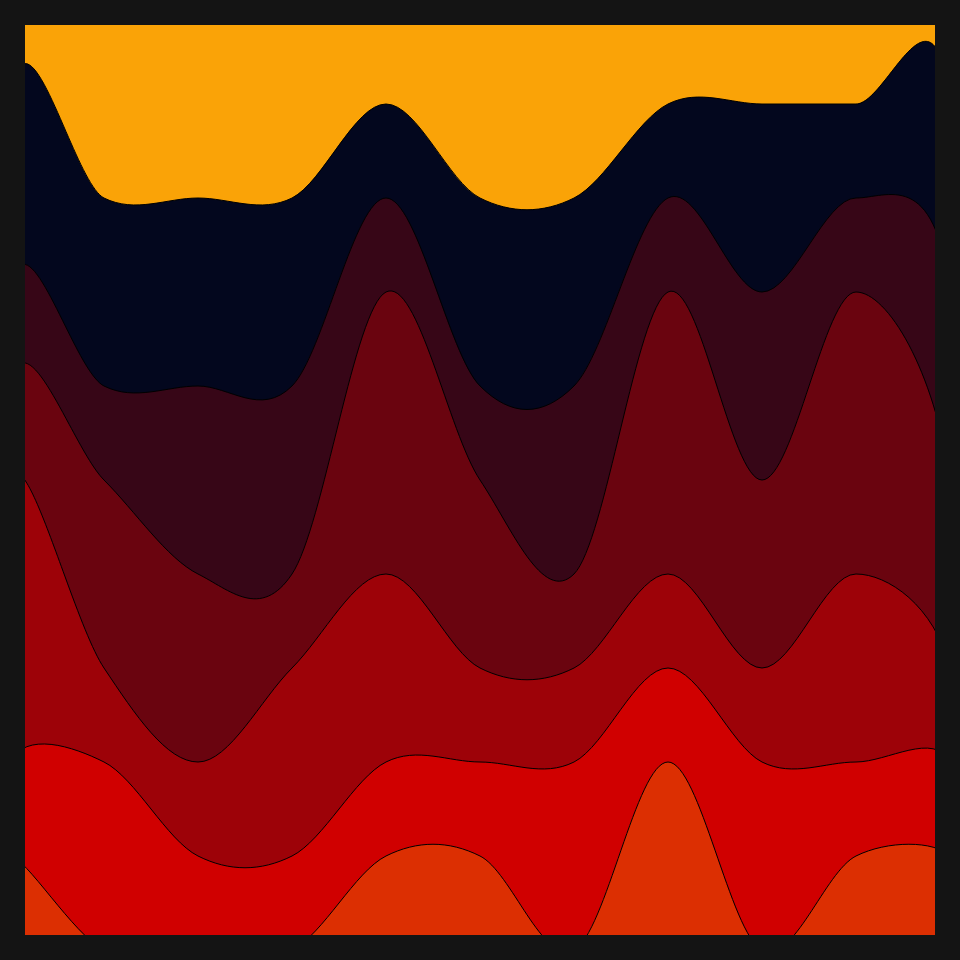
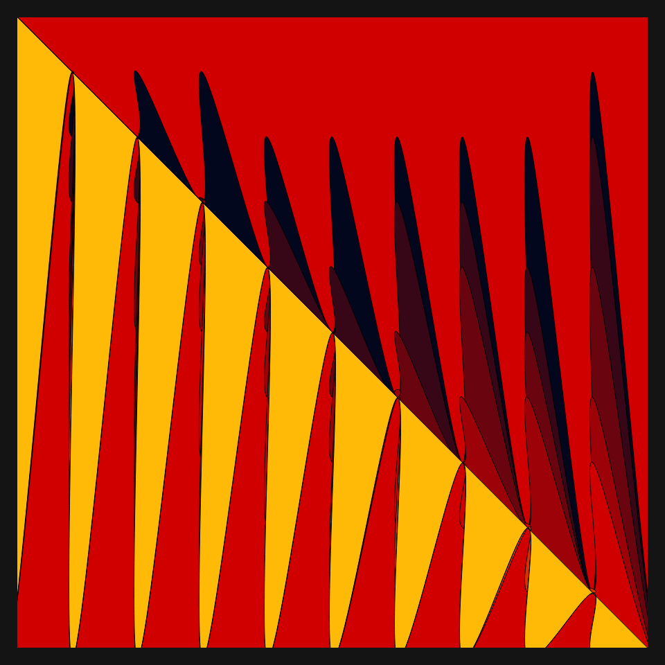

# DAILY SKETCH for 2021-06-03

## Done using P5.js

### Description

These `daily sketches` which are meant to be quick explorations     on whatever topic interested me on that day. This code is not typically optimized, but I share it as-is     for anyone interested.

[Code](2021-06-03) 

    

## Progression of Images that were generated.

 
 
 
 

[More Images](2021-06-03/images) 

 ## 2021-06-03
Keywords: Shape creation, contours, waves, dripping lava
 

## Description 

 Across a Grid of columns, multiple wavy shapes in 2 attempted Triangles.
 

Made using P5.js. | [Code](2021/2021-06-03/) | [Top](#daily-sketches) 

-----

