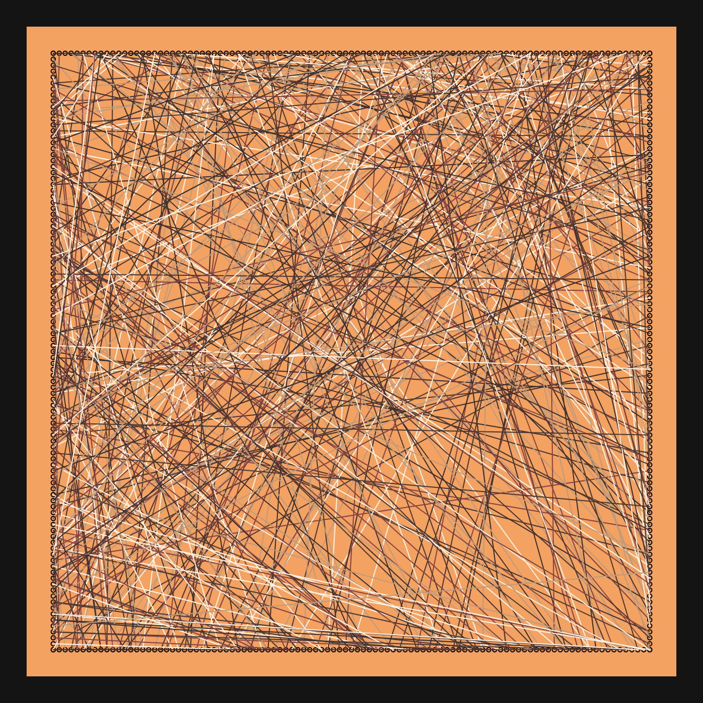
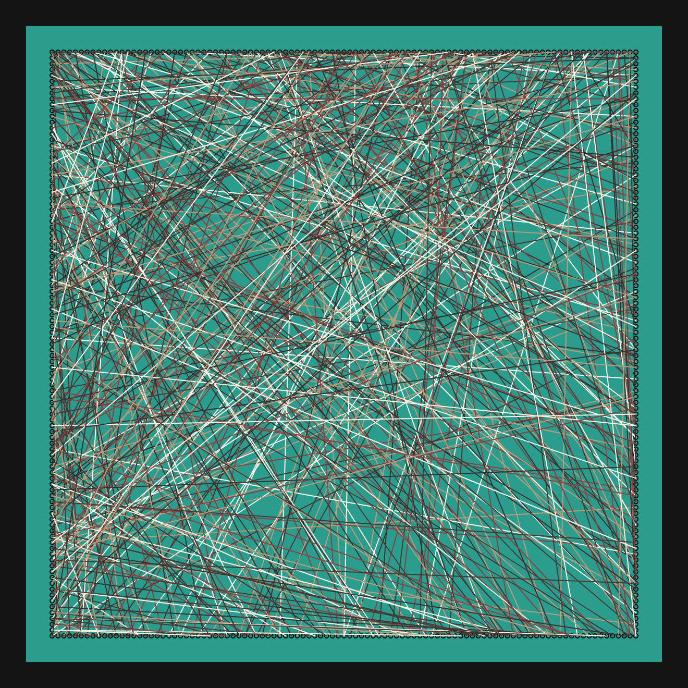
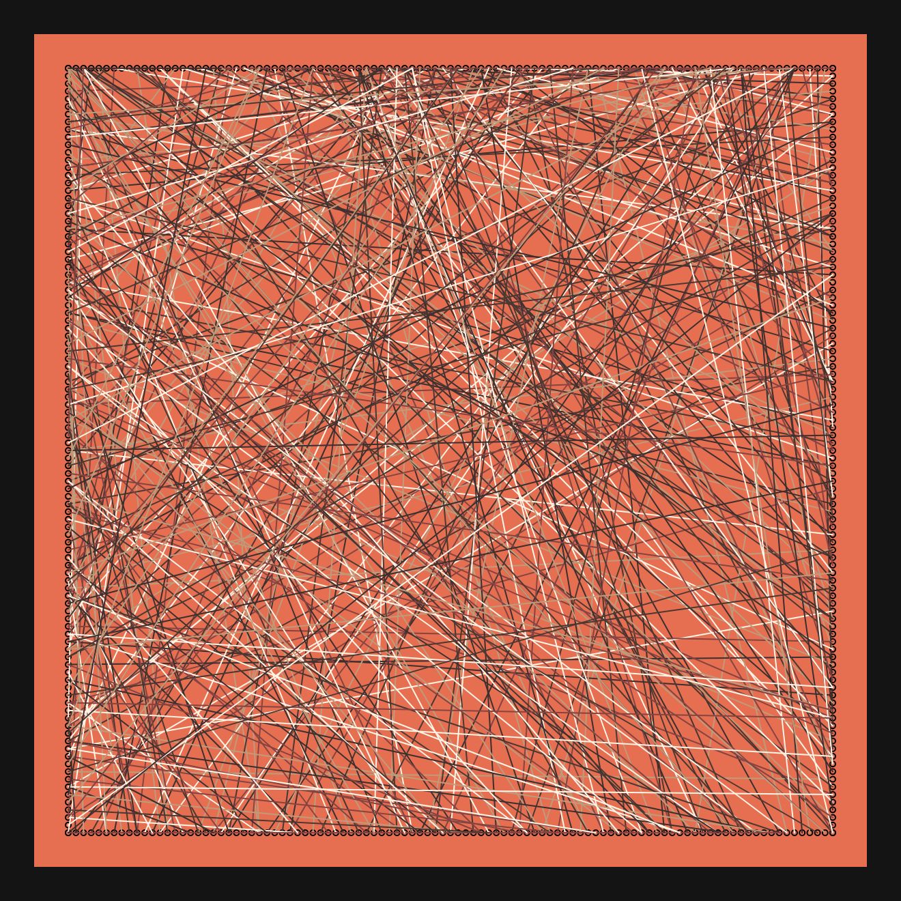
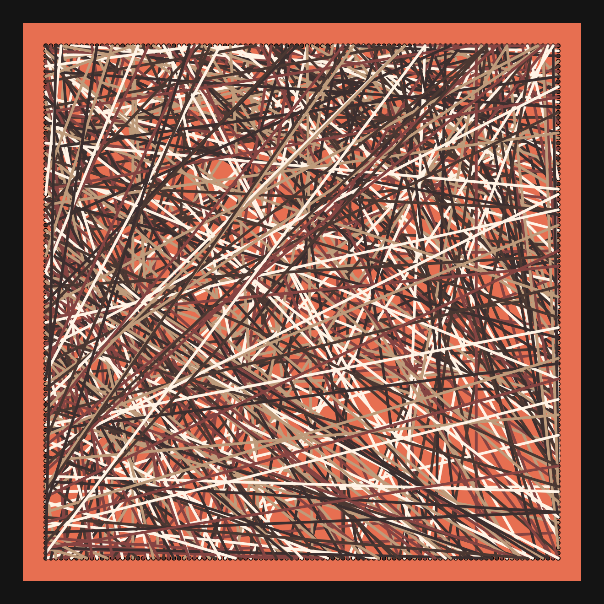

# DAILY SKETCH for 2021-06-13

## Done using P5.js

### Description

These `daily sketches` which are meant to be quick explorations     on whatever topic interested me on that day. This code is not typically optimized, but I share it as-is     for anyone interested.

[Code](2021-06-13) 

     

## Progression of Images that were generated.

 
 
 
 
 

[More Images](2021-06-13/images) 

 ## 2021-06-13
Keywords: Edge conncect, Line segments
 

## Description 

 Start with a Rectangular set of edge points. For each point in the Northern wall
 Connect with a line to "another" wall. Color specific to a wall.
 

Made using P5.js. | [Code](2021/2021-06-13/) | [Top](#daily-sketches) 

-----

