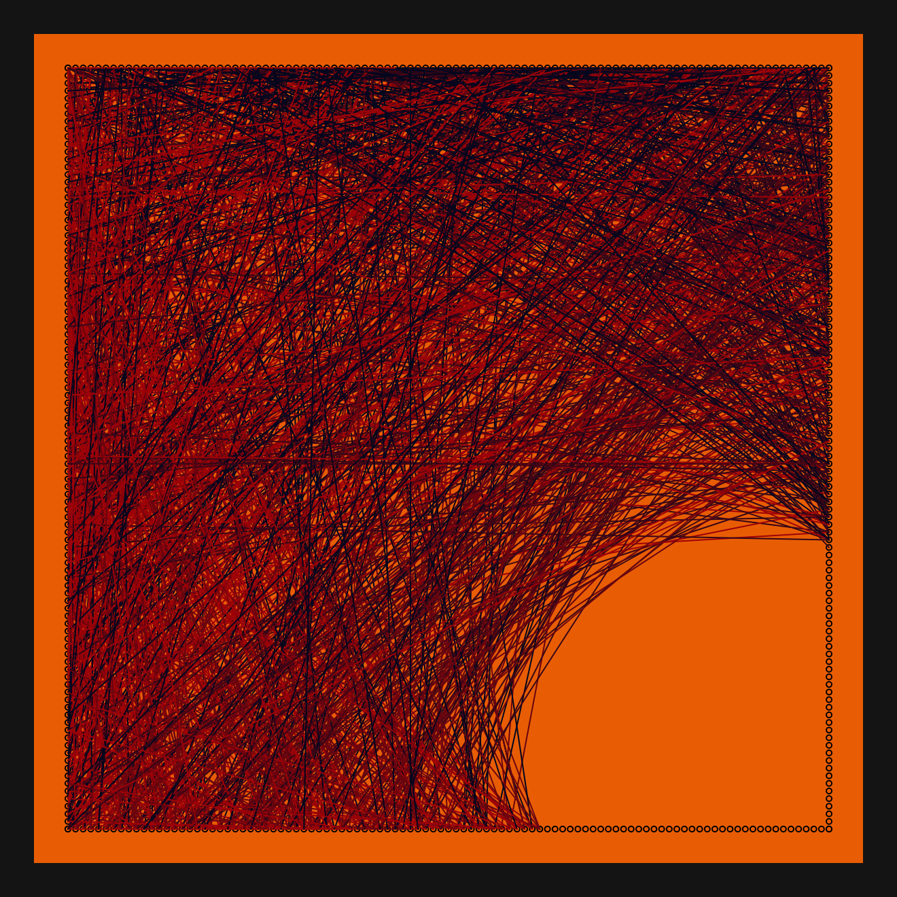
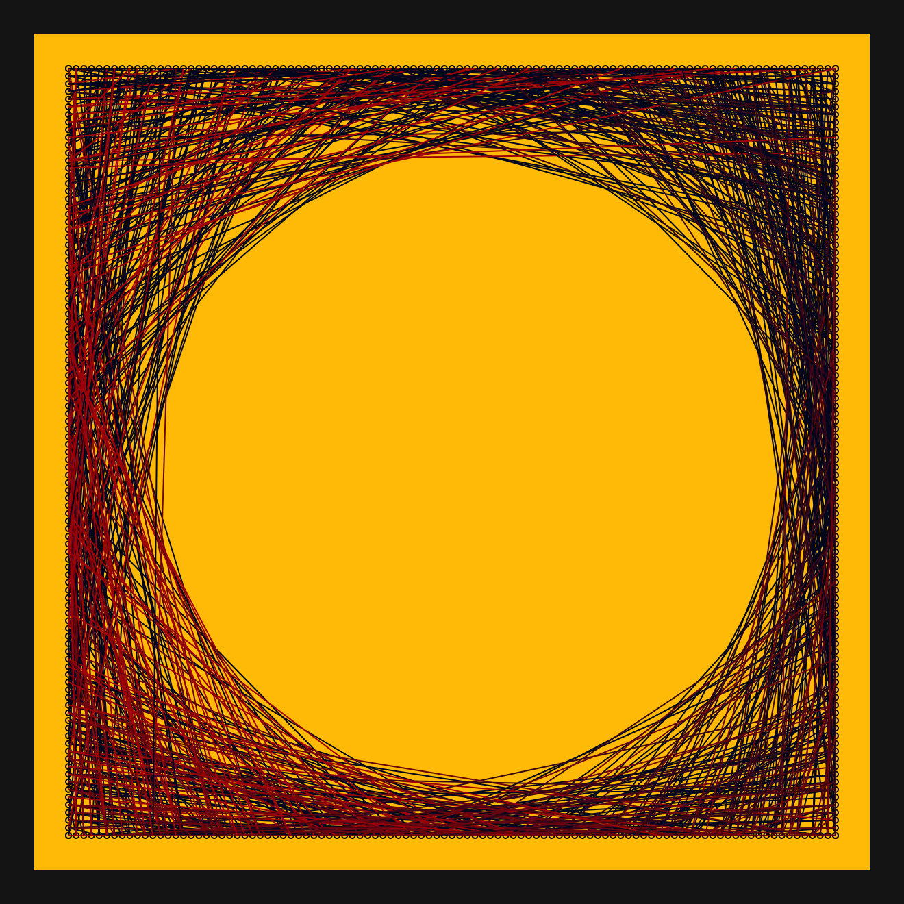
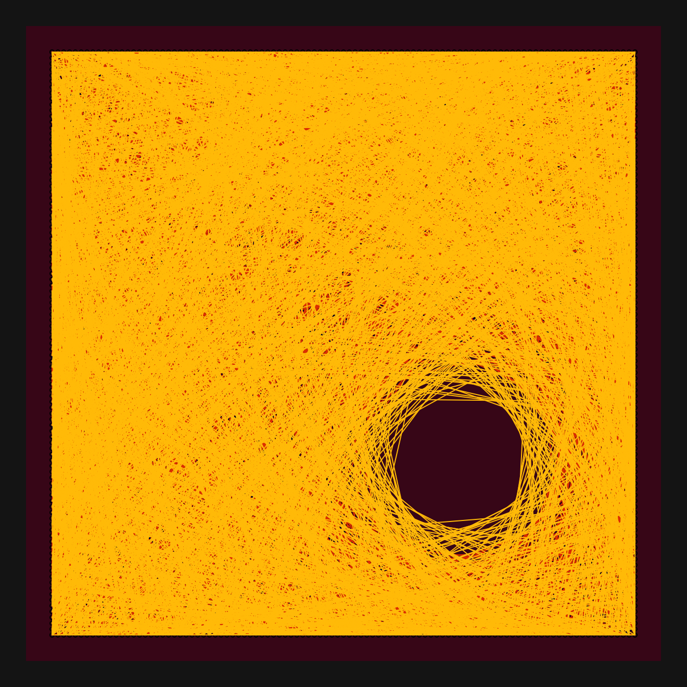
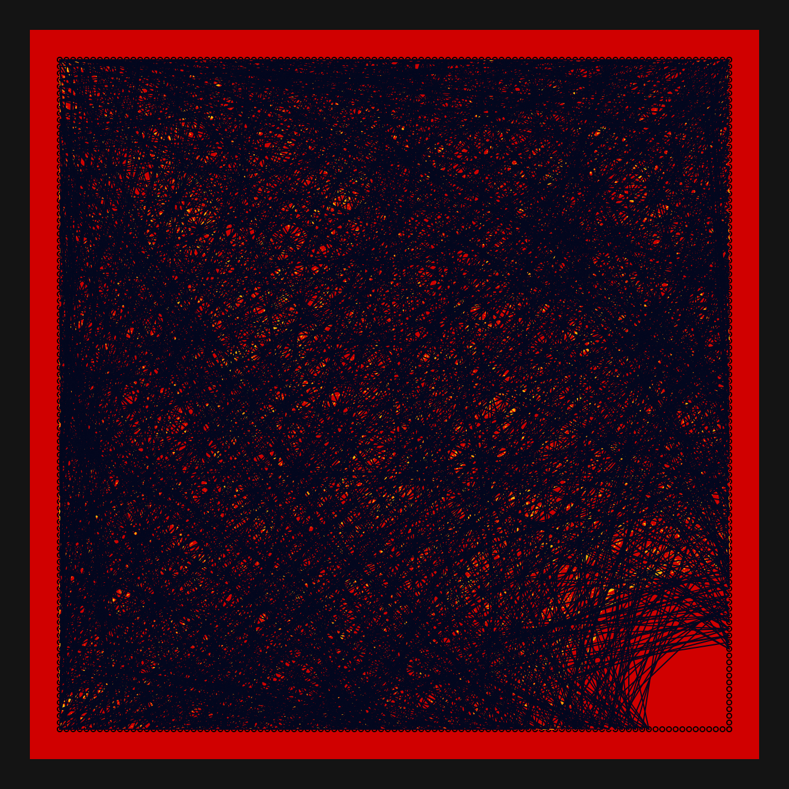
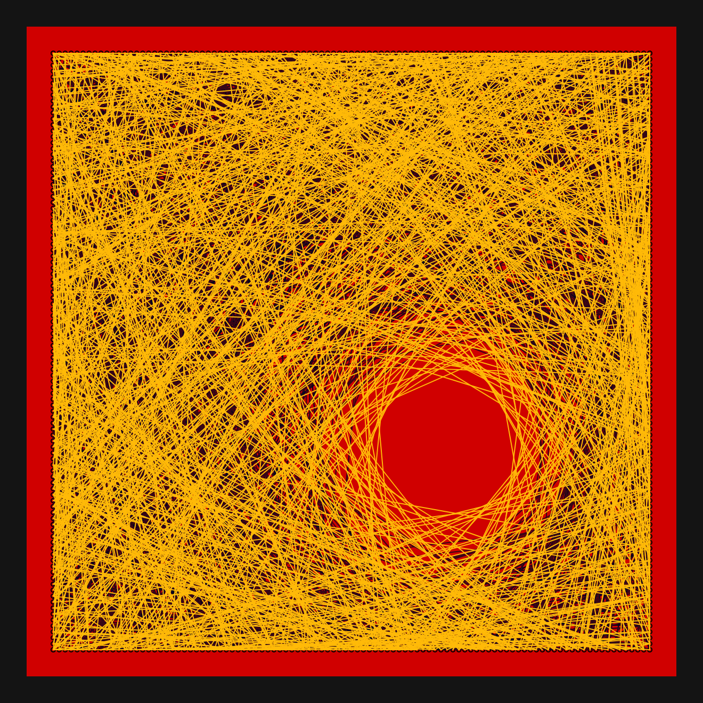
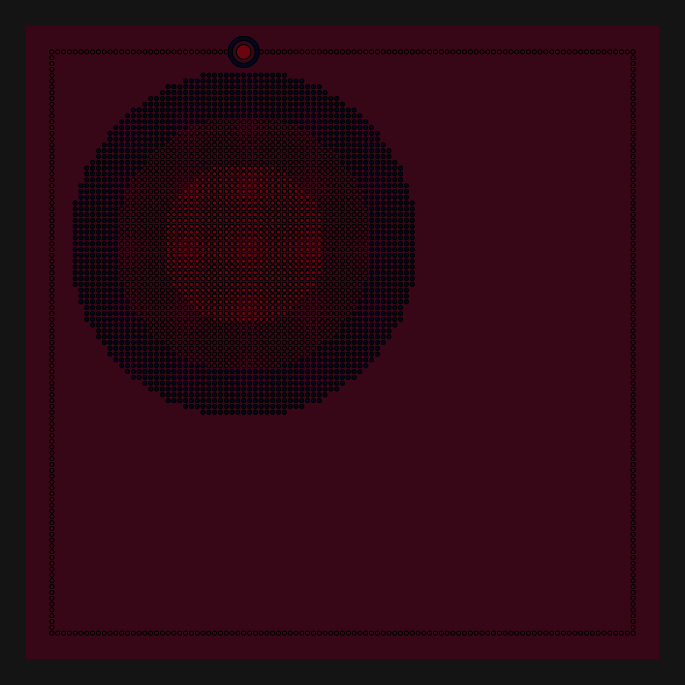

# DAILY SKETCH for 2021-06-15

## Done using P5.js

### Description

These `daily sketches` which are meant to be quick explorations     on whatever topic interested me on that day. This code is not typically optimized, but I share it as-is     for anyone interested.

[Code](2021-06-15) 

       

## Progression of Images that were generated.

 
 
 
 
 
 
 

[More Images](2021-06-15/images) 

 ## 2021-06-15
Keywords: Edge conncect, Line segments, Implied Shapes
 

## Description 

 Start with a Rectangular set of edge points. 
 Create a subset of circular grid points. Draw 100s of lines. Avoid lines that pass through
 this circle. Have 2 or 3 concentric circles.
 

Made using P5.js. | [Code](2021/2021-06-15/) | [Top](#daily-sketches) 

-----

