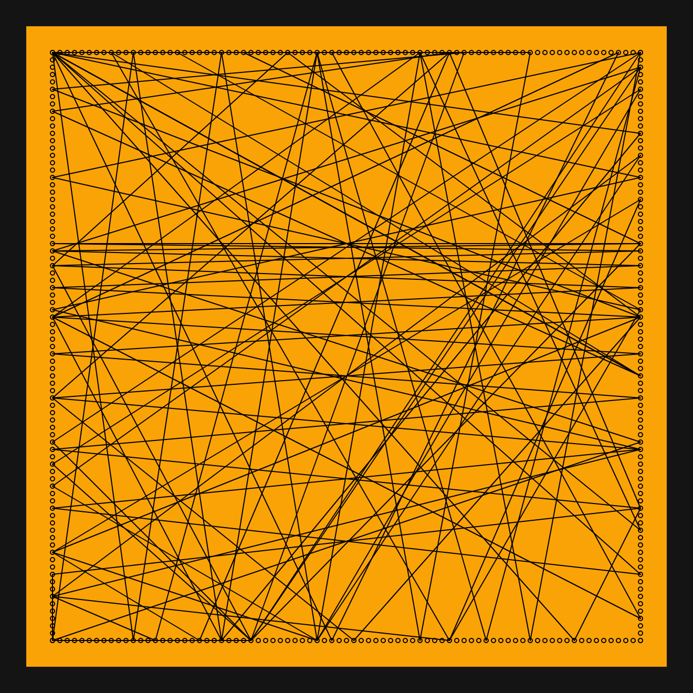
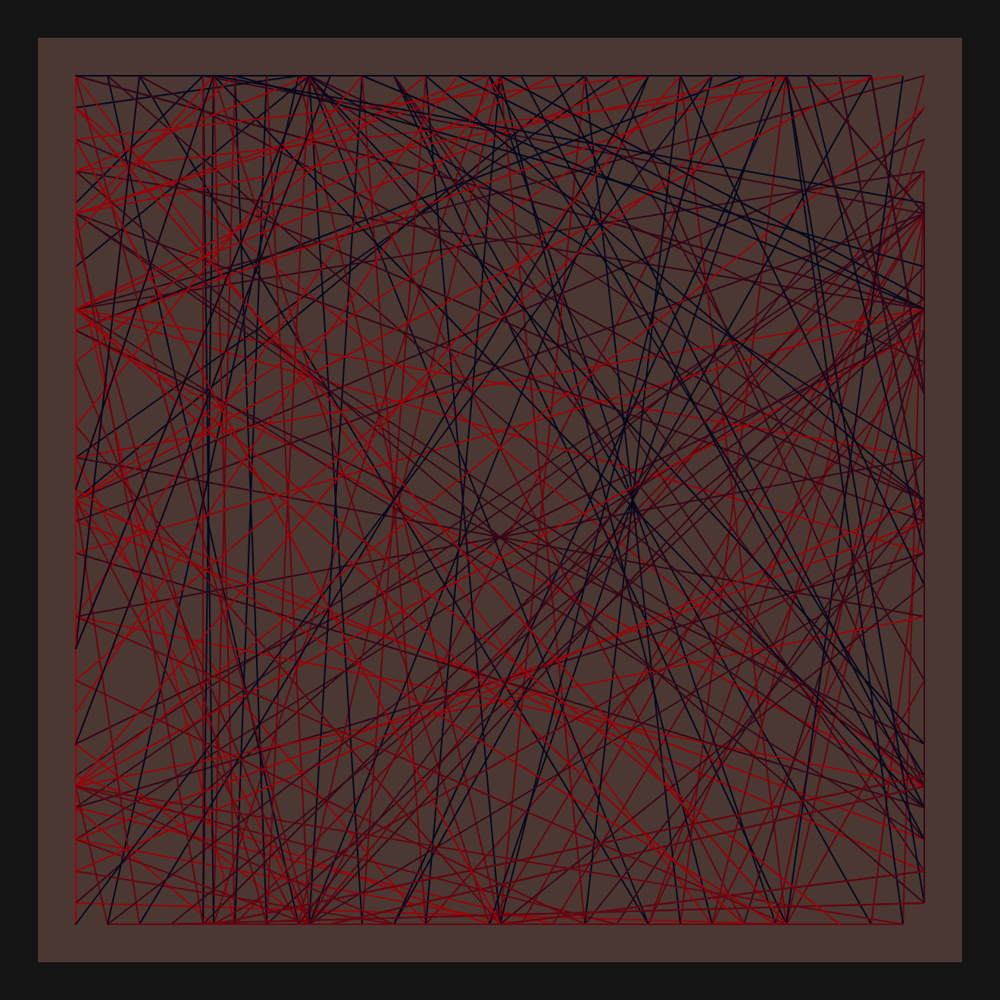
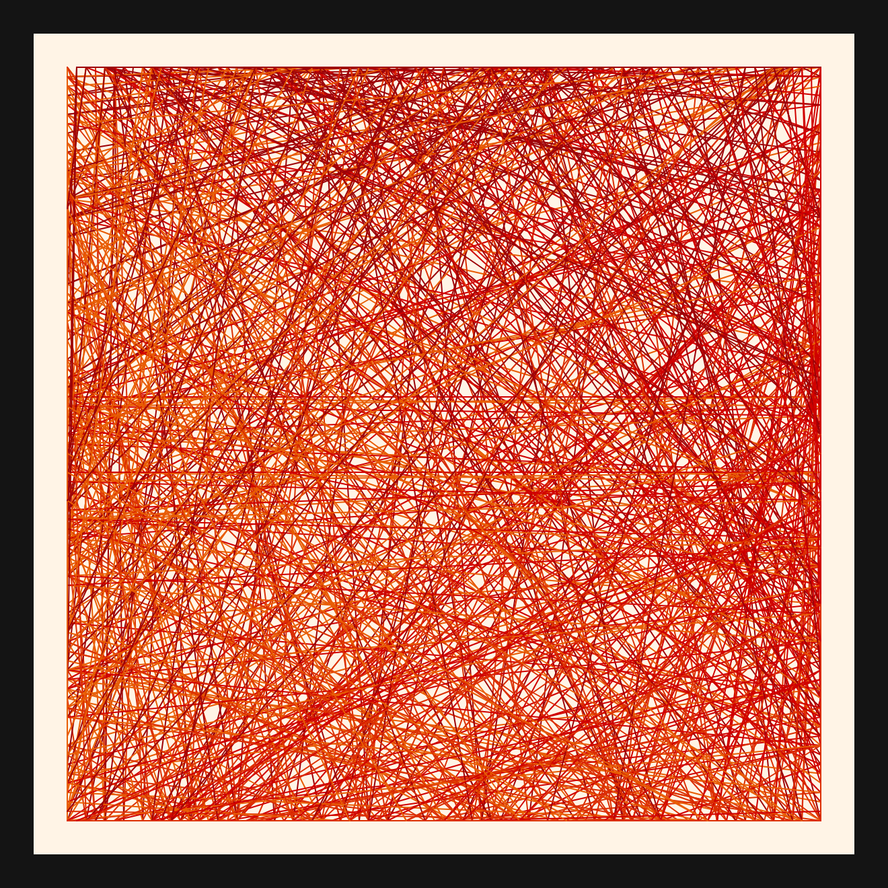
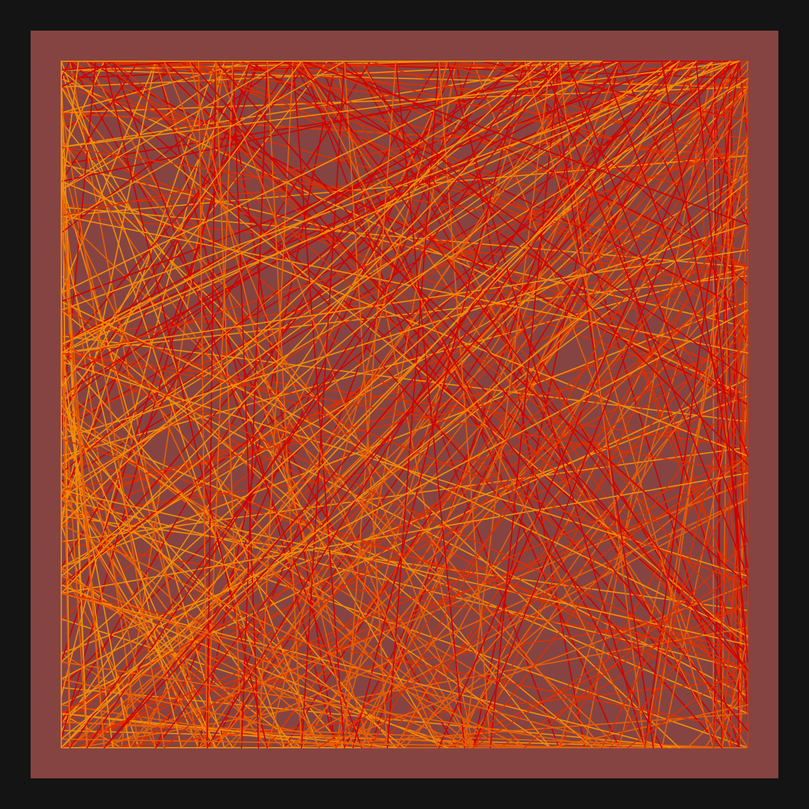
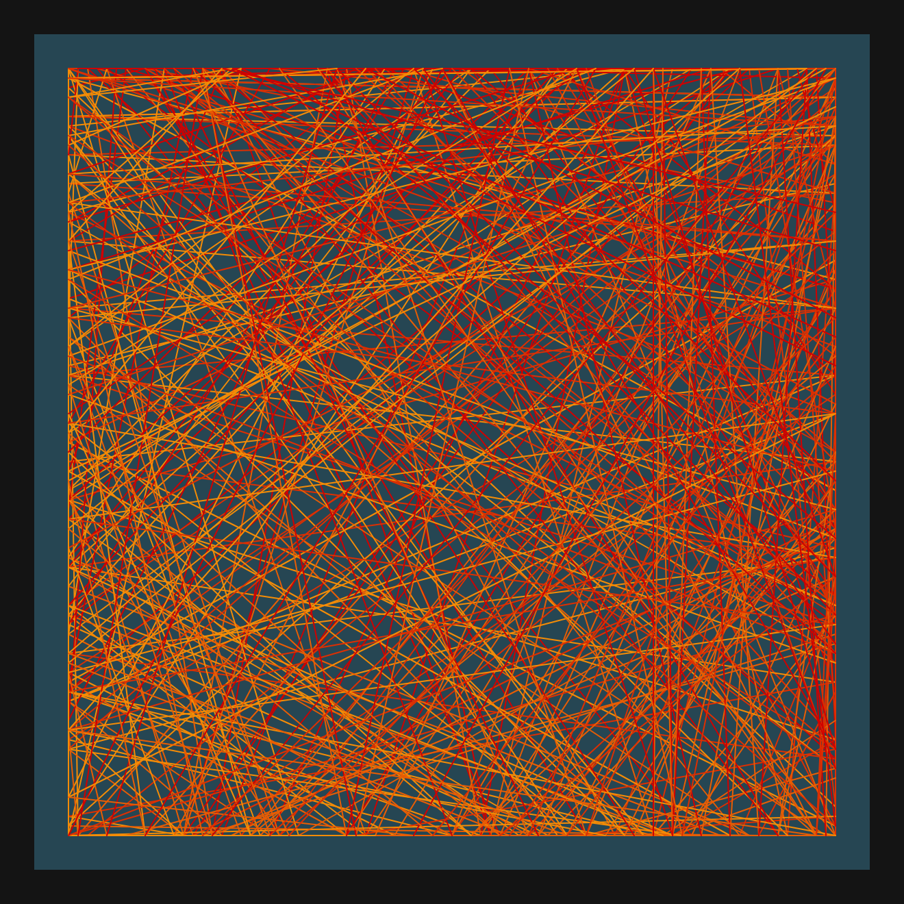
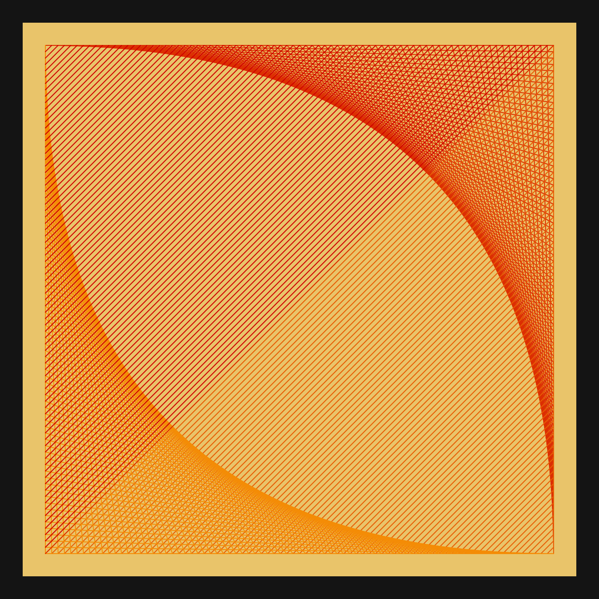

# DAILY SKETCH for 2021-06-17

## Done using P5.js

### Description

These `daily sketches` which are meant to be quick explorations     on whatever topic interested me on that day. This code is not typically optimized, but I share it as-is     for anyone interested.

[Code](2021-06-17) 

       

## Progression of Images that were generated.

 
 
 
 
 
 
 

[More Images](2021-06-17/images) 

 ## 2021-06-17
Keywords: Edge connect, Line segments
 

## Description 

 Start with a Rectangular set of edge (border) points. 
 Draw lines connecting each edge point to its counterpart in the adjacent face.
 Due to some double counting, getting a lovely effect of double parabola.
 

Made using P5.js. | [Code](2021/2021-06-17/) | [Top](#daily-sketches) 

-----

