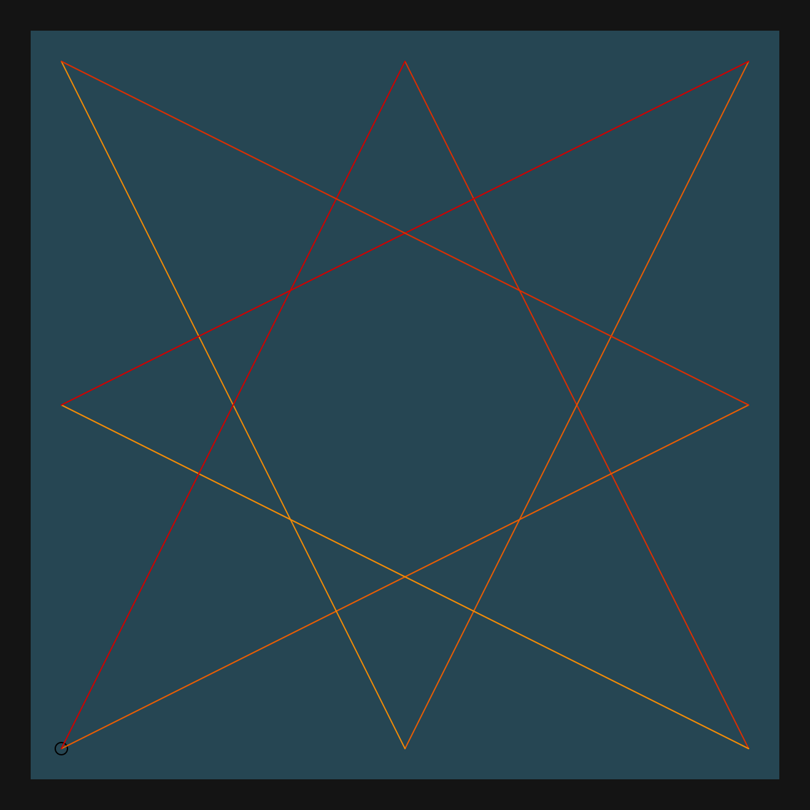
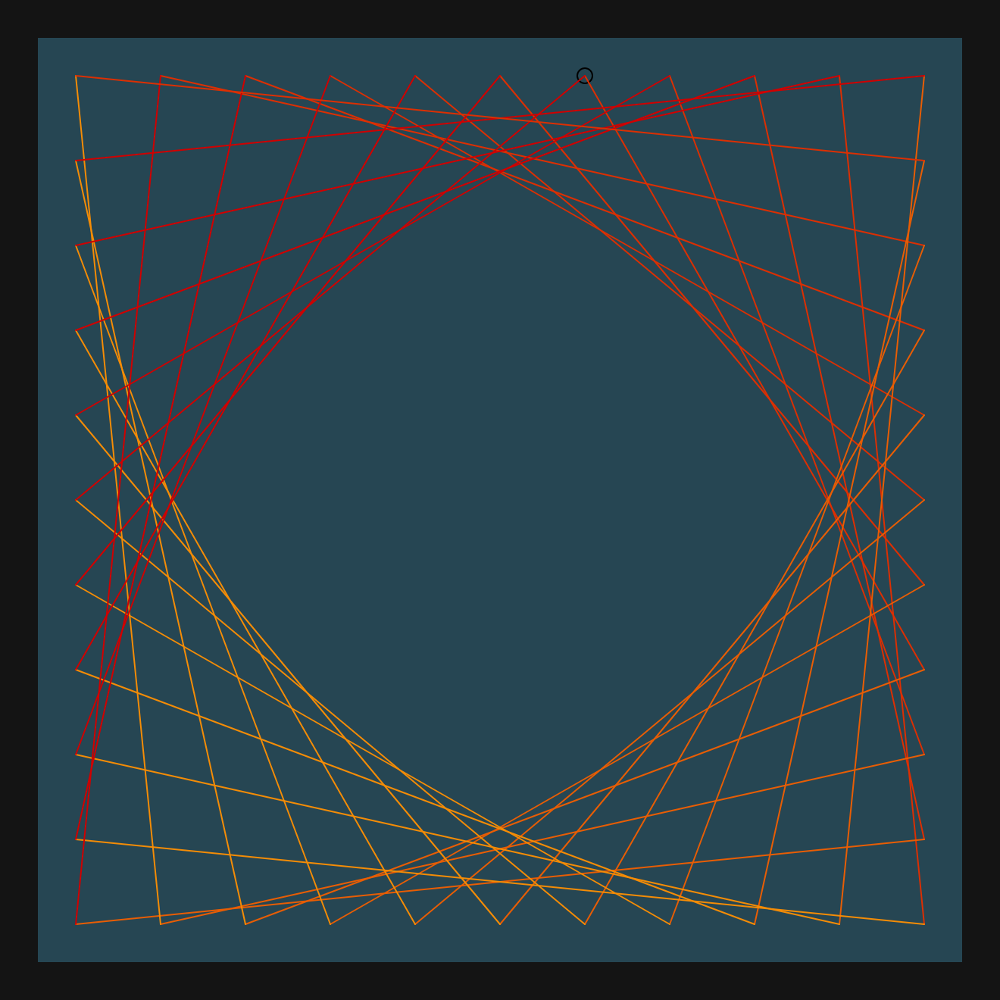

# DAILY SKETCH for 2021-06-18

## Done using P5.js

### Description

These `daily sketches` which are meant to be quick explorations     on whatever topic interested me on that day. This code is not typically optimized, but I share it as-is     for anyone interested.

[Code](2021-06-18) 

    

## Progression of Images that were generated.

 
 
 
 

[More Images](2021-06-18/images) 

 ## 2021-06-18
Keywords: Edge connect, Line segments
 

## Description 

 Start with a Rectangular set of edge (border) points. 
 Draw lines connecting each edge point to its counterpart in the adjacent face.
 with a specified offset. (Need to explore this next.)
 Curves get formed when lines get displaced slowly.
 

Made using P5.js. | [Code](2021/2021-06-18/) | [Top](#daily-sketches) 

-----

