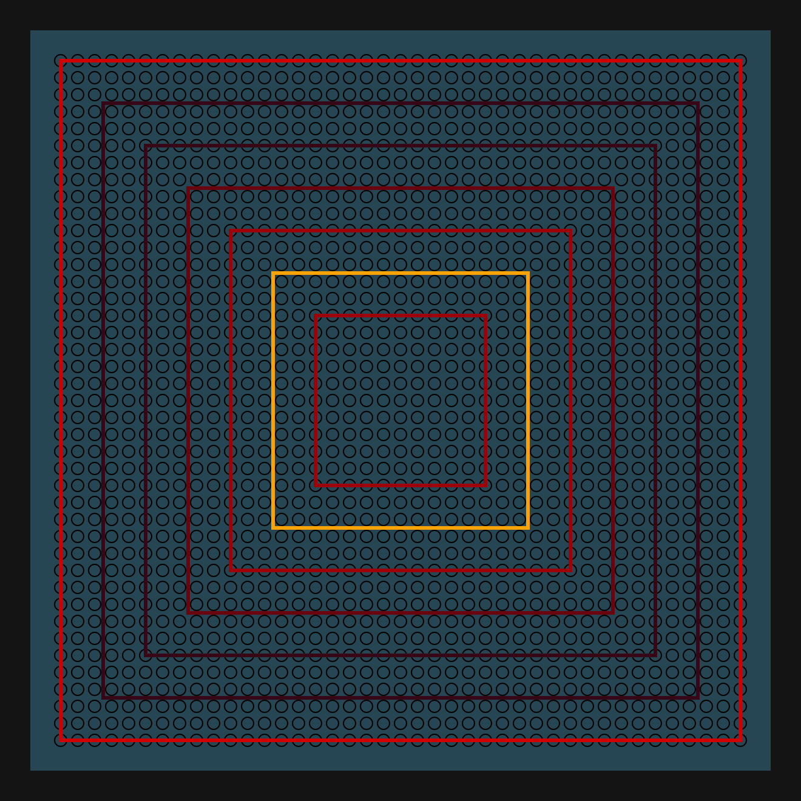
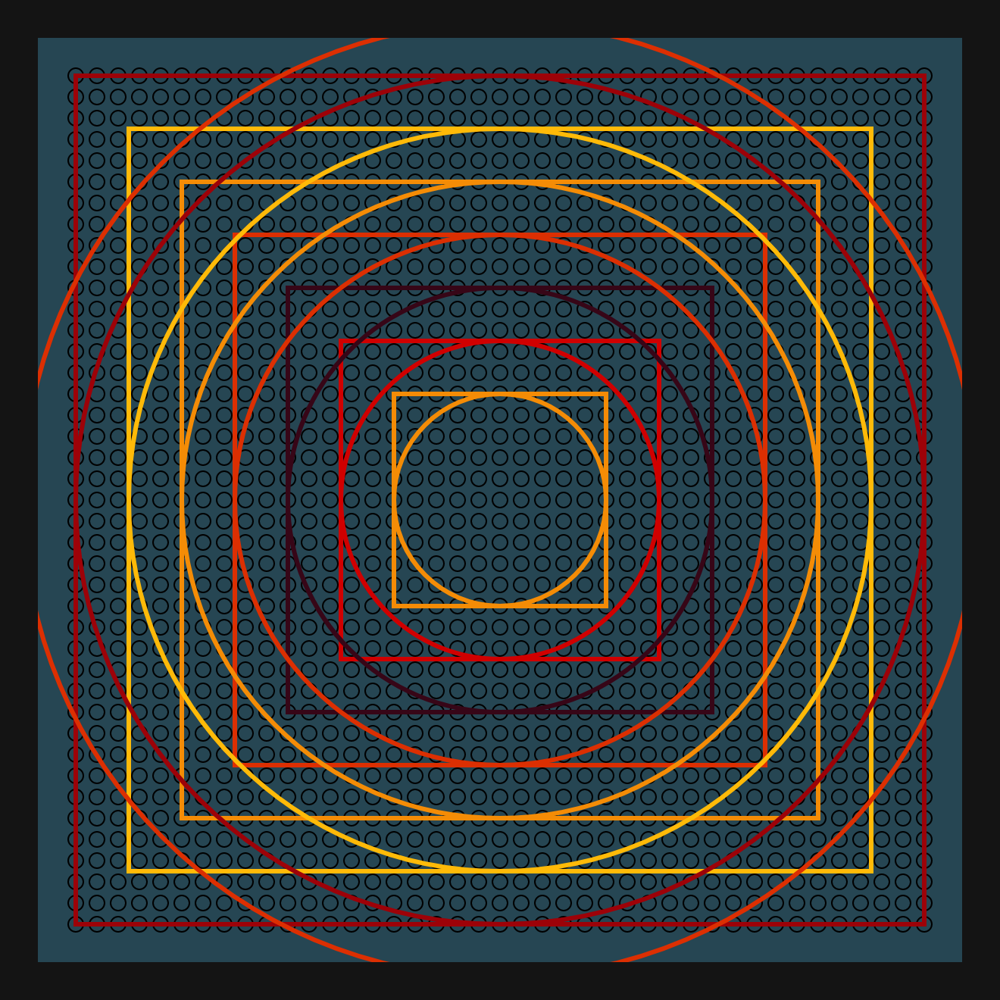
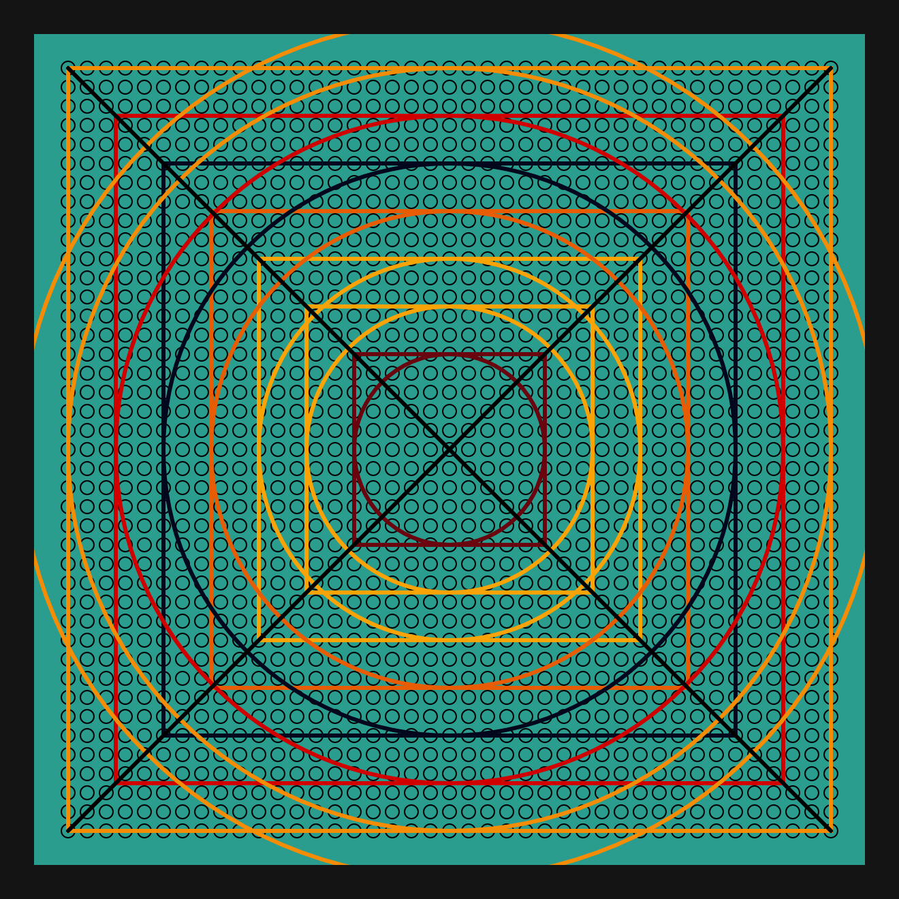
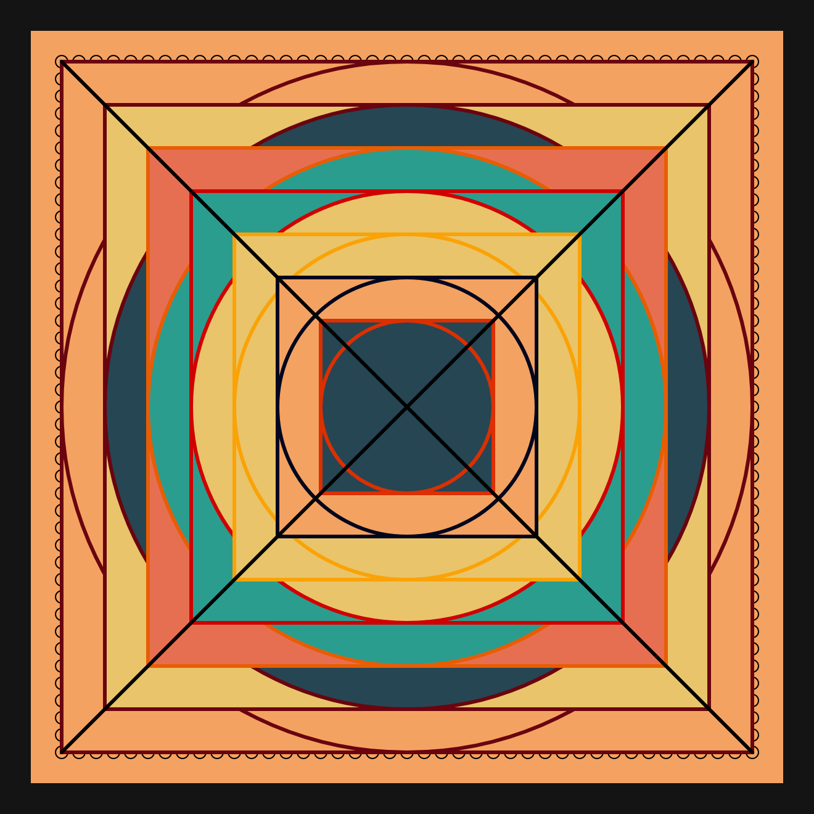
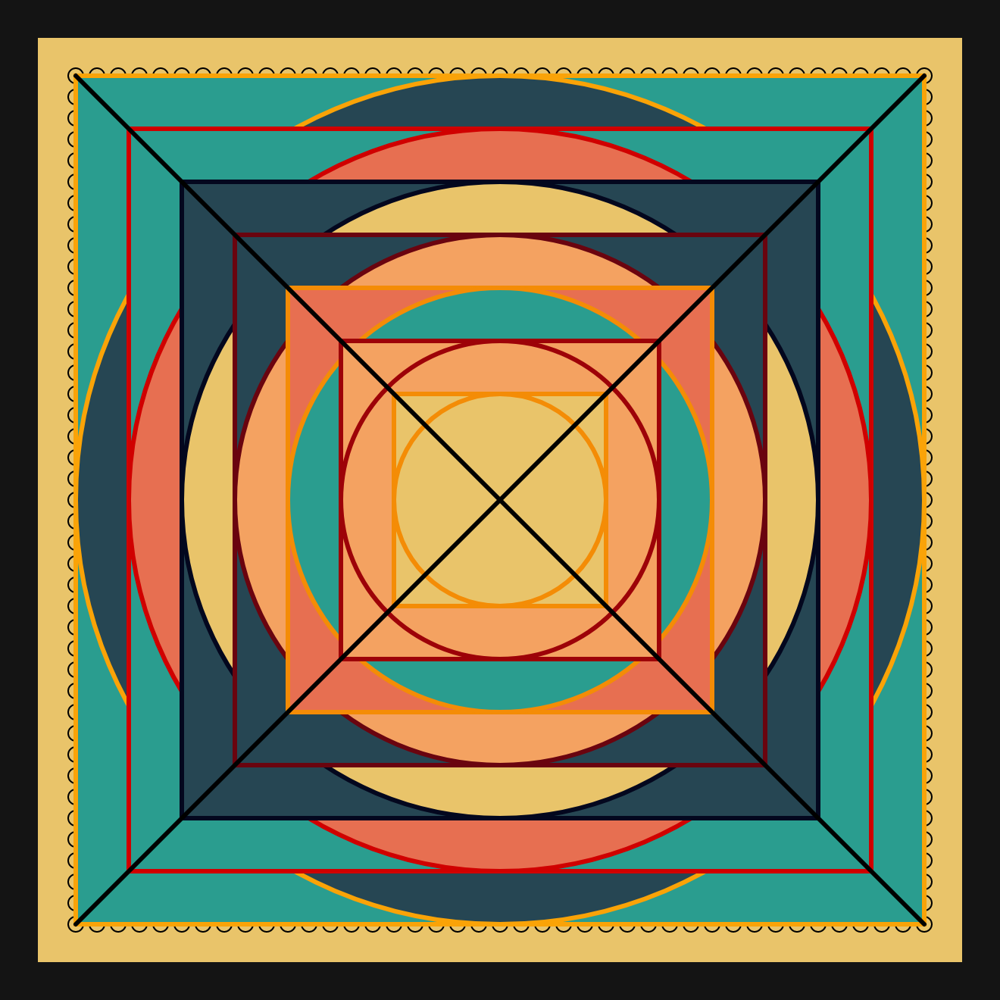
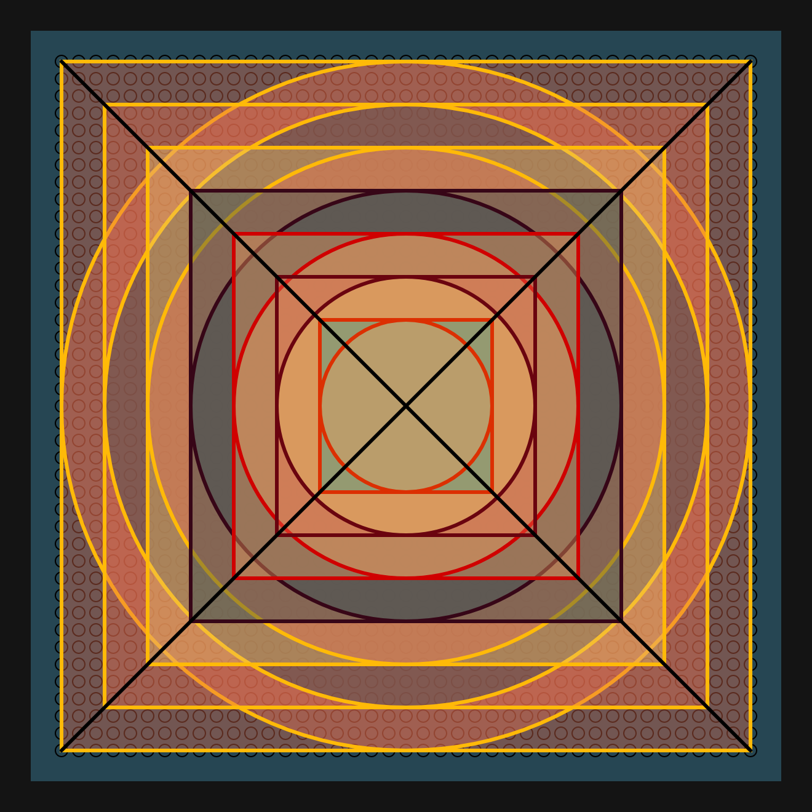

# DAILY SKETCH for 2021-06-19

## Done using P5.js

### Description

These `daily sketches` which are meant to be quick explorations     on whatever topic interested me on that day. This code is not typically optimized, but I share it as-is     for anyone interested.

[Code](2021-06-19) 

       

## Progression of Images that were generated.

 
 
 
 
 
 
 

[More Images](2021-06-19/images) 

 ## 2021-06-19
Keywords: Mandala, Concentric, Symmetry
 

## Description 

 Draw concentric Squares and circles. 
 Make them transparent to create a Mandala effect.
 

Made using P5.js. | [Code](2021/2021-06-19/) | [Top](#daily-sketches) 

-----

