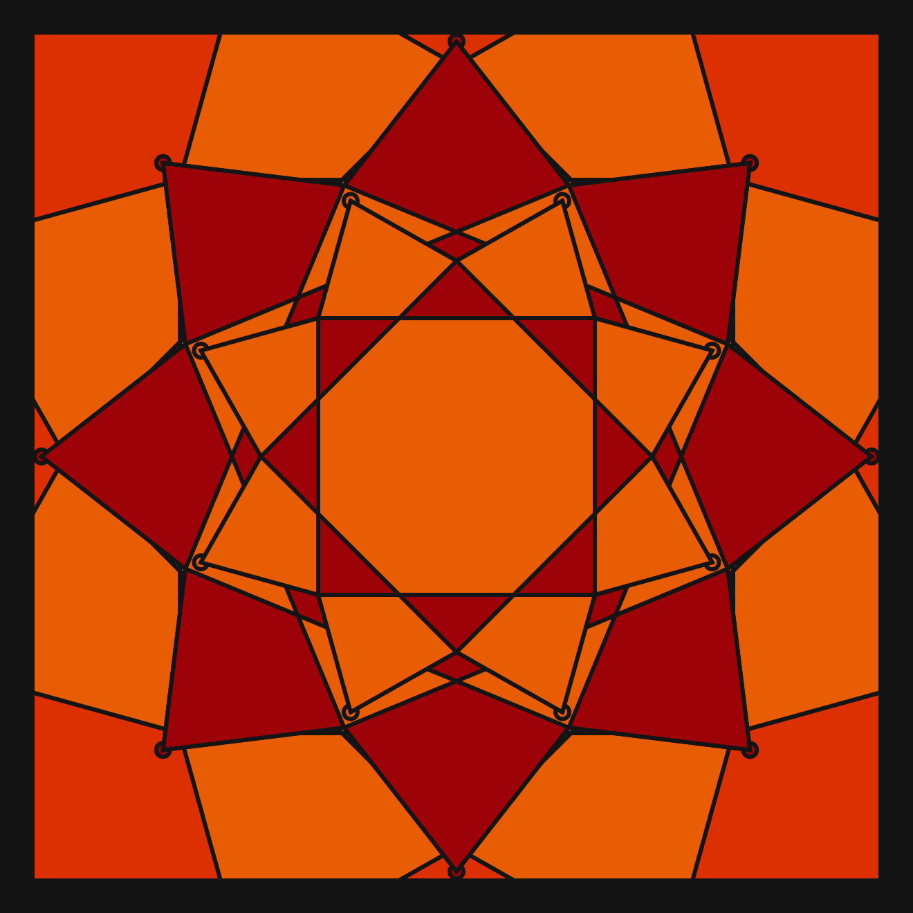
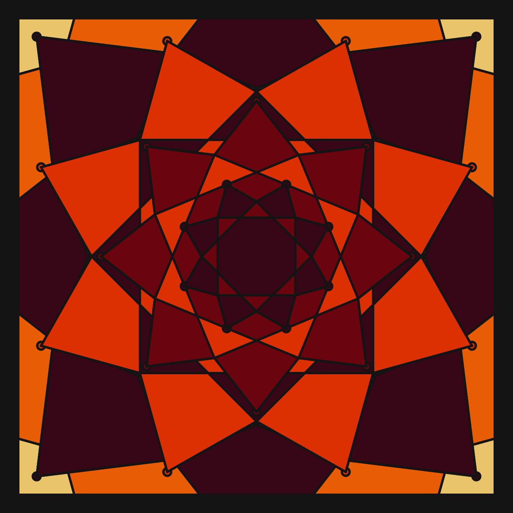
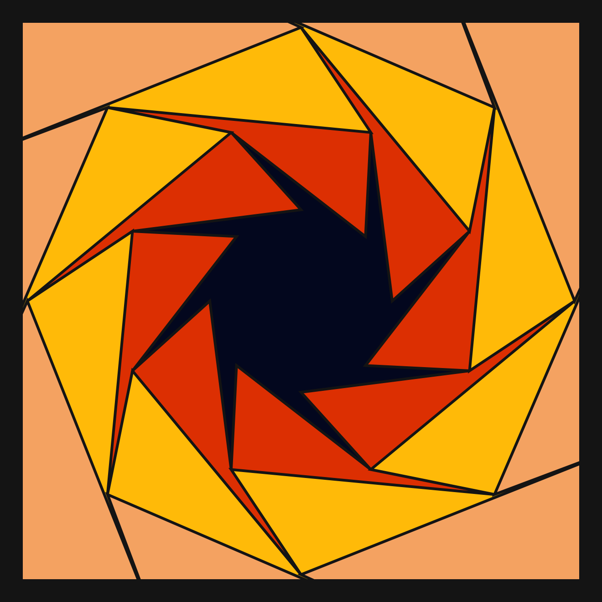
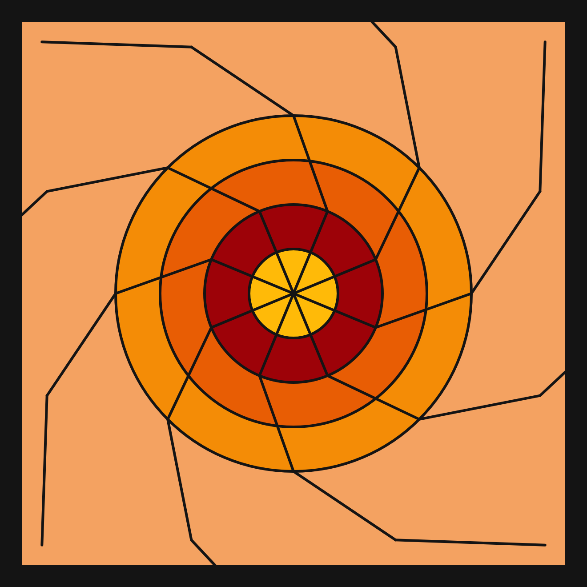
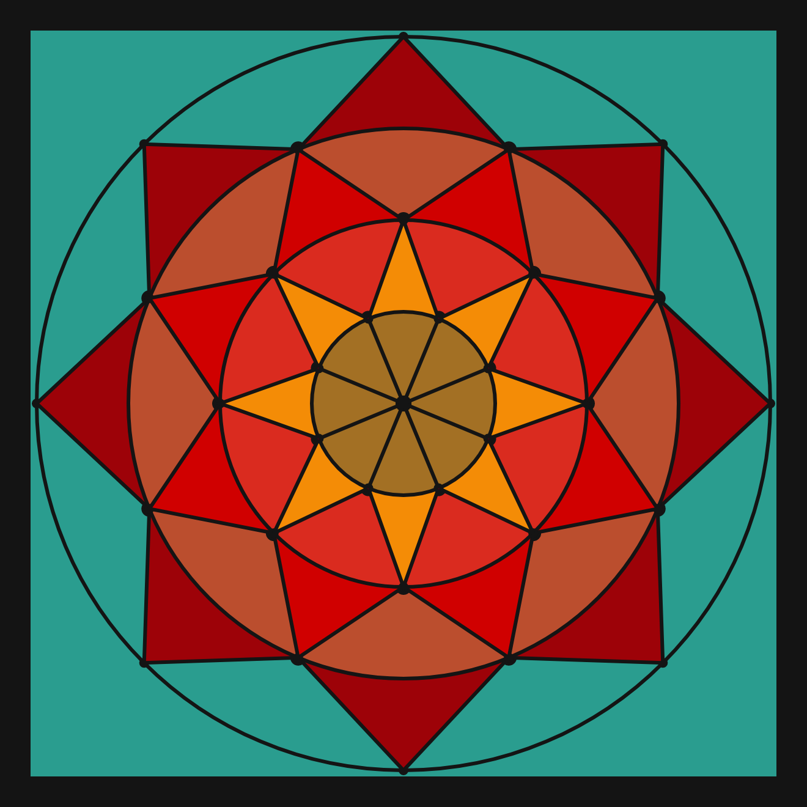
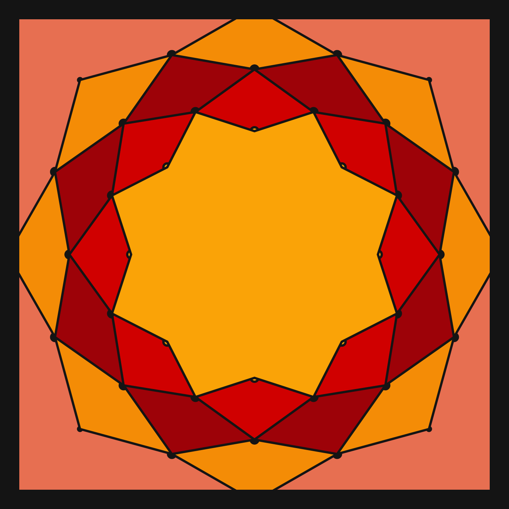

# DAILY SKETCH for 2021-06-22

## Done using P5.js

### Description

These `daily sketches` which are meant to be quick explorations     on whatever topic interested me on that day. This code is not typically optimized, but I share it as-is     for anyone interested.

[Code](2021-06-22) 

       

## Progression of Images that were generated.

 
 
 
 
 
 
 

[More Images](2021-06-22/images) 

 ## 2021-06-22
Keywords: Mandala, Concentric, Symmetry, circle division
 

## Description 

 Draw concentric circular layer, outermost to inner.
 Start from outermost circle. 
 Decorate based on circle division, 2 radii for each layer (upper/lower)
 N pointed stars in each layer
 

Made using P5.js. | [Code](2021/2021-06-22/) | [Top](#daily-sketches) 

-----

