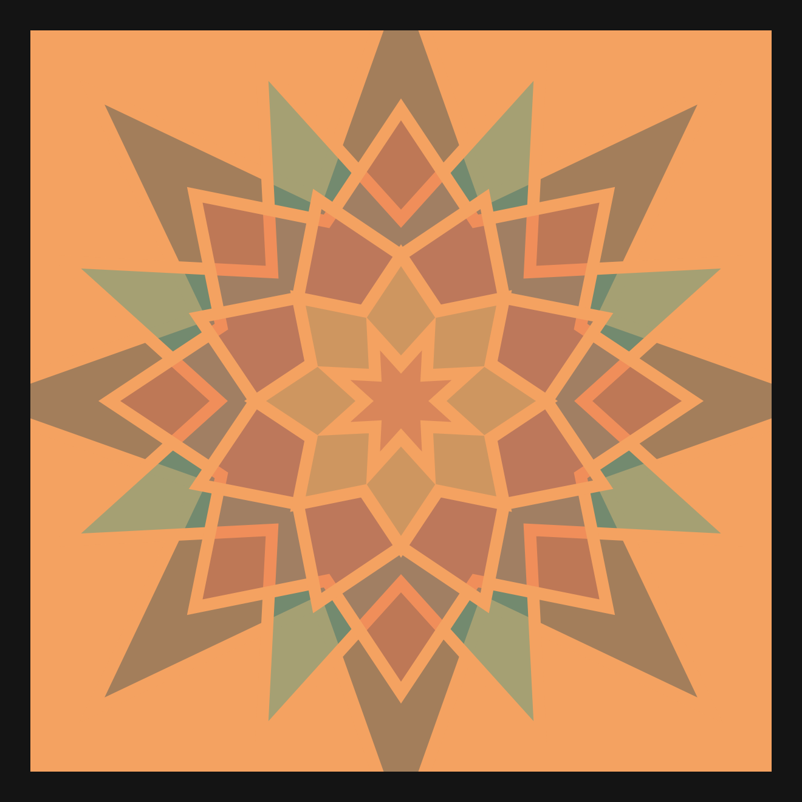
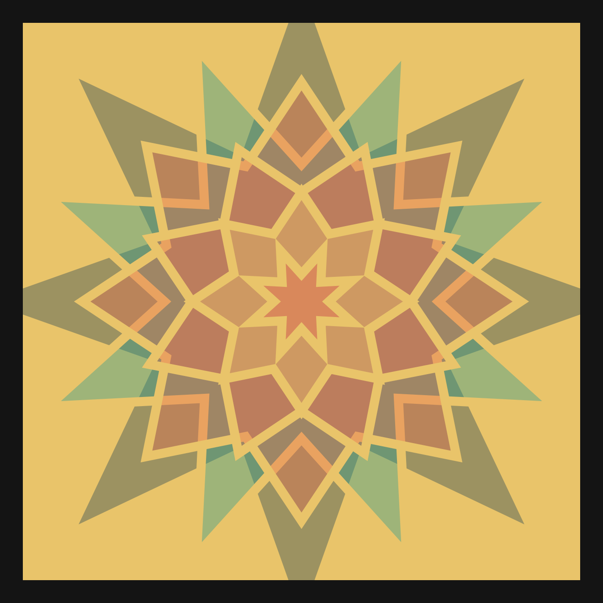
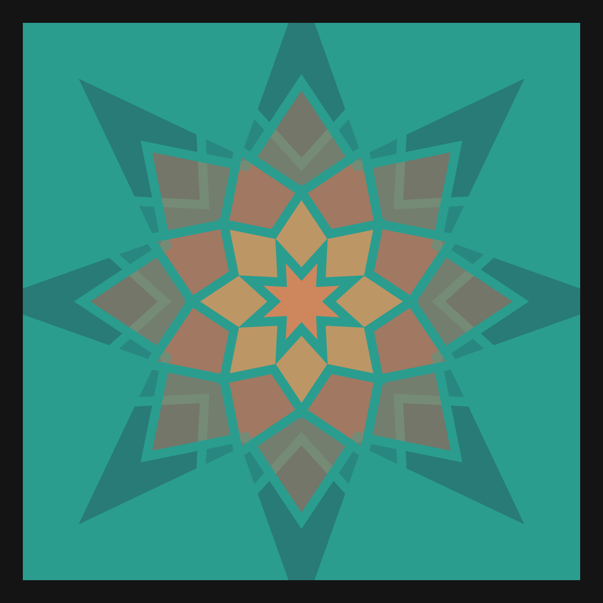
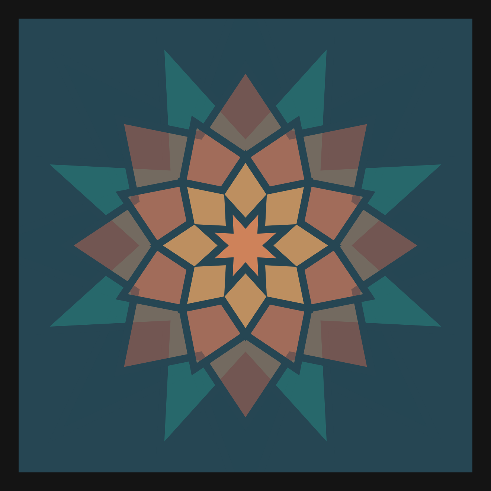

# DAILY SKETCH for 2021-06-25

## Done using P5.js

### Description

These `daily sketches` which are meant to be quick explorations     on whatever topic interested me on that day. This code is not typically optimized, but I share it as-is     for anyone interested.

[Code](2021-06-25) 

                  

## Progression of Images that were generated.

 
 
 
 
 
 
 
 
 
 
 
 
 
 
 
 
 
 

[More Images](2021-06-25/images) 

 ## 2021-06-25
Keywords: Mandala, Concentric, Symmetry
 

## Description 

 A Mandala generating machine.
 One function (the director) to design the Mandala, and draw() just executes it.
 In each subsequent variation, ONE parameter only is altered, resulting
 in endless variations of Mandalas.
 

Made using P5.js. | [Code](2021/2021-06-25/) | [Top](#daily-sketches) 

-----

