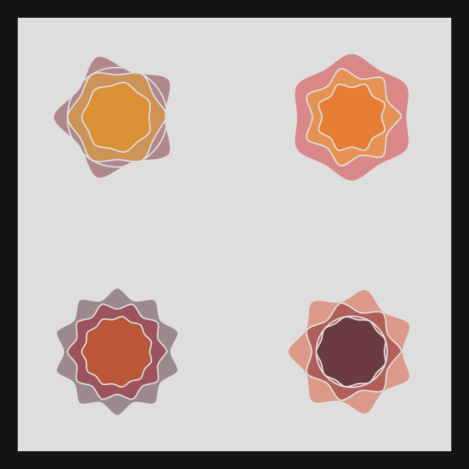

# DAILY SKETCH for 2021-07-06

## Done using P5.js

### Description

These `daily sketches` which are meant to be quick explorations     on whatever topic interested me on that day. This code is not typically optimized, but I share it as-is     for anyone interested.

[Code](2021-07-06) 

  

## Progression of Images that were generated.

 
 

[More Images](2021-07-06/images) 

 ## 2021-07-06
Keywords: Mandala, Grid
 

## Description 

 Multiple Mandalas on a Grid, All with the same outer radius. Inner radius varies as does
 the number of petals.
 

Made using P5.js. | [Code](2021/2021-07-06/) | [Top](#daily-sketches) 

-----

