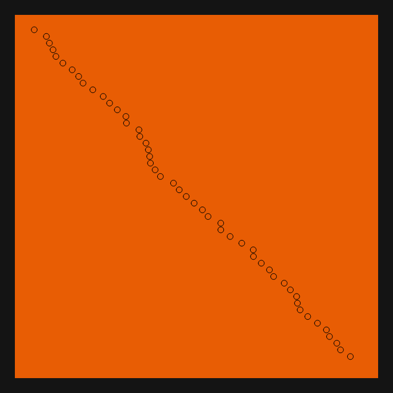
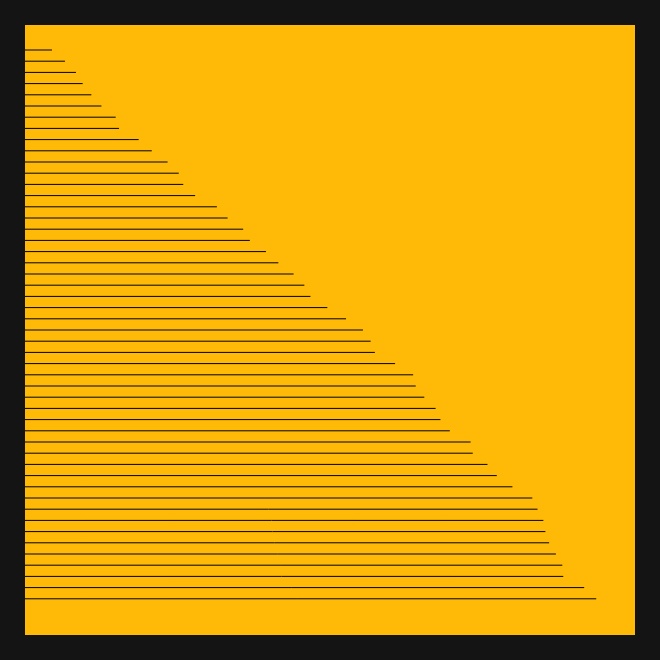

# DAILY SKETCH for 2021-07-13

## Done using P5.js

### Description

These `daily sketches` which are meant to be quick explorations     on whatever topic interested me on that day. This code is not typically optimized, but I share it as-is     for anyone interested.

   

## Progression of Images that were generated.

 
 
 

[More Images](2021-07-13/images) 

 ## 2021-07-13
Keywords: Lines, Edge Connect
 

## Description 

 Use Noise to get a series of mid-points. Connect horizontal and vertical lines to it.
 

Made using P5.js. | [Code](2021/2021-07-13/) | [Top](#daily-sketches) 

-----

