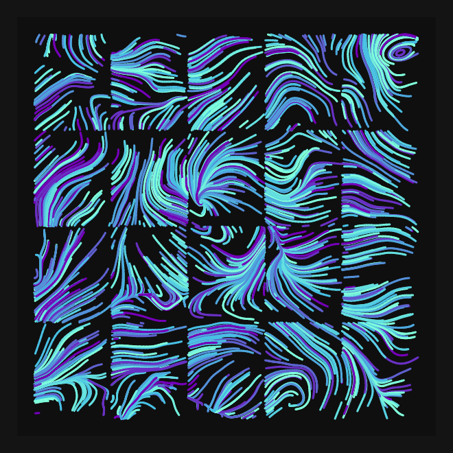

# DAILY SKETCH for 2021-08-03

## Done using P5.js

### Description

These `daily sketches` which are meant to be quick explorations     on whatever topic interested me on that day. This code is not typically optimized, but I share it as-is     for anyone interested.

 

## Progression of Images that were generated.

 

[More Images](2021-08-03/images) 

 ## 2021-08-03
Keywords: Flow field
 

## Description 

 Flow particles inside a set of tiles. colored
 Next, trying to contain them within tiles. 

Made using P5.js. | [Code](2021/2021-08-03/) | [Top](#daily-sketches) 

-----

