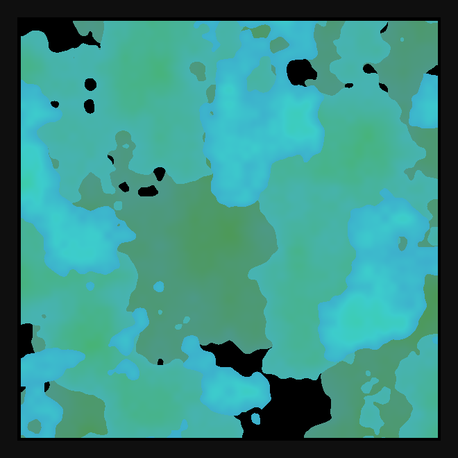

# DAILY SKETCH for 2021-08-23

## Done using P5.js

### Description

These `daily sketches` which are meant to be quick explorations     on whatever topic interested me on that day. This code is not typically optimized, but I share it as-is     for anyone interested.

  

## Progression of Images that were generated.

 
 

[More Images](2021-08-23/images) 

 ## 2021-08-23
Keywords: Domain Warping, Perlin Noise, Layers
 

## Description 

 Three layers of Domain Warping (cutoff-based) has a continent/map-like effect, color shift from layer to layer
 

Made using P5.js. | [Code](2021/2021-08-23/) | [Top](#daily-sketches) 

-----

