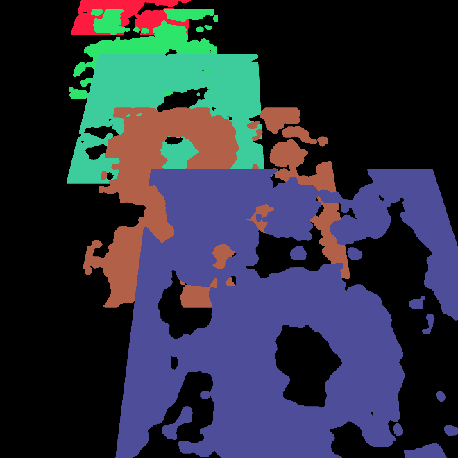

# DAILY SKETCH for 2021-08-27

## Done using P5.js

### Description

These `daily sketches` which are meant to be quick explorations     on whatever topic interested me on that day. This code is not typically optimized, but I share it as-is     for anyone interested.

   

## Progression of Images that were generated.

 
 
 

[More Images](2021-08-27/images) 

 ## 2021-08-27
Keywords: Domain Warping, Perlin Noise, Layers, WEBGL
 

## Description 

 WEBGL 3D attempt continent/map-like effect with single colored layers
 

Made using P5.js. | [Code](2021/2021-08-27/) | [Top](#daily-sketches) 

-----

