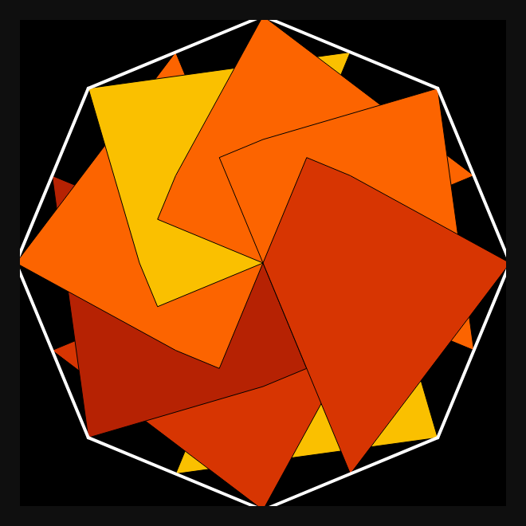
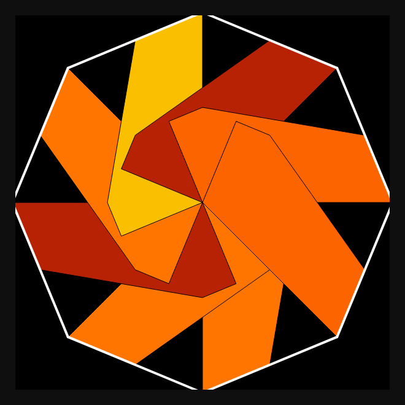
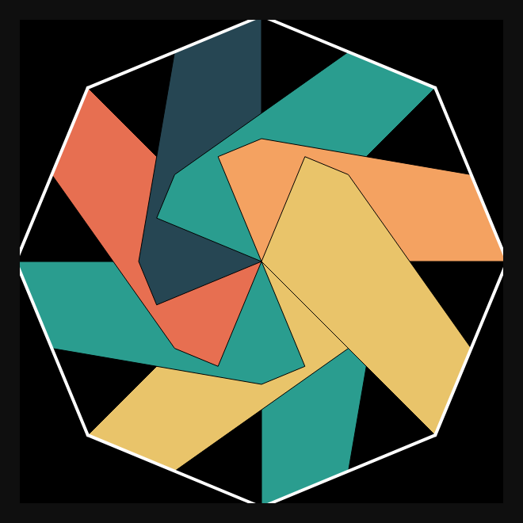
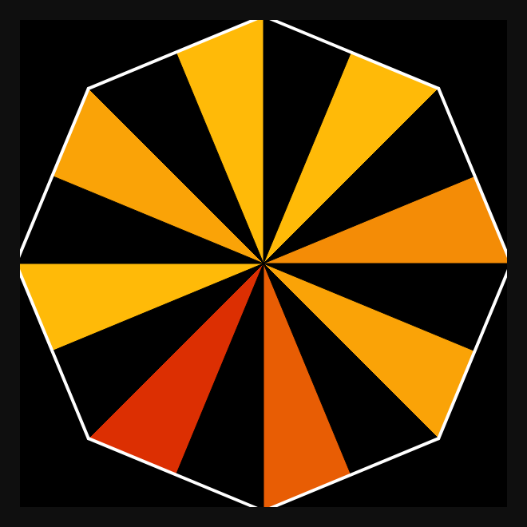
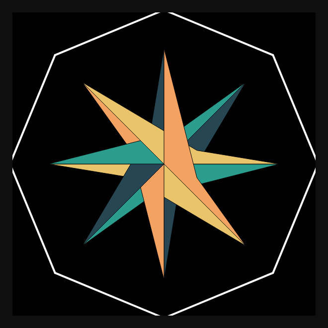
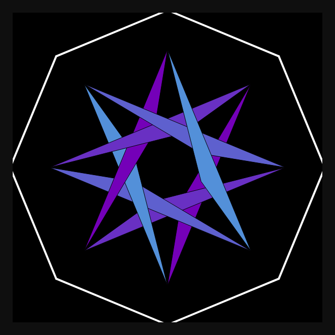

# DAILY SKETCH for 2021-09-04

## Done using P5.js

### Description

These `daily sketches` which are meant to be quick explorations     on whatever topic interested me on that day. This code is not typically optimized, but I share it as-is     for anyone interested.

       

## Progression of Images that were generated.

 
 
 
 
 
 
 

[More Images](2021-09-04/images) 

 ## 2021-09-04
Keywords: Octagonal
 

## Description 

 Geometric Design Octagons made up of sub-shapes, petals 

Made using P5.js. | [Code](2021/2021-09-04/) | [Top](#daily-sketches) 

-----

