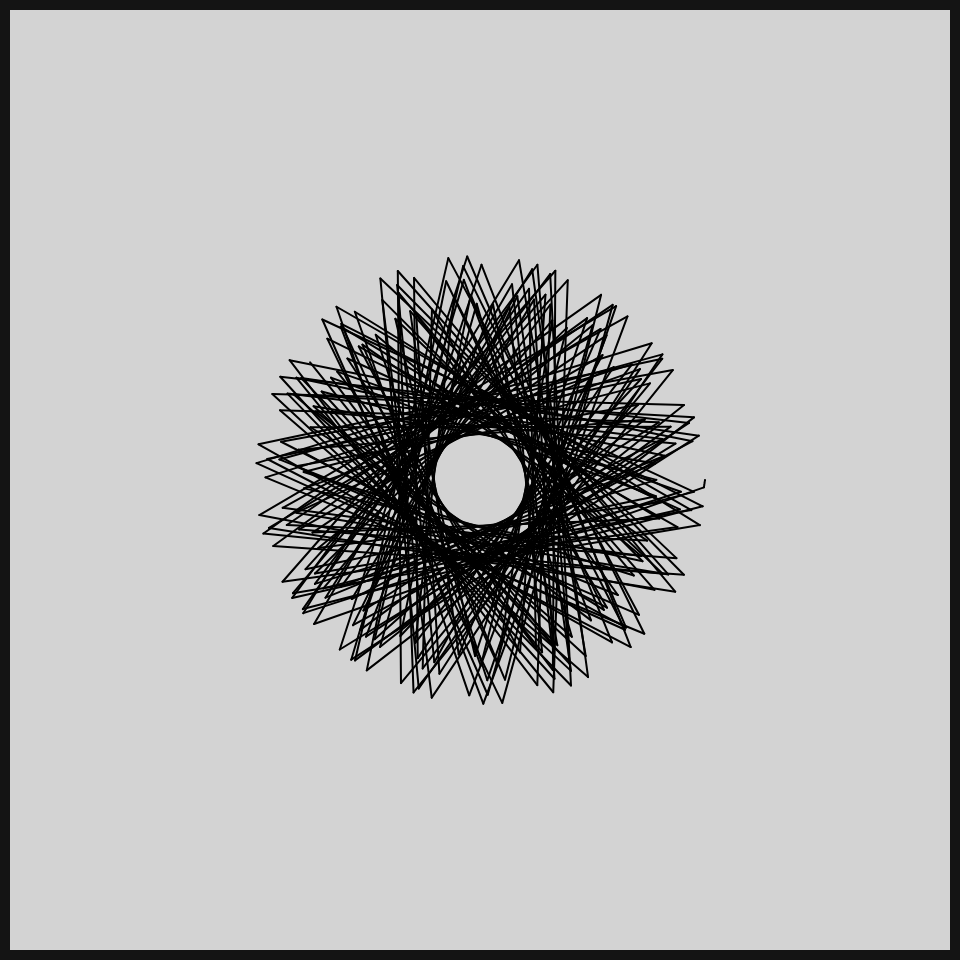
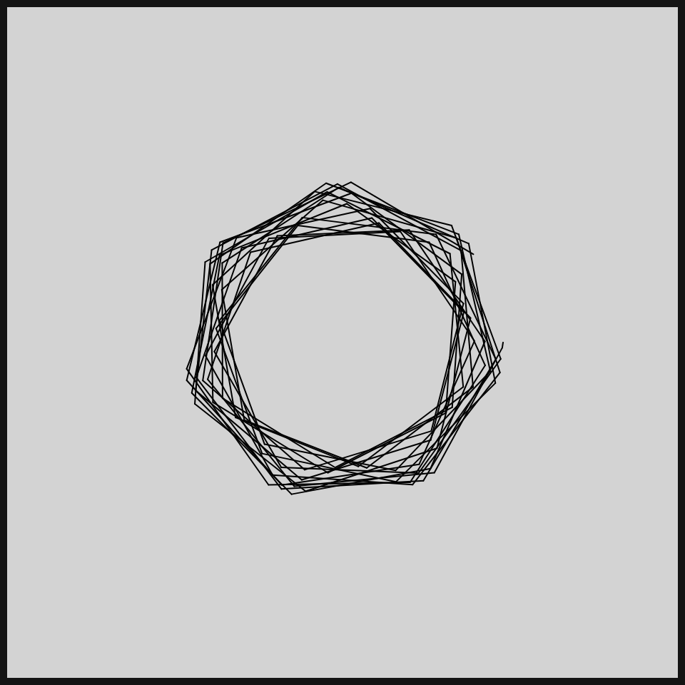

# DAILY SKETCH for 2021-09-07

## Done using P5.js

### Description

These `daily sketches` which are meant to be quick explorations     on whatever topic interested me on that day. This code is not typically optimized, but I share it as-is     for anyone interested.

    

## Progression of Images that were generated.

 
 
 
 

[More Images](2021-09-07/images) 

 ## 2021-09-07
Keywords: Spirograph
 

## Description 

 Playing around with two radii (r1 and r2) and angle increments
 http://www.eddaardvark.co.uk/python_patterns/spirograph.htm
 

Made using P5.js. | [Code](2021/2021-09-07/) | [Top](#daily-sketches) 

-----

