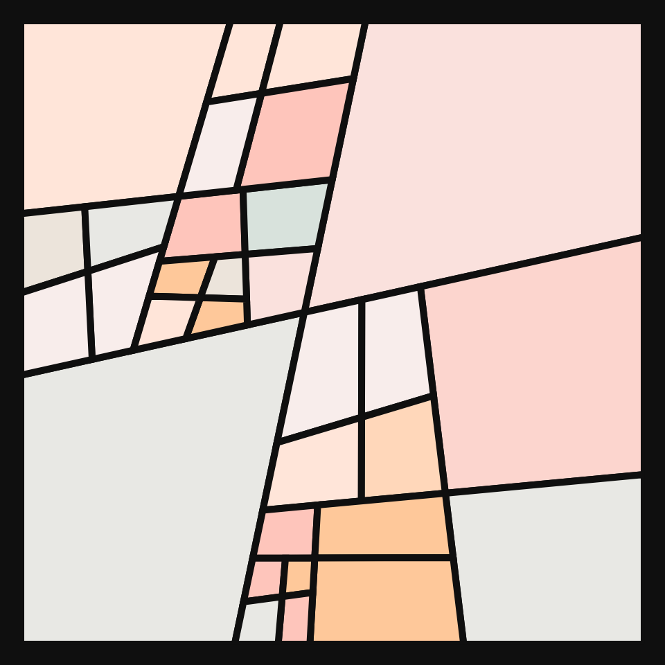
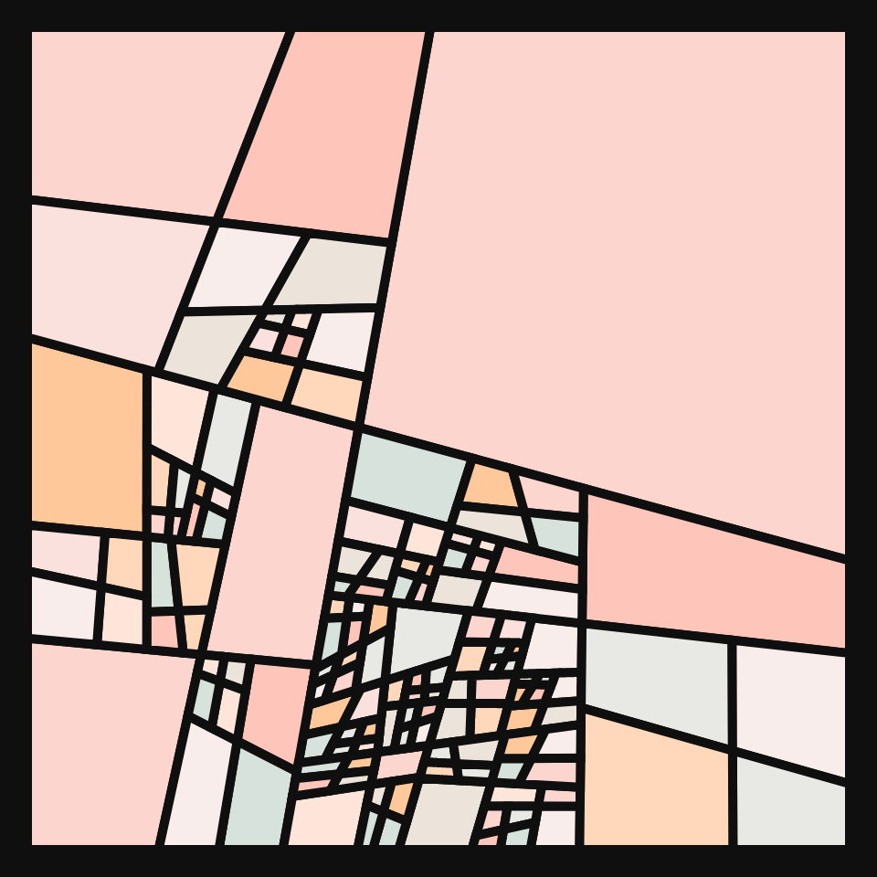
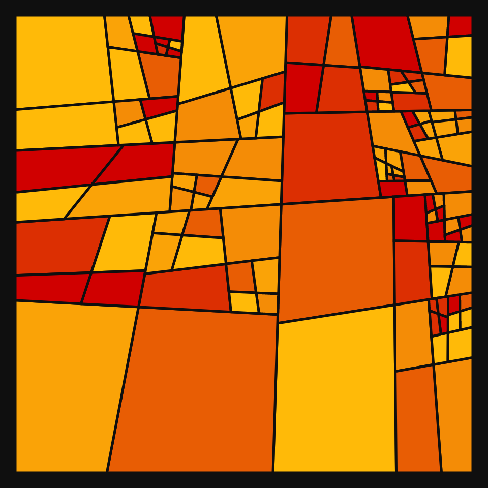
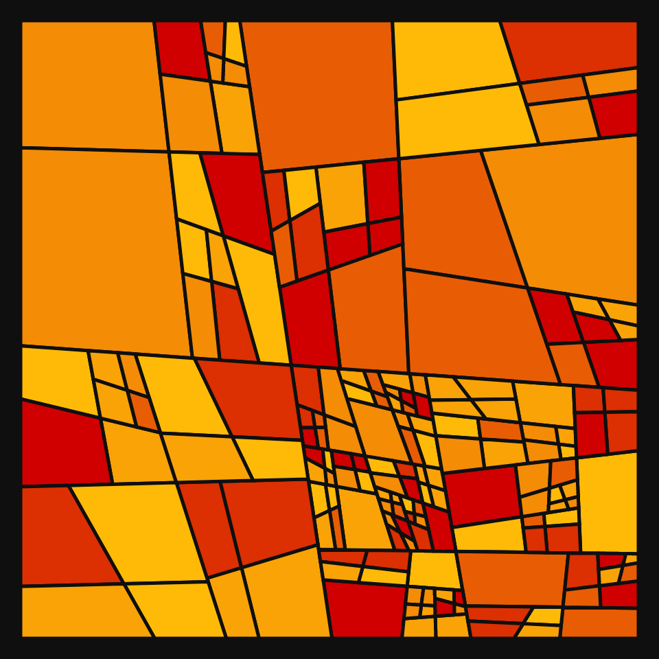

# DAILY SKETCH for 2021-09-25

## Done using P5.js

### Description

These `daily sketches` which are meant to be quick explorations     on whatever topic interested me on that day. This code is not typically optimized, but I share it as-is     for anyone interested.

      

## Progression of Images that were generated.

 
 
 
 
 
 

[More Images](2021-09-25/images) 

 ## 2021-09-25
Keywords: Fractal, subdivision, shapes
 

## Description 

 Fractal subdivision with random splits on 4 sides. Calculate midpoint and then connect.
 Creates a cityscape map effect.
 

Made using P5.js. | [Code](2021/2021-09-25/) | [Top](#daily-sketches) 

-----

