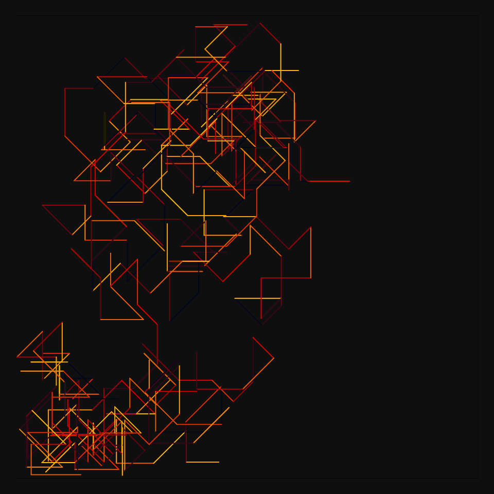
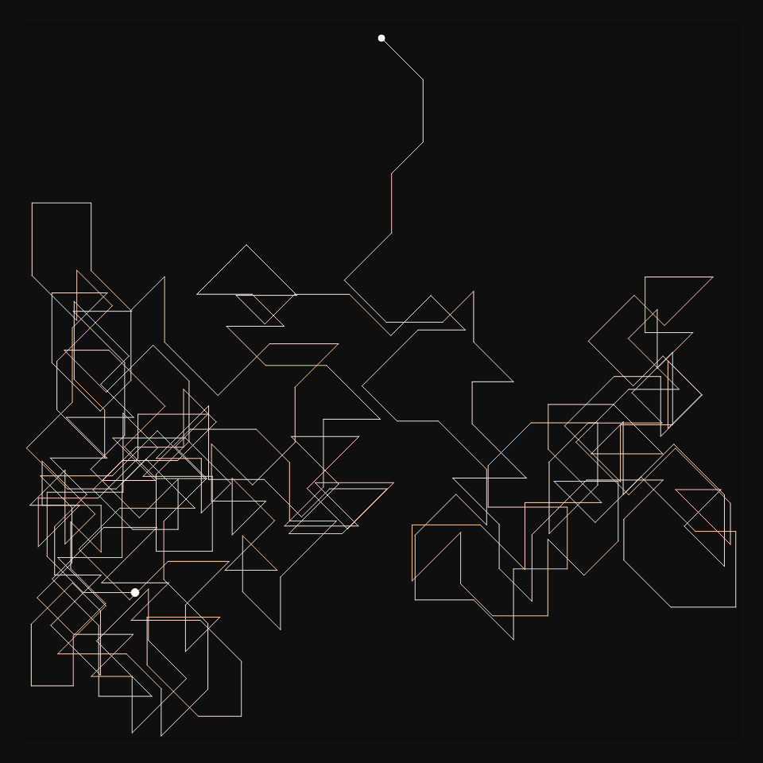
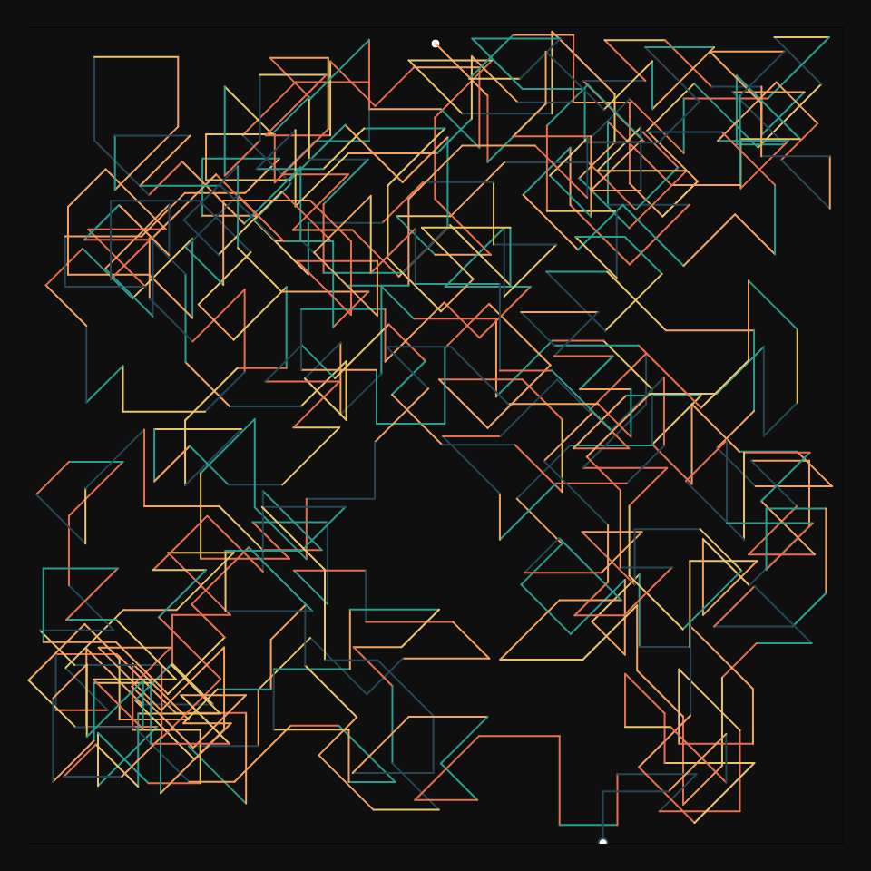
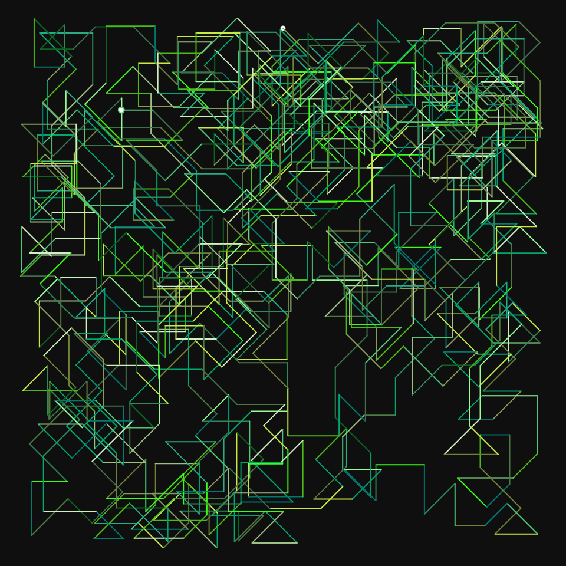

# DAILY SKETCH for 2021-10-04

## Done using P5.js

### Description

These `daily sketches` which are meant to be quick explorations     on whatever topic interested me on that day. This code is not typically optimized, but I share it as-is     for anyone interested.

     

## Progression of Images that were generated.

 
 
 
 
 

[More Images](2021-10-04/images) 

## 2021-10-04
Keywords: Single Line, 45-degree-angles-only
 

## Description 

 This is one single line that twists and turns in 45 degree angles. It forms clusters and then jumps to a different areas
 The idea is to imply an overcrowded Metro transportation map.
 

Made using P5.js. | [Code](2021/2021-10-04/) | [Top](#daily-sketches) 

-----

