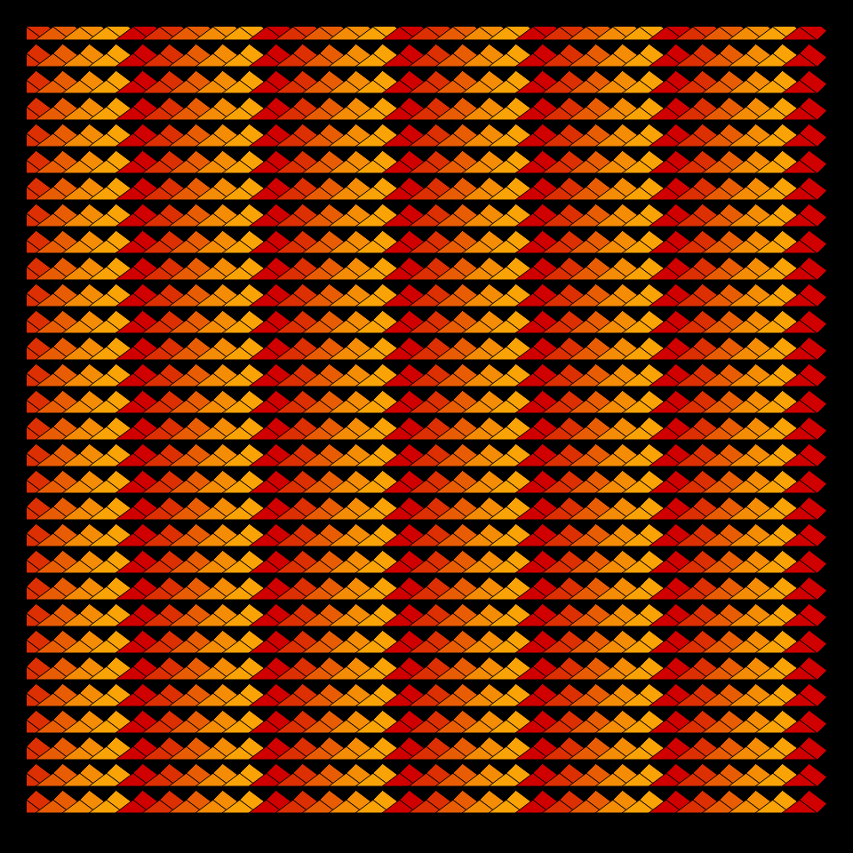
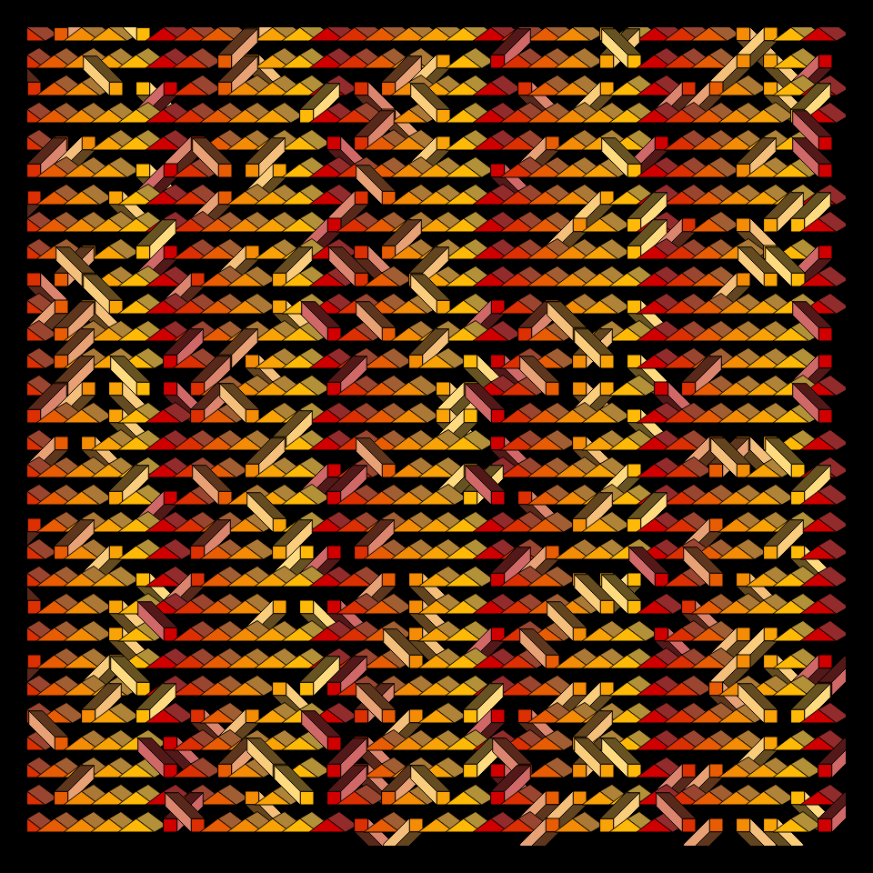

# DAILY SKETCH for 2021-10-14

## Done using P5.js

### Description

These `daily sketches` which are meant to be quick explorations     on whatever topic interested me on that day. This code is not typically optimized, but I share it as-is     for anyone interested.

    

## Progression of Images that were generated.

 
 
 
 

[More Images](2021-10-14/images) 

## 2021-10-14
Keywords: shapes, prisms
 

## Description 

 An array of assorted shapes, with a few voids
 

Made using P5.js. | [Code](2021/2021-10-14/) | [Top](#daily-sketches) 

-----

