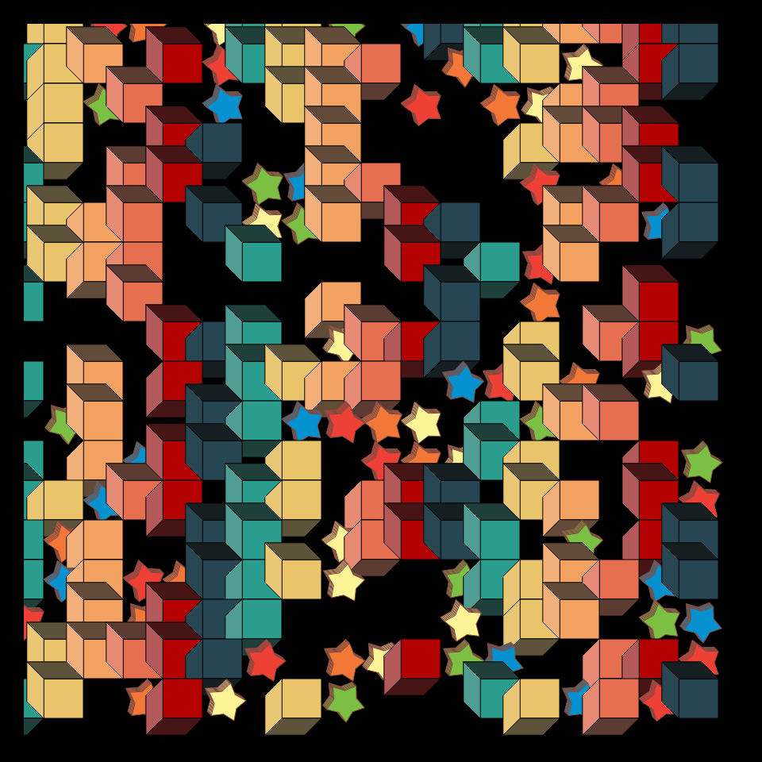

# DAILY SKETCH for 2021-10-16

## Done using P5.js

### Description

These `daily sketches` which are meant to be quick explorations     on whatever topic interested me on that day. This code is not typically optimized, but I share it as-is     for anyone interested.

  

## Progression of Images that were generated.

 
 

[More Images](2021-10-16/images) 

## 2021-10-16
Keywords: shapes, cuboids, star
 

## Description 

 A Grid array of assorted shapes, cuboids, stars & cylinders, with a few voids.
 

Made using P5.js. | [Code](2021/2021-10-16/) | [Top](#daily-sketches) 

-----

