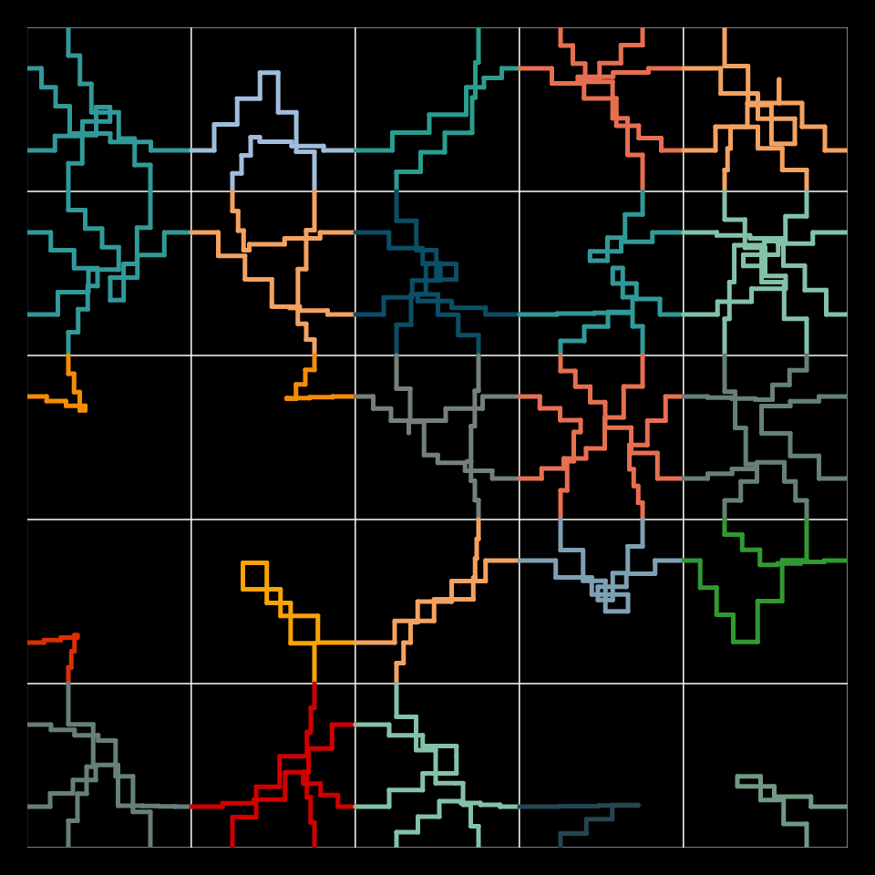
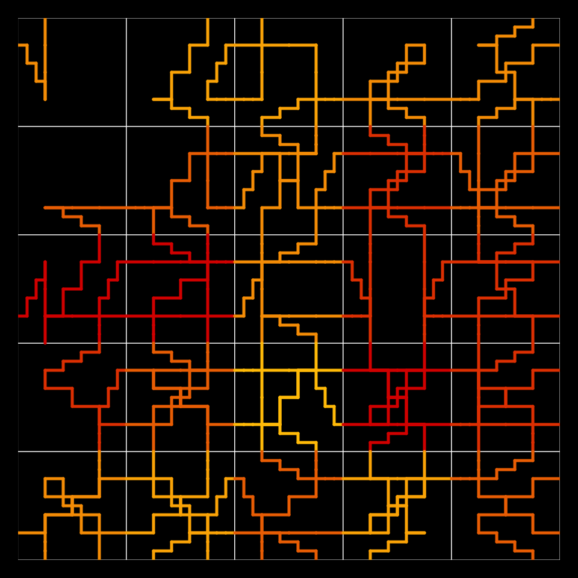
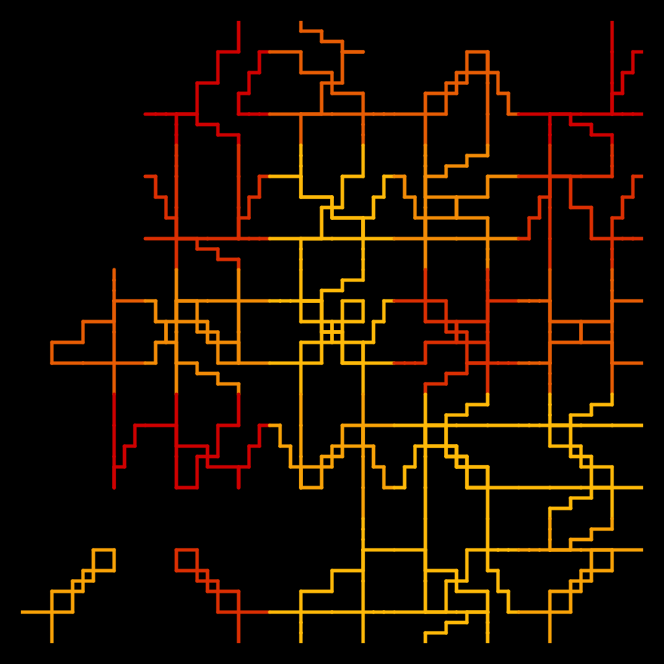
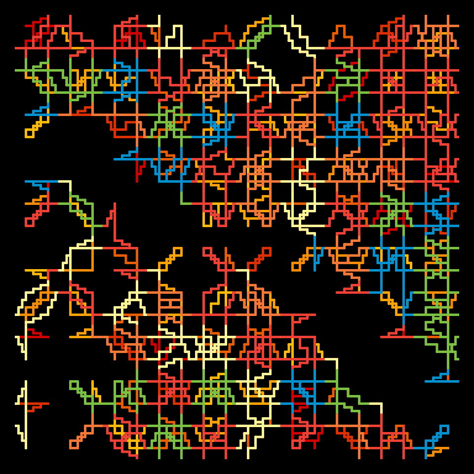

# DAILY SKETCH for 2021-10-28

## Done using P5.js

### Description

These `daily sketches` which are meant to be quick explorations     on whatever topic interested me on that day. This code is not typically optimized, but I share it as-is     for anyone interested.

     

## Progression of Images that were generated.

 
 
 
 
 

[More Images](2021-10-28/images) 

## 2021-10-28
Keywords: tiles, truchet
 

## Description 

 An assorted colorful tile grid of truchet tiles, with stepped lines and 
 random connects. (Any two per point)
 

Made using P5.js. | [Code](2021/2021-10-28/) | [Top](#daily-sketches) 

-----

