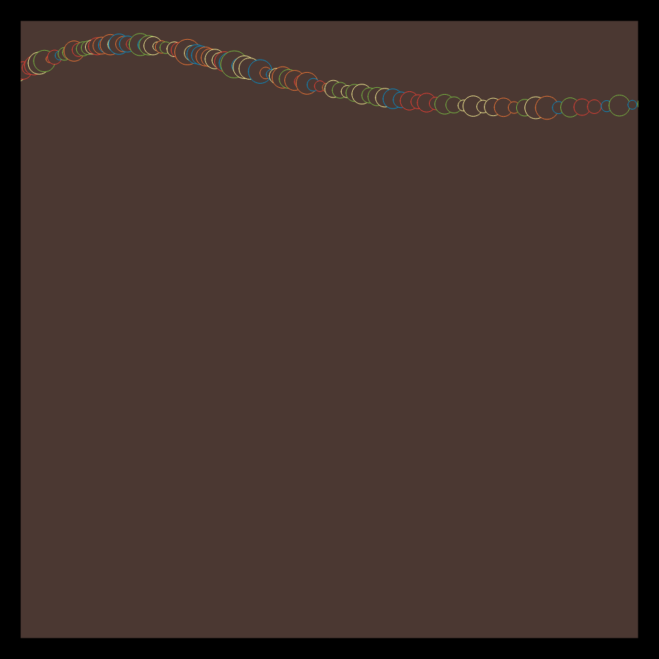

# DAILY SKETCH for 2021-11-01

## Done using P5.js

### Description

These `daily sketches` which are meant to be quick explorations     on whatever topic interested me on that day. This code is not typically optimized, but I share it as-is     for anyone interested.

  

## Progression of Images that were generated.

 
 

[More Images](2021-11-01/images) 

## 2021-11-01
Keywords: Bezier
 

## Description 

 Draw a Bezier curve. Draw circles along this curve.
 Radius of the circles are dependent on the noise() at the coords of the center.
 

Made using P5.js. | [Code](2021/2021-11-01/) | [Top](#daily-sketches) 

-----

