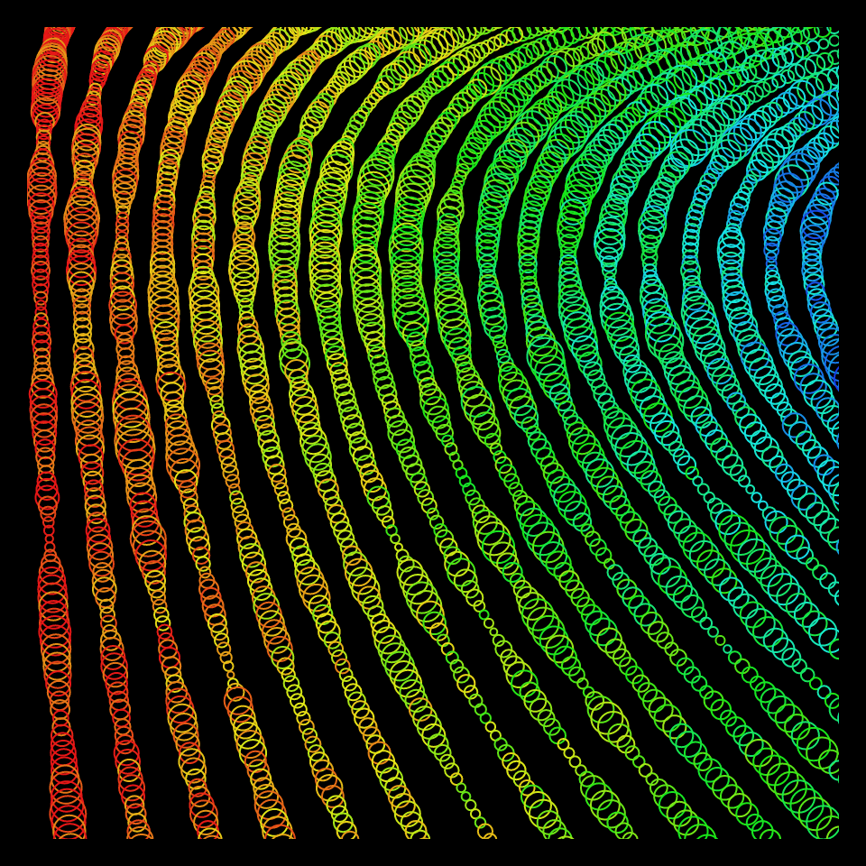

# DAILY SKETCH for 2021-11-02

## Done using P5.js

### Description

These `daily sketches` which are meant to be quick explorations     on whatever topic interested me on that day. This code is not typically optimized, but I share it as-is     for anyone interested.

  

## Progression of Images that were generated.

 
 

[More Images](2021-11-02/images) 

## 2021-11-02
Keywords: Bezier
 

## Description 

 Construct a bunch of Bezier curves, that mostly go from top to bottom, along 
 the x-axis. But instead of plotting the base curve, draw a circle at each point.
 Make the radius of each small circle to be dependent on the noise at that (x,y) coordinate, scaled.
 Make each strand have a different color, again with some random jitter added for complexity.
 

Made using P5.js. | [Code](2021/2021-11-02/) | [Top](#daily-sketches) 

-----

