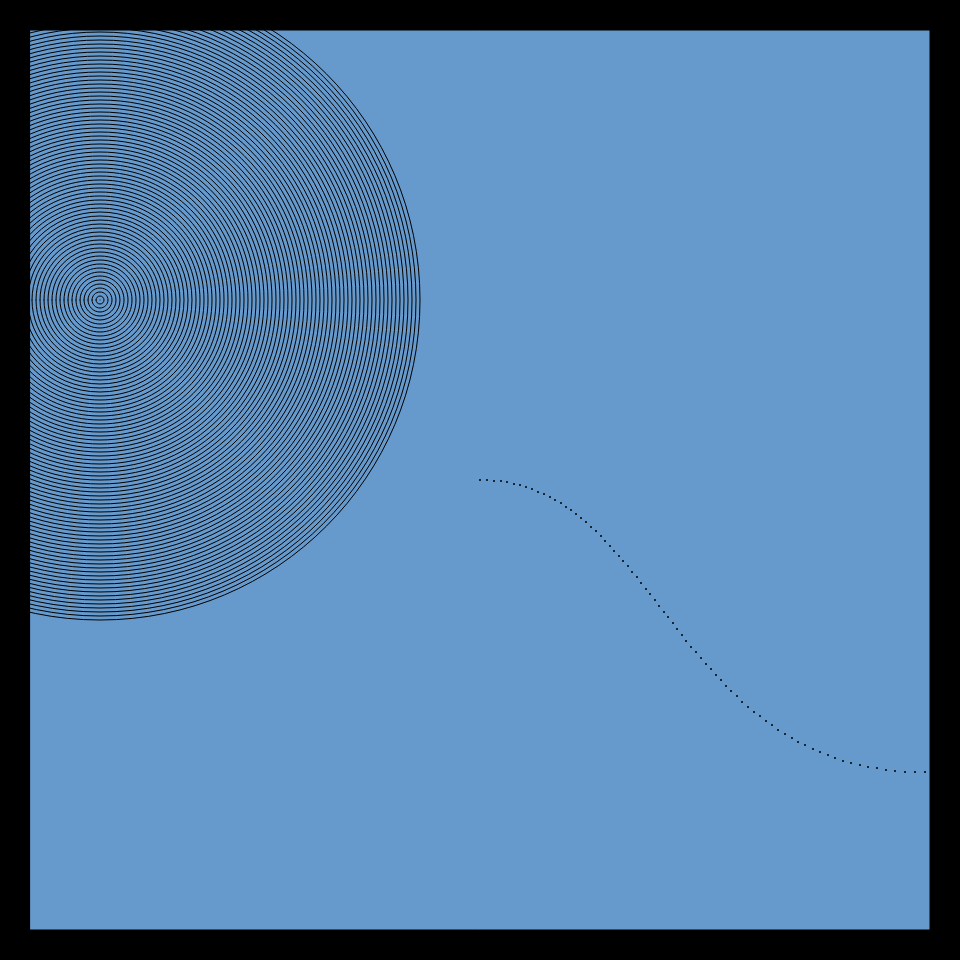
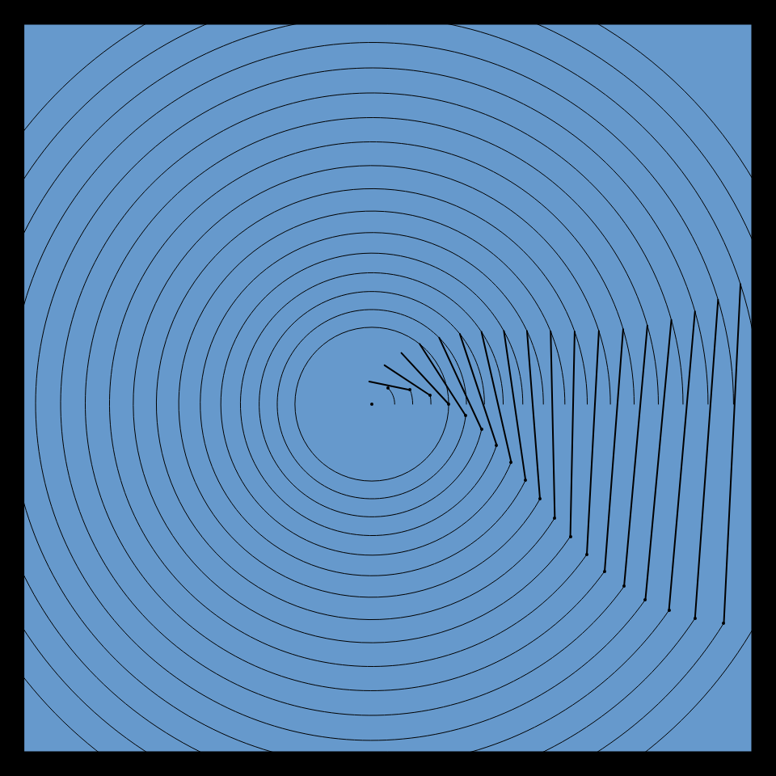

# DAILY SKETCH for 2021-11-05

## Done using P5.js

### Description

These `daily sketches` which are meant to be quick explorations     on whatever topic interested me on that day. This code is not typically optimized, but I share it as-is     for anyone interested.

   

## Progression of Images that were generated.

 
 
 

## 2021-11-05
Keywords: Bezier
 

## Description 

 Construct a bunch of Bezier curves, that emanate from the center. 
 Instead of plotting the base curve, draw a circle at each point of the bezier.
 Make the radius of each small circle to be dependent on the noise at that (x,y) coordinate, scaled.
 Render on a colored background
 

Made using P5.js. | [Code](2021/2021-11-05/) | [Top](#daily-sketches) 

-----

